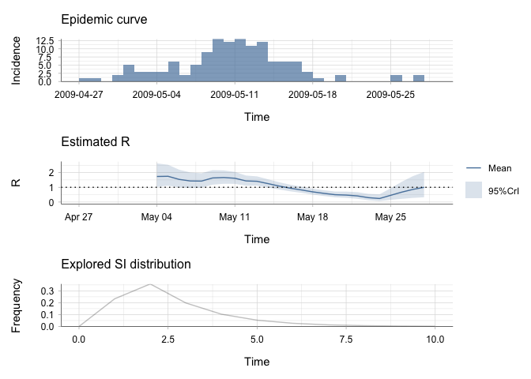
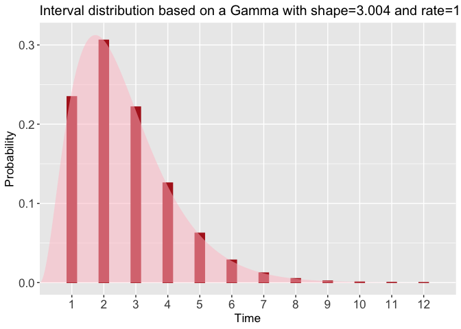
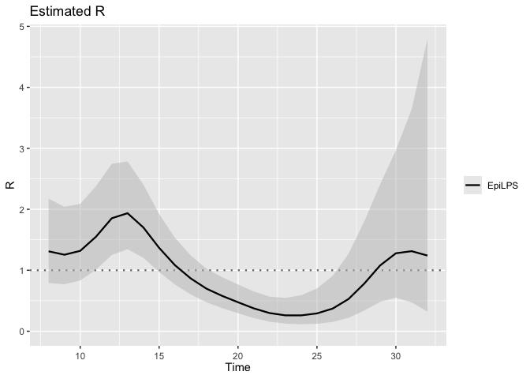
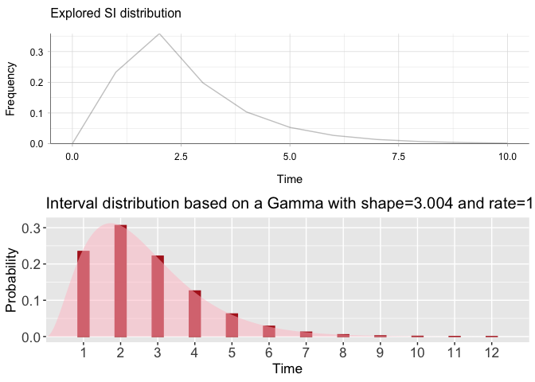
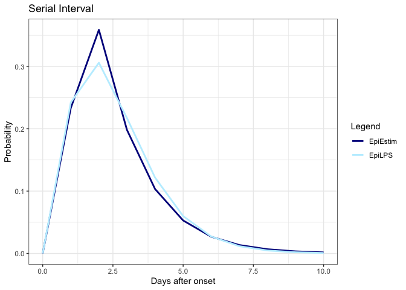
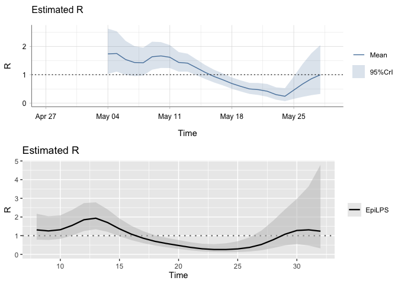
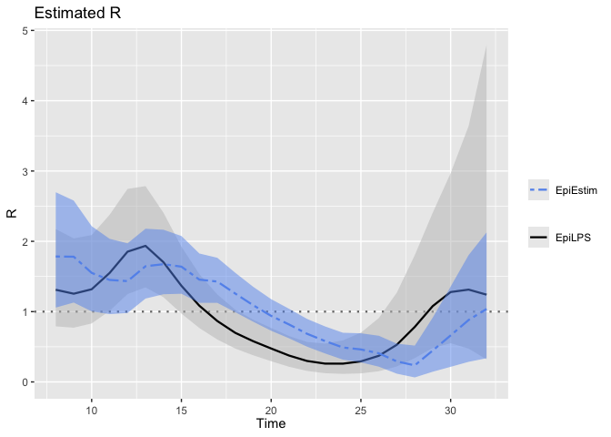

EpiEstim x EpiLPS testing
================
Christine Sangphet
2024-07-26

# **EpiEstim x EpiLPS**

``` r
#load environment

library(EpiEstim)
library(ggplot2)
library(incidence)
library(EpiLPS)
```

``` r
#load data

data(Flu2009)
```

### **Estimations with EpiEstim**

``` r
res_parametric_si <- estimate_R(Flu2009$incidence, 
                                method="parametric_si",
                                config = make_config(list(
                                  mean_si = 2.6, 
                                  std_si = 1.5))
)
```

    ## Default config will estimate R on weekly sliding windows.
    ##     To change this change the t_start and t_end arguments.

``` r
plot(res_parametric_si)
```

    ## Warning: The `guide` argument in `scale_*()` cannot be `FALSE`. This was deprecated in
    ## ggplot2 3.3.4.
    ## ℹ Please use "none" instead.
    ## ℹ The deprecated feature was likely used in the incidence package.
    ##   Please report the issue at <https://github.com/reconhub/incidence/issues>.
    ## This warning is displayed once every 8 hours.
    ## Call `lifecycle::last_lifecycle_warnings()` to see where this warning was
    ## generated.

<!-- -->


### **Estimations with EpiLPS**

#### SI

``` r
si_spec <- Idist(mean = 2.6, sd = 1.5, dist = "gamma")
si <- si_spec$pvec
si
```

    ##  [1] 0.2347607172 0.3061130999 0.2217949514 0.1258257345 0.0624515217
    ##  [6] 0.0284937595 0.0122689922 0.0050642269 0.0020240933 0.0007887430
    ## [11] 0.0003011238 0.0001130366

``` r
plot(si_spec)
```

<!-- -->

#### R

``` r
incidence <- Flu2009$incidence$I
incidence
```

    ##  [1]  1  1  0  2  5  3  3  3  6  2  5  9 13 12 13 11 12  6  6  6  3  1  0  2  0
    ## [26]  0  0  0  2  0  2  0

``` r
LPSfit <- estimR(incidence = incidence, si = si)
summary(LPSfit)
```

    ## Estimation of the reproduction number with Laplacian-P-splines 
    ## -------------------------------------------------------------- 
    ## Total number of days:          32 
    ## Routine time (seconds):        0.042 
    ## Method:                        Maximum a posteriori (MAP) 
    ## Hyperparam. optim method:      Nelder-Mead 
    ## Hyperparam. optim convergence: TRUE 
    ## Mean reproduction number:      0.963 
    ## Min  reproduction number:      0.260 
    ## Max  reproduction number:      1.936 
    ## --------------------------------------------------------------

``` r
plot(LPSfit)
```

<!-- -->

### Comparison of SI estimation

#### Side-by-side

``` r
# Plot for res_parametric_si
plot1 <- plot(res_parametric_si, "SI")

# Plot for dist.gi
plot2 <- plot(si_spec)

library(cowplot)

plot_grid(plot1, plot2, ncol = 1)
```

<!-- -->

#### Overlay

``` r
#turn epiestim SI into dataframe

si_data <- data.frame(si_distr = res_parametric_si$si_distr[0:11],
                      time = 0:10)

#turn epiLPS into data frame

shape <- si_spec$shape
rate <- si_spec$rate

time_values <- 0:10
gamma_values <- dgamma(time_values, shape = shape, rate = rate)

epi_data <- data.frame(time = time_values, epi_values = gamma_values)

#combine the plots

plot <- ggplot() +
 geom_line(data = si_data, aes(x = time, y = si_distr, color = "EpiEstim"), size = 1) +
  geom_line(data = epi_data, aes(x = time, y = epi_values, color = "EpiLPS"), size = 1) +
  scale_color_manual(name = "Legend", values = c("EpiEstim" = "blue4", "EpiLPS" = "lightblue1")) +
  theme_bw() +
  labs(title = "Serial Interval",
       x = "Days after onset",
       y = "Probability")
```

    ## Warning: Using `size` aesthetic for lines was deprecated in ggplot2 3.4.0.
    ## ℹ Please use `linewidth` instead.
    ## This warning is displayed once every 8 hours.
    ## Call `lifecycle::last_lifecycle_warnings()` to see where this warning was
    ## generated.

``` r
plot
```

<!-- -->

### Comparision of R estimation

#### SIde-by-side

``` r
plot3 <- plot(res_parametric_si, "R")

plot4 <- plot(LPSfit)

library(cowplot)

plot_grid(plot3, plot4, ncol = 1)
```

<!-- -->

#### Overlap

``` r
LPSfit2 <- estimR(incidence = incidence, si = si, CoriR = TRUE)
plot(LPSfit2, addfit = "Cori")
```

<!-- -->
