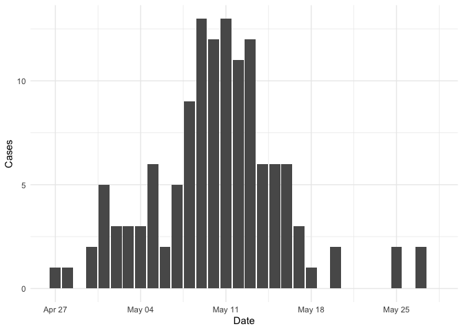
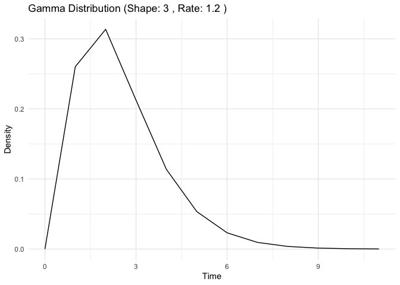
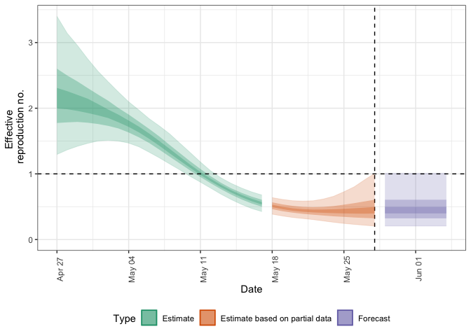
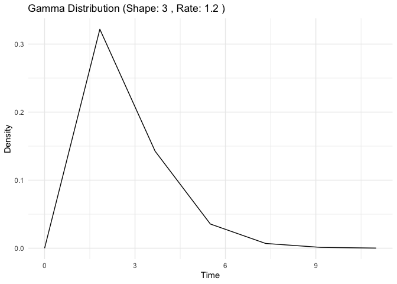
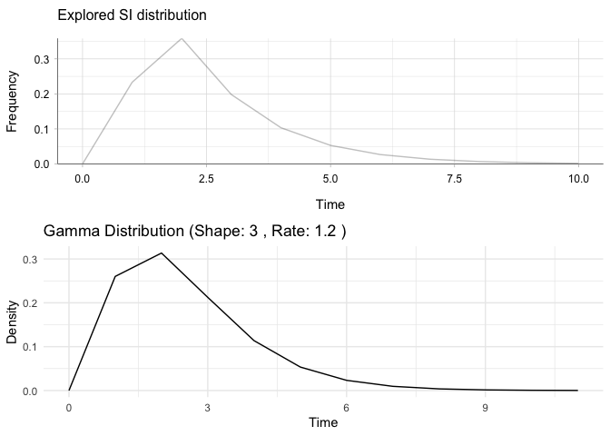
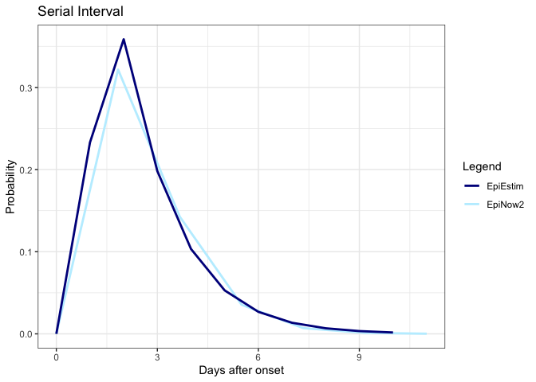
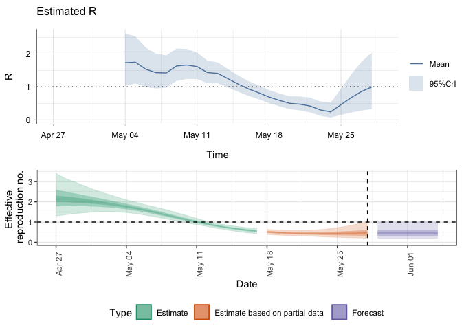
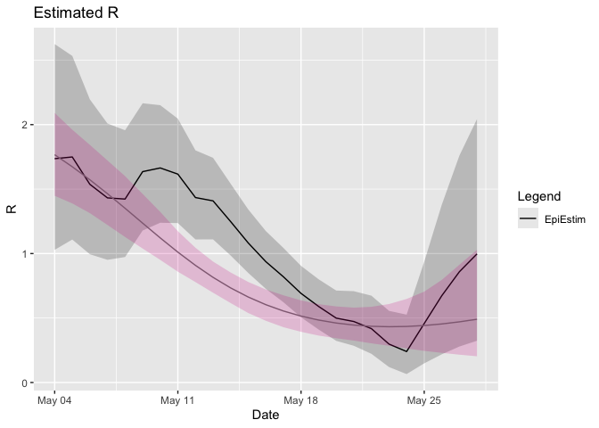

EpiEstim x EpiNow2 testing
================
Christine Sangphet
2024-07-25

# **EpiEstim x EpiNow2**

``` r
# load environment

library(EpiEstim)
library(ggplot2)
library(incidence)
library(EpiNow2)
```

    ## 
    ## Attaching package: 'EpiNow2'

    ## The following object is masked from 'package:stats':
    ## 
    ##     Gamma

``` r
#load data

data(Flu2009)
```

### **Estimations with EpiEstim**

``` r
res_parametric_si <- estimate_R(Flu2009$incidence, 
                                method="parametric_si",
                                config = make_config(list(
                                  mean_si = 2.6, 
                                  std_si = 1.5))
)
```

    ## Default config will estimate R on weekly sliding windows.
    ##     To change this change the t_start and t_end arguments.

``` r
plot(res_parametric_si)
```

    ## Warning: The `guide` argument in `scale_*()` cannot be `FALSE`. This was deprecated in
    ## ggplot2 3.3.4.
    ## ℹ Please use "none" instead.
    ## ℹ The deprecated feature was likely used in the incidence package.
    ##   Please report the issue at <https://github.com/reconhub/incidence/issues>.
    ## This warning is displayed once every 8 hours.
    ## Call `lifecycle::last_lifecycle_warnings()` to see where this warning was
    ## generated.

<!-- -->

### **Estimations with EpiNow2**

``` r
library("ggplot2")
reported_cases <- Flu2009$incidence
ggplot(reported_cases, aes(x =  dates, y = I)) +
  geom_col() +
  theme_minimal() +
  xlab("Date") +
  ylab("Cases")
```

<!-- -->

#### **SI**

``` r
#copied from epiestim x ern testing

si_distr <- c(0.000, 0.233, 0.359, 0.198, 0.103, 0.053, 0.027, 0.014, 0.007, 0.003, 0.002, 0.001)

intervals <- seq_along(si_distr) - 1

# The maximum value in the serial interval distribution
max_si <- max(intervals[si_distr > 0])

cat("Maximum SI:", max_si, "\n")
```

    ## Maximum SI: 11

``` r
generation_time_est <- generation_time_opts(Gamma(mean = 2.6, sd = 1.5, max = 11))

generation_time_est
```

    ## - gamma distribution (max: 11):
    ##   shape:
    ##     3
    ##   rate:
    ##     1.2

``` r
# Define parameters

shape <- 3
rate <- 1.2
max_x <- 11

# Generate data for gamma distribution
x <- seq(0, max_x)
y <- dgamma(x, shape = shape, rate = rate)

# Create a data frame for plotting
data <- data.frame(x = x, y = y)

# Plot using ggplot2
epinow_si <- ggplot(data, aes(x = x, y = y)) +
  geom_line() +
  labs(title = paste("Gamma Distribution (Shape:", shape, ", Rate:", rate, ")"),
       x = "Time",
       y = "Density") +
  theme_minimal()

plot(epinow_si)
```

<!-- -->

#### R

``` r
reported_cases <- Flu2009$incidence

# Change column names

colnames(reported_cases) <- c("date", "confirm")

reported_cases
```

    ##          date confirm
    ## 1  2009-04-27       1
    ## 2  2009-04-28       1
    ## 3  2009-04-29       0
    ## 4  2009-04-30       2
    ## 5  2009-05-01       5
    ## 6  2009-05-02       3
    ## 7  2009-05-03       3
    ## 8  2009-05-04       3
    ## 9  2009-05-05       6
    ## 10 2009-05-06       2
    ## 11 2009-05-07       5
    ## 12 2009-05-08       9
    ## 13 2009-05-09      13
    ## 14 2009-05-10      12
    ## 15 2009-05-11      13
    ## 16 2009-05-12      11
    ## 17 2009-05-13      12
    ## 18 2009-05-14       6
    ## 19 2009-05-15       6
    ## 20 2009-05-16       6
    ## 21 2009-05-17       3
    ## 22 2009-05-18       1
    ## 23 2009-05-19       0
    ## 24 2009-05-20       2
    ## 25 2009-05-21       0
    ## 26 2009-05-22       0
    ## 27 2009-05-23       0
    ## 28 2009-05-24       0
    ## 29 2009-05-25       2
    ## 30 2009-05-26       0
    ## 31 2009-05-27       2
    ## 32 2009-05-28       0

``` r
#EpiNow2 requires the following arguments:
#reporting delay
#delay (incubation period + reporting delay)
#rt_prior
```

``` r
#NOTE: simulating random samples does not work

# mean_log <- log(3)
# sd_log <- 1
#n <- nrow(Flu2009$incidence)

# Generate random samples from a log-normal distribution

#reporting_delay <- rlnorm(n, meanlog = mean_log, sdlog = sd_log)
#incubation_period <- rlnorm(n, meanlog = mean_log, sdlog = sd_log)

# Ensure values are within the specified maximum (truncating the values above max)

#reporting_delay <- pmin(reporting_delay, 11)
#incubation_period <- pmin(incubation_period, 11)
```

``` r
options(mc.cores = 4)

reporting_delay <- Gamma(mean = 0.3143663, sd = 0.5606837, max = 0.8671758) #values from ern
incubation_period <- Gamma(mean = 0.3589284, sd = 0.5991064, max = 1.057728) #values from ern 
delay <- incubation_period + reporting_delay
rt_prior <- list(mean = 4, sd = 2.9) #from epiestim x ern prior_R0_shape = 2 and prior_R0_rate = 0.5

res <- epinow(reported_cases,
  generation_time = generation_time_opts(generation_time_est),
  delays = delay_opts(delay),
  rt = rt_opts(prior = rt_prior)
)
```

    ## Logging threshold set at INFO for the EpiNow2 logger

    ## Writing EpiNow2 logs to the console and: /var/folders/kz/vb4s2bzd5m59rdxjpt9vyk_h0000gn/T//Rtmp3UndbF/regional-epinow/2009-05-28.log

    ## Logging threshold set at INFO for the EpiNow2.epinow logger

    ## Writing EpiNow2.epinow logs to the console and: /var/folders/kz/vb4s2bzd5m59rdxjpt9vyk_h0000gn/T//Rtmp3UndbF/epinow/2009-05-28.log

    ## WARN [2024-08-21 11:44:33] epinow: There were 3 divergent transitions after warmup. See
    ## https://mc-stan.org/misc/warnings.html#divergent-transitions-after-warmup
    ## to find out why this is a problem and how to eliminate them. - 
    ## WARN [2024-08-21 11:44:33] epinow: Examine the pairs() plot to diagnose sampling problems
    ##  -

``` r
res$plots$R
```

<!-- -->

### Comparison of SI estimation

#### Side-by-side

``` r
# Plot for res_parametric_si
plot1 <- plot(res_parametric_si, "SI")

# Plot for dist.gi
plot2 <- plot(epinow_si)
```

<!-- -->

``` r
library(cowplot)

plot_grid(plot1, plot2, ncol = 1)
```

<!-- -->

#### Overlaying

``` r
#turn epiestim SI into dataframe

si_data <- data.frame(si_distr = res_parametric_si$si_distr[0:11],
                      time = 0:10)

plot <- ggplot() + 
  geom_line(data = data, aes(x = x, y = y, color = "EpiNow2"), size = 1) +
  geom_line(data = si_data, aes(x = time, y = si_distr, color = "EpiEstim"), size = 1) + 
  scale_color_manual(name = "Legend", values = c("EpiEstim" = "blue4", "EpiNow2" = "lightblue1")) +
  theme_bw() +
  labs(title = "Serial Interval",
       x = "Days after onset",
       y = "Probability")
```

    ## Warning: Using `size` aesthetic for lines was deprecated in ggplot2 3.4.0.
    ## ℹ Please use `linewidth` instead.
    ## This warning is displayed once every 8 hours.
    ## Call `lifecycle::last_lifecycle_warnings()` to see where this warning was
    ## generated.

``` r
plot
```

<!-- -->

### Comparison of R estimation

#### Side-by-side

``` r
plot3 <- plot(res_parametric_si, "R")

plot4 <- res$plots$R

library(cowplot)

plot_grid(plot3, plot4, ncol = 1)
```

<!-- -->

#### Overlaying

``` r
#turn epiestim R into a dataframe 

names(res_parametric_si$R)
```

    ##  [1] "t_start"           "t_end"             "Mean(R)"          
    ##  [4] "Std(R)"            "Quantile.0.025(R)" "Quantile.0.05(R)" 
    ##  [7] "Quantile.0.25(R)"  "Median(R)"         "Quantile.0.75(R)" 
    ## [10] "Quantile.0.95(R)"  "Quantile.0.975(R)"

``` r
r_data <- data.frame(
  t = Flu2009$incidence$dates[8:32],
  mean_r = c(res_parametric_si$R$`Mean(R)`),
  quantile_0_025_r = c(res_parametric_si$R$`Quantile.0.025(R)`),
  quantile_0_975_r = c(res_parametric_si$R$`Quantile.0.975(R)`)
)

#EpiNow2 into dataframe
epinow_r <- data.frame(
  epi_t = c(res$plots$R$data$date[8:32]),
  epi_mean = c(res$plots$R$data$mean[8:32]),
  epi_lwr = c(res$plots$R$data$lower_90[8:32]),
  epi_upr = c(res$plots$R$data$upper_90[8:32])
)

#combine

plot2 <- ggplot() +
  geom_line(data = r_data, aes(x = t, y = mean_r, color = "EpiEstim")) +
  geom_ribbon(data = r_data, aes(x = t, ymin = quantile_0_025_r, ymax = quantile_0_975_r), alpha = 0.2, fill = "black") +
  geom_line(data = epinow_r, aes(x = epi_t, y = epi_mean, color = "EpiNow2")) +
  geom_ribbon(data = epinow_r, aes(x = epi_t, ymin = epi_lwr, ymax = epi_upr), alpha = 0.2, fill = "violetred") +
   scale_color_manual(name = "Legend", values = c("EpiEstim" = "black", "EpiNow" = "violetred")) +
  
  labs(title = "Estimated R",
       x = "Date",
       y = "R")

plot2
```

<!-- -->
