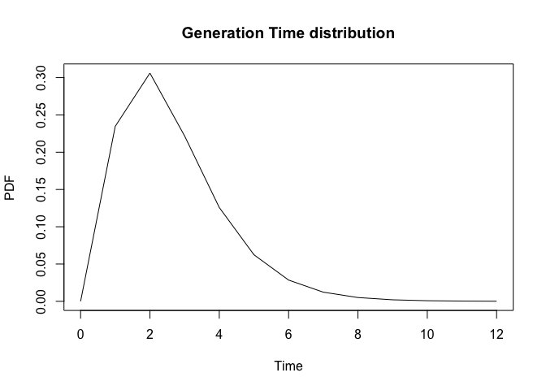

EpiEstim x R0
================
Christine Sangphet
2024-07-24

# **EpiEstim x R0**

``` r
# load environment

library(EpiEstim)
library(ggplot2)
library(gridExtra)
library(incidence)
library(R0)
```

``` r
#load data

data(Flu2009)
```

### **Estimations with EpiEstim**

``` r
res_parametric_si <- estimate_R(Flu2009$incidence, 
                                method="parametric_si",
                                config = make_config(list(
                                  mean_si = 2.6, 
                                  std_si = 1.5))
)
```

    ## Default config will estimate R on weekly sliding windows.
    ##     To change this change the t_start and t_end arguments.

``` r
plot(res_parametric_si)
```

    ## Warning: The `guide` argument in `scale_*()` cannot be `FALSE`. This was deprecated in
    ## ggplot2 3.3.4.
    ## ℹ Please use "none" instead.
    ## ℹ The deprecated feature was likely used in the incidence package.
    ##   Please report the issue at <https://github.com/reconhub/incidence/issues>.
    ## This warning is displayed once every 8 hours.
    ## Call `lifecycle::last_lifecycle_warnings()` to see where this warning was
    ## generated.

<!-- -->

### **Estimations with R0**

#### SI

``` r
Flu2009$si_distr
```

    ##  [1] 0.000 0.233 0.359 0.198 0.103 0.053 0.027 0.014 0.007 0.003 0.002 0.001

``` r
GT.chld.hsld1<-generation.time("empirical", c(0.000,0.233,0.359,0.198,0.103,0.053,0.027,0.014,0.007,0.003,0.002,0.001))

GT.chld.hsld1
```

    ## Discretized Generation Time distribution
    ## mean: 2.596 , sd: 1.534531 
    ##  [1] 0.000 0.233 0.359 0.198 0.103 0.053 0.027 0.014 0.007 0.003 0.002 0.001

``` r
plot(GT.chld.hsld1)
```

<!-- -->

#### R

``` r
data("Germany.1918")
print(Germany.1918)
```

    ## 1918-09-29 1918-09-30 1918-10-01 1918-10-02 1918-10-03 1918-10-04 1918-10-05 
    ##         10          4          4         19          6         13         28 
    ## 1918-10-06 1918-10-07 1918-10-08 1918-10-09 1918-10-10 1918-10-11 1918-10-12 
    ##         23         35         27         42         51         43         78 
    ## 1918-10-13 1918-10-14 1918-10-15 1918-10-16 1918-10-17 1918-10-18 1918-10-19 
    ##         86         80        109        126        126        159        190 
    ## 1918-10-20 1918-10-21 1918-10-22 1918-10-23 1918-10-24 1918-10-25 1918-10-26 
    ##        209        161        199        227        246        269        243 
    ## 1918-10-27 1918-10-28 1918-10-29 1918-10-30 1918-10-31 1918-11-01 1918-11-02 
    ##        259        264        243        289        247        289        263 
    ## 1918-11-03 1918-11-04 1918-11-05 1918-11-06 1918-11-07 1918-11-08 1918-11-09 
    ##        230        235        227        208        184        179        139 
    ## 1918-11-10 1918-11-11 1918-11-12 1918-11-13 1918-11-14 1918-11-15 1918-11-16 
    ##        157        141        128        142        129         99        109 
    ## 1918-11-17 1918-11-18 1918-11-19 1918-11-20 1918-11-21 1918-11-22 1918-11-23 
    ##         79         86         73         86         71         80         71 
    ## 1918-11-24 1918-11-25 1918-11-26 1918-11-27 1918-11-28 1918-11-29 1918-11-30 
    ##         58         56         42         61         48         47         47 
    ## 1918-12-01 1918-12-02 1918-12-03 1918-12-04 1918-12-05 1918-12-06 1918-12-07 
    ##         40         36         47         31         39         23         29 
    ## 1918-12-08 1918-12-09 1918-12-10 1918-12-11 1918-12-12 1918-12-13 1918-12-14 
    ##         27         28         20         30         21         24         28 
    ## 1918-12-15 1918-12-16 1918-12-17 1918-12-18 1918-12-19 1918-12-20 1918-12-21 
    ##         16         13         15         21         16         17         16 
    ## 1918-12-22 1918-12-23 1918-12-24 1918-12-25 1918-12-26 1918-12-27 1918-12-28 
    ##         13         32          5          9         14         25         17 
    ## 1918-12-29 1918-12-30 1918-12-31 1919-01-01 1919-01-02 1919-01-03 1919-01-04 
    ##         15         14         12         13         23         13         21 
    ## 1919-01-05 1919-01-06 1919-01-07 1919-01-08 1919-01-09 1919-01-10 1919-01-11 
    ##         12         11         12          7         11         15         12 
    ## 1919-01-12 1919-01-13 1919-01-14 1919-01-15 1919-01-16 1919-01-17 1919-01-18 
    ##          3         22          8         10         10          6          7 
    ## 1919-01-19 1919-01-20 1919-01-21 1919-01-22 1919-01-23 1919-01-24 1919-01-25 
    ##         15         15          1         20          2          2          2 
    ## 1919-01-26 1919-01-27 1919-01-28 1919-01-29 1919-01-30 1919-01-31 1919-02-01 
    ##         17         16         15         11          3          1          3

``` r
Flu2009$incidence
```

    ##         dates  I
    ## 1  2009-04-27  1
    ## 2  2009-04-28  1
    ## 3  2009-04-29  0
    ## 4  2009-04-30  2
    ## 5  2009-05-01  5
    ## 6  2009-05-02  3
    ## 7  2009-05-03  3
    ## 8  2009-05-04  3
    ## 9  2009-05-05  6
    ## 10 2009-05-06  2
    ## 11 2009-05-07  5
    ## 12 2009-05-08  9
    ## 13 2009-05-09 13
    ## 14 2009-05-10 12
    ## 15 2009-05-11 13
    ## 16 2009-05-12 11
    ## 17 2009-05-13 12
    ## 18 2009-05-14  6
    ## 19 2009-05-15  6
    ## 20 2009-05-16  6
    ## 21 2009-05-17  3
    ## 22 2009-05-18  1
    ## 23 2009-05-19  0
    ## 24 2009-05-20  2
    ## 25 2009-05-21  0
    ## 26 2009-05-22  0
    ## 27 2009-05-23  0
    ## 28 2009-05-24  0
    ## 29 2009-05-25  2
    ## 30 2009-05-26  0
    ## 31 2009-05-27  2
    ## 32 2009-05-28  0

``` r
#change Flu2009$incidence format

library(dplyr)
```

    ## 
    ## Attaching package: 'dplyr'

    ## The following object is masked from 'package:gridExtra':
    ## 
    ##     combine

    ## The following objects are masked from 'package:stats':
    ## 
    ##     filter, lag

    ## The following objects are masked from 'package:base':
    ## 
    ##     intersect, setdiff, setequal, union

``` r
colnames(Flu2009$incidence) <- c("dates", "incid")

# Convert the dates column to character format for column names
date_vector <- as.character(Flu2009$incidence$dates)
incid_vector <- Flu2009$incidence$incid

# Create a named vector for the matrix
incid_new_format <- setNames(incid_vector, date_vector)

print(incid_new_format, quote = FALSE)
```

    ## 2009-04-27 2009-04-28 2009-04-29 2009-04-30 2009-05-01 2009-05-02 2009-05-03 
    ##          1          1          0          2          5          3          3 
    ## 2009-05-04 2009-05-05 2009-05-06 2009-05-07 2009-05-08 2009-05-09 2009-05-10 
    ##          3          6          2          5          9         13         12 
    ## 2009-05-11 2009-05-12 2009-05-13 2009-05-14 2009-05-15 2009-05-16 2009-05-17 
    ##         13         11         12          6          6          6          3 
    ## 2009-05-18 2009-05-19 2009-05-20 2009-05-21 2009-05-22 2009-05-23 2009-05-24 
    ##          1          0          2          0          0          0          0 
    ## 2009-05-25 2009-05-26 2009-05-27 2009-05-28 
    ##          2          0          2          0

``` r
mGT<-generation.time("gamma", c(2.6, 1.5))
est.R0.ML(incid_new_format, mGT, begin=1, end=32)
```

    ## Reproduction number estimate using  Maximum Likelihood  method.
    ## R :  1.007973[ 0.7807748 , 1.275485 ]

``` r
res = est.R0.ML(incid_new_format, mGT, begin=1, end=27, range=c(0.01,50))
plot(res)
```

<!-- -->

``` r
TD <- est.R0.TD(incid_new_format, mGT, begin=8, end=30, nsim=1000)
```

    ## Warning in est.R0.TD(incid_new_format, mGT, begin = 8, end = 30, nsim = 1000):
    ## Simulations may take several minutes.

    ## Warning in est.R0.TD(incid_new_format, mGT, begin = 8, end = 30, nsim = 1000):
    ## Using initial incidence as initial number of cases.

``` r
TD
```

    ## Reproduction number estimate using  Time-Dependent  method.
    ## 1.443153 1.528194 1.915087 1.933233 1.575514 1.180122 0.9678166 0.7906301 0.6478225 0.5225889 ...

``` r
plot(TD)
```

<!-- -->

### Comparison of SI estimation

#### Side-by-side

``` r
library(cowplot)

plot1 <- plot(res_parametric_si, "SI")

plot2 <- plot(GT.chld.hsld1)
```

<!-- -->

``` r
grid.arrange(plot1, plot2, ncol = 1)
```

<!-- -->

#### Overlay

``` r
#turn epiestim SI into dataframe

si_data <- data.frame(si_distr = res_parametric_si$si_distr[0:11],
                      time = 0:10)

#turn R0 SI into dataframe

mean_gt <- 2.596
sd_gt <- 1.534531

shape <- (mean_gt / sd_gt)^2
scale <- (sd_gt^2) / mean_gt

time_values <- 0:10
gamma_values <- dgamma(time_values, shape = shape, scale = scale)

r0_data <- data.frame(time = time_values, r0_values = gamma_values)

#combine the plots

plot <- ggplot() +
 geom_line(data = si_data, aes(x = time, y = si_distr, color = "EpiEstim"), size = 1) +
  geom_line(data = r0_data, aes(x = time, y = r0_values, color = "R0"), size = 1) +
  scale_color_manual(name = "Legend", values = c("EpiEstim" = "blue4", "R0" = "lightblue1")) +
  theme_bw() +
  labs(title = "Serial Interval",
       x = "Days after onset",
       y = "Probability")
```

    ## Warning: Using `size` aesthetic for lines was deprecated in ggplot2 3.4.0.
    ## ℹ Please use `linewidth` instead.
    ## This warning is displayed once every 8 hours.
    ## Call `lifecycle::last_lifecycle_warnings()` to see where this warning was
    ## generated.

``` r
plot
```

<!-- -->

### Comparison of R estimation

#### Side-by-side

``` r
plot3 <- plot(res_parametric_si, "R")

plot4 <- plot(TD)
```

<!-- -->

``` r
grid.arrange(plot3, plot4, ncol = 1)
```

<!-- -->

#### Overlay

``` r
#turn TD$R into a dataframe

dates <- c("2009-05-04", "2009-05-05", "2009-05-06", "2009-05-07", "2009-05-08", "2009-05-09", 
           "2009-05-10", "2009-05-11", "2009-05-12", "2009-05-13", "2009-05-14", "2009-05-15", 
           "2009-05-16", "2009-05-17", "2009-05-18", "2009-05-19", "2009-05-20", "2009-05-21", 
           "2009-05-22", "2009-05-23", "2009-05-24", "2009-05-25", "2009-05-26")

R_values <- c(1.4431534, 1.5281943, 1.9150867, 1.9332333, 1.5755135, 1.1801216, 
              0.9678166, 0.7906301, 0.6478225, 0.5225889, 0.4846133, 0.3834813, 
              0.2713710, 0.2770432, 0.3921351, 0.0000000, 0.7650676, 0.0000000, 
              0.0000000, 0.0000000, 0.0000000, 1.2471919, 0.0000000)


df_r0 <- data.frame(dates, R_values)


print(df_r0)
```

    ##         dates  R_values
    ## 1  2009-05-04 1.4431534
    ## 2  2009-05-05 1.5281943
    ## 3  2009-05-06 1.9150867
    ## 4  2009-05-07 1.9332333
    ## 5  2009-05-08 1.5755135
    ## 6  2009-05-09 1.1801216
    ## 7  2009-05-10 0.9678166
    ## 8  2009-05-11 0.7906301
    ## 9  2009-05-12 0.6478225
    ## 10 2009-05-13 0.5225889
    ## 11 2009-05-14 0.4846133
    ## 12 2009-05-15 0.3834813
    ## 13 2009-05-16 0.2713710
    ## 14 2009-05-17 0.2770432
    ## 15 2009-05-18 0.3921351
    ## 16 2009-05-19 0.0000000
    ## 17 2009-05-20 0.7650676
    ## 18 2009-05-21 0.0000000
    ## 19 2009-05-22 0.0000000
    ## 20 2009-05-23 0.0000000
    ## 21 2009-05-24 0.0000000
    ## 22 2009-05-25 1.2471919
    ## 23 2009-05-26 0.0000000

``` r
#turn epiestim R into a dataframe 

names(res_parametric_si$R)
```

    ##  [1] "t_start"           "t_end"             "Mean(R)"          
    ##  [4] "Std(R)"            "Quantile.0.025(R)" "Quantile.0.05(R)" 
    ##  [7] "Quantile.0.25(R)"  "Median(R)"         "Quantile.0.75(R)" 
    ## [10] "Quantile.0.95(R)"  "Quantile.0.975(R)"

``` r
r_data <- data.frame(
  t = Flu2009$incidence$dates[8:30],
  mean_r = c(res_parametric_si$R$`Mean(R)`)[1:23],
  quantile_0_025_r = c(res_parametric_si$R$`Quantile.0.025(R)`)[1:23],
  quantile_0_975_r = c(res_parametric_si$R$`Quantile.0.975(R)`)[1:23]
)

#dataframe for R0

r0_r <- data.frame(
  r0_t = as.Date(c(df_r0$dates)),
  r0_mean = c(df_r0$R_values),
  r0_lwr = c(TD$conf.int$lower),
  r0_upr = c(TD$conf.int$upper)
)

#combine

plot2 <- ggplot() +
  geom_line(data = r_data, aes(x = t, y = mean_r, color = "EpiEstim")) +
  geom_ribbon(data = r_data, aes(x = t, ymin = quantile_0_025_r, ymax = quantile_0_975_r), alpha = 0.2, fill = "black") +
  geom_line(data = r0_r, aes(x = r0_t, y = r0_mean, color = "R0")) +
  geom_ribbon(data = r0_r, aes(x = r0_t, ymin = r0_lwr, ymax = r0_upr), alpha = 0.2, fill = "violetred") +
   scale_color_manual(name = "Legend", values = c("EpiEstim" = "black", "R0" = "violetred")) +
  
  labs(title = "Estimated R",
       x = "Date",
       y = "R")

plot2
```

<!-- -->
