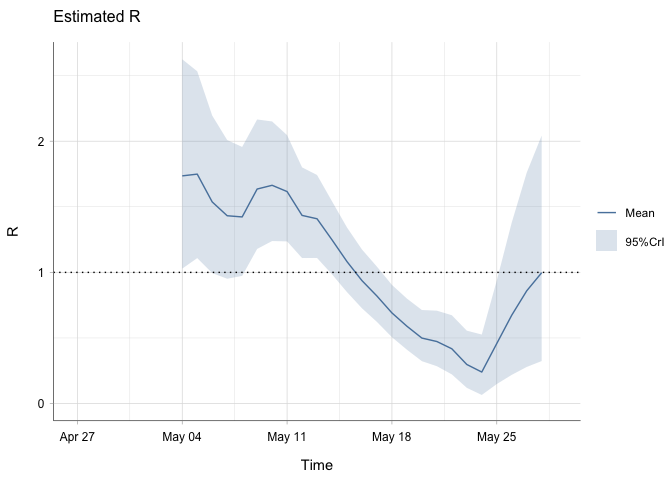
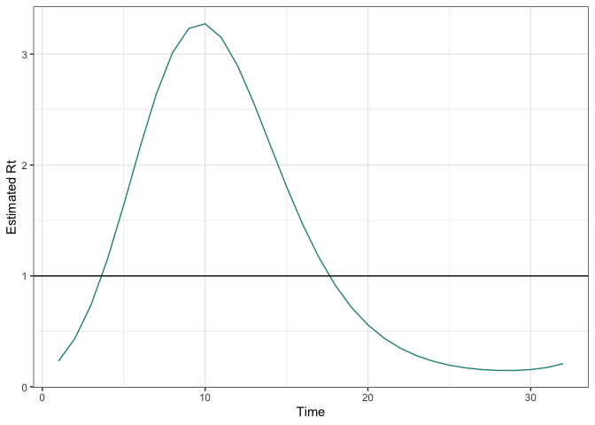
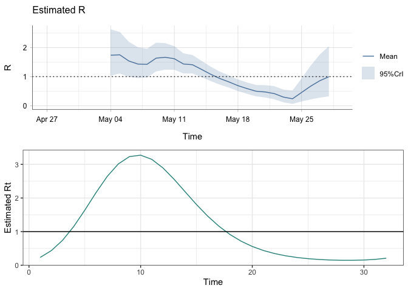
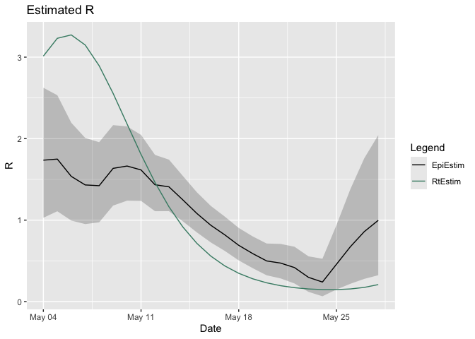

EpiEstim x RtEstim testing
================
Christine Sangphet
2024-07-26

# **EpiEstim x RtEstim**

``` r
#load environment

library(EpiEstim)
library(ggplot2)
library(incidence)
library(rtestim)
```

``` r
#load data

data(Flu2009)
```

### **Estimations with EpiEstim**

``` r
res_parametric_si <- estimate_R(Flu2009$incidence, 
                                method="parametric_si",
                                config = make_config(list(
                                  mean_si = 2.6, 
                                  std_si = 1.5))
)
```

    ## Default config will estimate R on weekly sliding windows.
    ##     To change this change the t_start and t_end arguments.

``` r
plot(res_parametric_si, "R")
```

<!-- -->

### **Estimations with RtEstim**

``` r
mod <- estimate_rt(observed_counts = Flu2009$incidence$I, nsol = 1)
plot(mod)
```

<!-- -->

### Comparision of R estimation

#### Side-by-side

``` r
library(cowplot)
library(gridExtra)

plot1 <- plot(res_parametric_si, "R")

plot2 <- plot(mod)

grid.arrange(plot1, plot2, ncol = 1)
```

<!-- -->

#### Overlay

``` r
#turn epiestim R into a dataframe 

names(res_parametric_si$R)
```

    ##  [1] "t_start"           "t_end"             "Mean(R)"          
    ##  [4] "Std(R)"            "Quantile.0.025(R)" "Quantile.0.05(R)" 
    ##  [7] "Quantile.0.25(R)"  "Median(R)"         "Quantile.0.75(R)" 
    ## [10] "Quantile.0.95(R)"  "Quantile.0.975(R)"

``` r
r_data <- data.frame(
  t = Flu2009$incidence$dates[8:32],
  mean_r = c(res_parametric_si$R$`Mean(R)`),
  quantile_0_025_r = c(res_parametric_si$R$`Quantile.0.025(R)`),
  quantile_0_975_r = c(res_parametric_si$R$`Quantile.0.975(R)`)
)

#create dataframe for RtEstim

rtestim_data <- data.frame(
  rt_t = Flu2009$incidence$dates[8:32],
  rt_values = c(mod$Rt[8:32])
)

plot <- ggplot() +
  geom_line(data = r_data, aes(x = t, y = mean_r, color = "EpiEstim")) +
  geom_ribbon(data = r_data, aes(x = t, ymin = quantile_0_025_r, ymax = quantile_0_975_r), alpha = 0.2, fill = "black") +
  geom_line(data = rtestim_data, aes(x = rt_t, y = rt_values, color = "RtEstim")) +
   scale_color_manual(name = "Legend", values = c("EpiEstim" = "black", "RtEstim" = "aquamarine4")) +
  labs(title = "Estimated R",
       x = "Date",
       y = "R")

plot
```

<!-- -->
