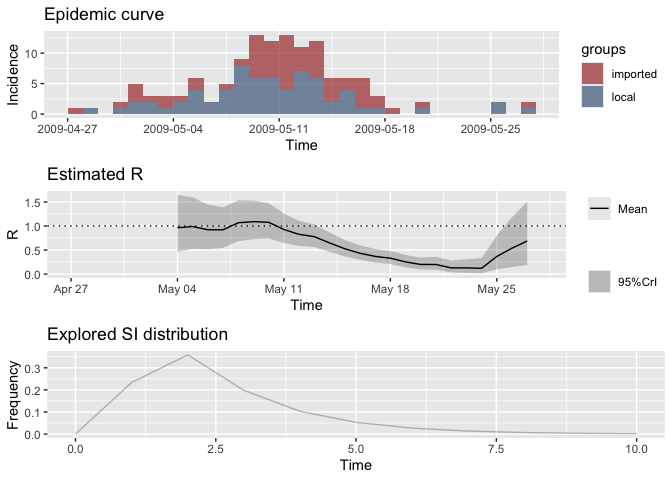

EpiEstim Testing
================
Christine Sangphet
2024-07-03

# A demonstration

``` r
#load environment

library(EpiEstim)
library(ggplot2)
```

``` r
#load data

data(Flu2009)
```

``` r
#incidence

head(Flu2009$incidence)
```

    ##        dates I
    ## 1 2009-04-27 1
    ## 2 2009-04-28 1
    ## 3 2009-04-29 0
    ## 4 2009-04-30 2
    ## 5 2009-05-01 5
    ## 6 2009-05-02 3

``` r
#serial interval (SI) distribution:

Flu2009$si_distr
```

    ##  [1] 0.000 0.233 0.359 0.198 0.103 0.053 0.027 0.014 0.007 0.003 0.002 0.001

``` r
head(Flu2009$si_data)
```

    ##   EL ER SL SR type
    ## 1  0  1  7  8    0
    ## 2  0  1  2  3    0
    ## 3  0  1  3  4    0
    ## 4  0  1  2  5    0
    ## 5  0  1  1  9    0
    ## 6  0  1  2  4    0

``` r
#we can use the incidence R pacakge to plot the daily incidence data

library(incidence)
plot(as.incidence(Flu2009$incidence$I, dates = Flu2009$incidence$dates))
```

    ## Warning: The `guide` argument in `scale_*()` cannot be `FALSE`. This was deprecated in
    ## ggplot2 3.3.4.
    ## ℹ Please use "none" instead.
    ## ℹ The deprecated feature was likely used in the incidence package.
    ##   Please report the issue at <https://github.com/reconhub/incidence/issues>.
    ## This warning is displayed once every 8 hours.
    ## Call `lifecycle::last_lifecycle_warnings()` to see where this warning was
    ## generated.

<!-- -->

### Estimating R on sliding weekly windows, with a parametric serial interval

``` r
res_parametric_si <- estimate_R(Flu2009$incidence, 
                                method="parametric_si",
                                config = make_config(list(
                                  mean_si = 2.6, 
                                  std_si = 1.5))
)
```

    ## Default config will estimate R on weekly sliding windows.
    ##     To change this change the t_start and t_end arguments.

``` r
head(res_parametric_si$R)
```

    ##   t_start t_end  Mean(R)    Std(R) Quantile.0.025(R) Quantile.0.05(R)
    ## 1       2     8 1.735798 0.4091314         1.0287437         1.121933
    ## 2       3     9 1.749168 0.3647267         1.1088223         1.195480
    ## 3       4    10 1.537058 0.3074116         0.9947030         1.068694
    ## 4       5    11 1.431839 0.2705921         0.9514466         1.017661
    ## 5       6    12 1.422725 0.2515046         0.9731426         1.035808
    ## 6       7    13 1.635373 0.2523436         1.1786332         1.243590
    ##   Quantile.0.25(R) Median(R) Quantile.0.75(R) Quantile.0.95(R)
    ## 1         1.445198  1.703761         1.991520         2.458972
    ## 2         1.491345  1.723884         1.979457         2.389121
    ## 3         1.320090  1.516613         1.731761         2.075176
    ## 4         1.241251  1.414830         1.603900         1.904047
    ## 5         1.245996  1.407932         1.583340         1.860107
    ## 6         1.458847  1.622413         1.797779         2.071372
    ##   Quantile.0.975(R)
    ## 1          2.624781
    ## 2          2.533119
    ## 3          2.195540
    ## 4          2.008849
    ## 5          1.956336
    ## 6          2.165745

``` r
#the output can be plotted as follows

plot(res_parametric_si, legend = FALSE)
```

<!-- -->

``` r
#use `type = "R"`, `type = "incid"` or `type = "SI" to generate only one of the 3 plots
```

## Estimating R with a non parametric serial interval distribution

``` r
#if one already has a full distribution of the serial interval, and not only a mean and standard deviation, this can be fed into estimate_r as follows:

res_non_parametric_si <- estimate_R(Flu2009$incidence, 
                                    method="non_parametric_si",
                                    config = make_config(list(
                                      si_distr = Flu2009$si_distr))
)
```

    ## Default config will estimate R on weekly sliding windows.
    ##     To change this change the t_start and t_end arguments.

``` r
plot(res_non_parametric_si, "R")
```

<!-- -->

``` r
#Note that you can obtain such a full distribution of the serial interval using discr_si function

discr_si(0:20, mu = 2.6, sigma = 1.5)
```

    ##  [1] 0.000000e+00 2.331721e-01 3.585794e-01 1.981108e-01 1.033427e-01
    ##  [6] 5.290518e-02 2.682146e-02 1.351620e-02 6.783438e-03 3.394351e-03
    ## [11] 1.694674e-03 8.445945e-04 4.203313e-04 2.089422e-04 1.037609e-04
    ## [16] 5.148480e-05 2.552773e-05 1.264952e-05 6.264667e-06 3.101068e-06
    ## [21] 1.534394e-06

## Estimating R accounting for uncertainty on the serial interval distribution

``` r
# we choose to draw:
# - the mean of the SI in a Normal(2.6, 1), truncated at 1 and 4.2
# - the sd of the SI in a Normal(1.5, 0.5), truncated at 0.5 and 2.5

config <- make_config(list(mean_si = 2.6, std_mean_si = 1,
                           min_mean_si = 1, max_mean_si = 4.2,
                           std_si = 1.5, std_std_si = 0.5,
                           min_std_si = 0.5, max_std_si = 2.5))
res_uncertain_si <- estimate_R(Flu2009$incidence,
                               method = "uncertain_si",
                               config = config)
```

    ## Default config will estimate R on weekly sliding windows.
    ##     To change this change the t_start and t_end arguments.

``` r
plot(res_uncertain_si, legend = FALSE) 
```

<!-- -->

## Estimating R and the serial interval using data on pairs infector/infected

``` r
head(Flu2009$si_data)
```

    ##   EL ER SL SR type
    ## 1  0  1  7  8    0
    ## 2  0  1  2  3    0
    ## 3  0  1  3  4    0
    ## 4  0  1  2  5    0
    ## 5  0  1  1  9    0
    ## 6  0  1  2  4    0

``` r
#interval-ceonsored serial interval data:
#each line represents a transmission event
#EL/ER show the lower/upper bound of the symptoms onset date in the infector
#SL/SR show the same for the secondary case
#type has entries 0 corresponding to doubly interval-censored data
```

``` r
#These can be used to estimate the SI within estimate_R and produce estimates of the reproduction number based on the full SI posterior distribution

# fixing the random seeds
MCMC_seed <- 1
overall_seed <- 2
mcmc_control <- make_mcmc_control(seed = MCMC_seed, 
                                  burnin = 1000)
dist <- "G" # fitting a Gamma dsitribution for the SI
config <- make_config(list(si_parametric_distr = dist,
                           mcmc_control = mcmc_control,
                           seed = overall_seed, 
                           n1 = 50, 
                           n2 = 50))
res_si_from_data <- estimate_R(Flu2009$incidence,
                               method = "si_from_data",
                               si_data = Flu2009$si_data,
                               config = config)
```

    ## Default config will estimate R on weekly sliding windows.
    ##     To change this change the t_start and t_end arguments.

    ## Running 1500 MCMC iterations 
    ## MCMCmetrop1R iteration 1 of 1500 
    ## function value =  -27.68336
    ## theta = 
    ##    1.67335
    ##   -0.27928
    ## Metropolis acceptance rate = 0.00000
    ## 
    ## MCMCmetrop1R iteration 1001 of 1500 
    ## function value =  -29.17093
    ## theta = 
    ##    1.07173
    ##    0.18715
    ## Metropolis acceptance rate = 0.54246
    ## 
    ## 
    ## 
    ## @@@@@@@@@@@@@@@@@@@@@@@@@@@@@@@@@@@@@@@@@@@@@@@@@@@@@@@@@
    ## The Metropolis acceptance rate was 0.55267
    ## @@@@@@@@@@@@@@@@@@@@@@@@@@@@@@@@@@@@@@@@@@@@@@@@@@@@@@@@@
    ## 
    ## Gelman-Rubin MCMC convergence diagnostic was successful.
    ## 
    ## @@@@@@@@@@@@@@@@@@@@@@@@@@@@@@@@@@@@@@@@@@@@@@@@@@@@@@@@@ 
    ## Estimating the reproduction number for these serial interval estimates...
    ##  @@@@@@@@@@@@@@@@@@@@@@@@@@@@@@@@@@@@@@@@@@@@@@@@@@@@@@@@@

``` r
#the third plot now shows the posterior sample of SI distributions that were integrated over
```

``` r
plot(res_si_from_data, legend = FALSE)
```

<!-- -->

### Changing windows for estimation

``` r
#The time window can be specified through arguments config$t_start and config$t_end. For instance, the default weekly sliding windows can also be obtained by specifying

T <- nrow(Flu2009$incidence)
t_start <- seq(2, T-6) # starting at 2 as conditional on the past observations
t_end <- t_start + 6 # adding 6 to get 7-day windows as bounds included in window
res_weekly <- estimate_R(Flu2009$incidence, 
                         method="parametric_si",
                         config = make_config(list(
                           t_start = t_start,
                           t_end = t_end,
                           mean_si = 2.6, 
                           std_si = 1.5))
)
plot(res_weekly, "R") 
```

<!-- -->

``` r
#for biweekly estimates

t_start <- seq(2, T-13) # starting at 2 as conditional on the past observations
t_end <- t_start + 13 
res_biweekly <- estimate_R(Flu2009$incidence, 
                           method="parametric_si",
                           config = make_config(list(
                             t_start = t_start,
                             t_end = t_end,
                             mean_si = 2.6, 
                             std_si = 1.5))
)
plot(res_biweekly, "R") 
```

<!-- -->

``` r
#Sometimes it may be useful to consider consecutive non overlapping windows as well. For instance, in the flu outbreak we are considering, the school closed from 14th to 20th May 2009, i.e. days 18 to 24 in our dataset. It is interesting to estimate the reproduction number before, during, and after the shcool closure to assess whether this had an impact on transmissibility

t_start <- c(2, 18, 25) # starting at 2 as conditional on the past observations
t_end <- c(17, 24, 32)
res_before_during_after_closure <- estimate_R(Flu2009$incidence, 
                                              method="parametric_si",
                                              config = make_config(list(
                                                t_start = t_start,
                                                t_end = t_end,
                                                mean_si = 2.6, 
                                                std_si = 1.5))
)
plot(res_before_during_after_closure, "R") +
  geom_hline(aes(yintercept = 1), color = "red", lty = 2)
```

<!-- -->

### Different ways of specifying the incidence

#### Method 1

``` r
head(Flu2009$incidence)
```

    ##        dates I
    ## 1 2009-04-27 1
    ## 2 2009-04-28 1
    ## 3 2009-04-29 0
    ## 4 2009-04-30 2
    ## 5 2009-05-01 5
    ## 6 2009-05-02 3

``` r
config <- make_config(list(mean_si = 2.6, std_si = 1.5))
res_incid_table <- estimate_R(Flu2009$incidence, 
                              method="parametric_si",
                              config = config)
```

    ## Default config will estimate R on weekly sliding windows.
    ##     To change this change the t_start and t_end arguments.

``` r
plot(res_incid_table, "R")
```

<!-- -->

#### Method 2

``` r
res_incid_vector <- estimate_R(Flu2009$incidence$I, 
                               method="parametric_si",
                               config = config)
```

    ## Default config will estimate R on weekly sliding windows.
    ##     To change this change the t_start and t_end arguments.

``` r
plot(res_incid_vector, "R")
```

<!-- -->

#### Method 3

``` r
#Let’s artificially create a line-list corresponding to our flu incidence data

dates_onset <- Flu2009$incidence$dates[unlist(lapply(1:nrow(Flu2009$incidence), function(i) 
  rep(i, Flu2009$incidence$I[i])))]
```

``` r
#and now use the incidence function to generate an object that we feed to estimate_R

last_date <- Flu2009$incidence$date[T]
res_incid_class <- estimate_R(incidence(dates_onset, last_date = last_date), 
                              method="parametric_si",
                              config = config)
```

    ## Default config will estimate R on weekly sliding windows.
    ##     To change this change the t_start and t_end arguments.

``` r
plot(res_incid_class, "R")
```

<!-- -->

### Specifying imported cases

``` r
#generating fake information on our cases:
location <- sample(c("local","imported"), length(dates_onset), replace=TRUE)
location[1] <- "imported" # forcing the first case to be imported
```

``` r
#get incidence per group (location)

incid <- incidence(dates_onset, groups = location)
```

``` r
plot(incid)
```

<!-- -->

``` r
#Estimate R with assumptions on serial interval

res_with_imports <- estimate_R(incid, method = "parametric_si",
                   config = make_config(list(
                   mean_si = 2.6, std_si = 1.5)))
```

    ## Default config will estimate R on weekly sliding windows.
    ##     To change this change the t_start and t_end arguments.

``` r
plot(res_with_imports, add_imported_cases=TRUE)
```

    ## The number of colors (8) did not match the number of groups (2).
    ## Using `col_pal` instead.

<!-- -->

# Example: Entire workflow

``` r
#Let us say we have line list data in the format below, where each row corresponds to a reported case of EVD

library(readxl)
library(incidence)

#Specify the file path as a string and read Excel file

linelist <- read_excel("/Users/christinesangphet/Downloads/linelist_20140701.xlsx", na = c("", "NA"))

#Display the first few rows of the imported data

head(linelist)
```

    ## # A tibble: 6 × 11
    ##   case_id generation date_of_infection date_of_onset date_of_hospitalisation
    ##   <chr>        <dbl> <chr>             <chr>         <chr>                  
    ## 1 d1fafd           0 <NA>              2014-04-07    2014-04-17             
    ## 2 53371b           1 2014-04-09        2014-04-15    2014-04-20             
    ## 3 f5c3d8           1 2014-04-18        2014-04-21    2014-04-25             
    ## 4 6c286a           2 <NA>              2014-04-27    2014-04-27             
    ## 5 0f58c4           2 2014-04-22        2014-04-26    2014-04-29             
    ## 6 49731d           0 2014-03-19        2014-04-25    2014-05-02             
    ## # ℹ 6 more variables: date_of_outcome <chr>, outcome <chr>, gender <chr>,
    ## #   hospital <chr>, lon <dbl>, lat <dbl>

``` r
#make sure that all dates are stored correctly as date objects
linelist$date_of_onset <- as.Date(linelist$date_of_onset, format = "%Y-%m-%d")
```

``` r
#Create an incidence object:
evd_incid <- incidence(linelist$date_of_onset)
```

``` r
#plot the daily incidence
plot(evd_incid, xlab = "Date")
```

<!-- -->

``` r
#We supply estimate_R() with the incidence object and parameters for the parametric SI and this generates the following 3 panel plot

R_si_parametric <- estimate_R(incid = evd_incid, 
                             method = "parametric_si",
                             config = make_config(mean_si = 14.2, std_si = 9.6))
```

    ## Default config will estimate R on weekly sliding windows.
    ##     To change this change the t_start and t_end arguments.

    ## Warning in estimate_R_func(incid = incid, method = method, si_sample = si_sample, : You're estimating R too early in the epidemic to get the desired
    ##             posterior CV.

``` r
plot(R_si_parametric, legend = FALSE)
```

    ## Warning: Removed 7 rows containing missing values or values outside the scale range
    ## (`geom_line()`).

<!-- -->

### Make projections

``` r
#the projections package takes the estimated reproduction number, serial interval distribution and incidence object to simulate epidemic trajectories using branching processes.

library(projections)
```

``` r
#Truncate the linelist so that the last 7 days of data are not included
#(some people who have become symptomatic are yet to be reported)

library(magrittr)

trunc_date <- max(linelist$date_of_onset) - 7
trunc_linelist <- subset(linelist, linelist$date_of_onset < trunc_date)

#Create incidence object without last 7 days of data

evd_incid_trunc <- incidence(trunc_linelist$date_of_onset)

#Estimate R over a recent time window

R_si_parametric_recent <- estimate_R(incid = evd_incid_trunc, 
                             method = "parametric_si",
                             config = make_config(mean_si = 14.2, std_si = 9.6,
                             # 2 week window that ended a week ago:
                             t_start = length(evd_incid_trunc$counts) - 14,
                             t_end = length(evd_incid_trunc$counts)))

# Project future incidence over 30 days since last day in truncated incidence

proj <- project(evd_incid_trunc, # truncated incidence object
                R = R_si_parametric_recent$R$`Median(R)`, # R estimate
                si = R_si_parametric_recent$si_distr[-1], # SI (starting on day 1)
                n_sim = 1000, # simulate 1000 trajectories
                n_days = 30, # over 30 days
                R_fix_within = TRUE) # keep the same value of R every day

# Add the projections over all incidence data

plot(evd_incid, xlab = "Date of Symptom Onset") %>%
  add_projections(proj, c(0.025, 0.5, 0.975))
```

    ## Scale for x is already present.
    ## Adding another scale for x, which will replace the existing scale.

<!-- -->
