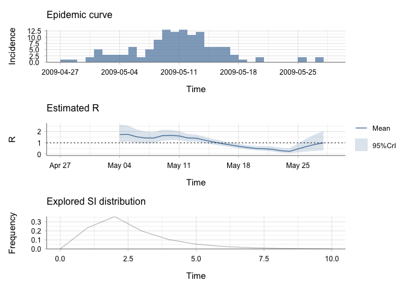
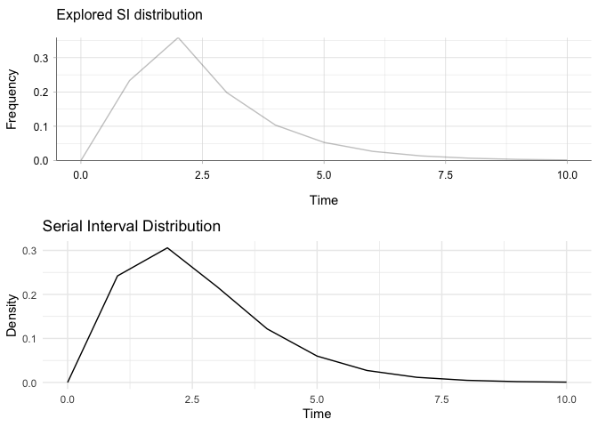

EpiEstim x earlyR testing
================
Christine Sangphet
2024-07-19

# **EpiEstim x earlyR**

``` r
#load environment

library(EpiEstim)
library(ggplot2)
library(incidence)
library(earlyR)
library(dplyr)
```

    ## 
    ## Attaching package: 'dplyr'

    ## The following objects are masked from 'package:stats':
    ## 
    ##     filter, lag

    ## The following objects are masked from 'package:base':
    ## 
    ##     intersect, setdiff, setequal, union

``` r
#load data

data(Flu2009)
```

### **Estimations with EpiEstim**

``` r
res_parametric_si <- estimate_R(Flu2009$incidence, 
                                method="parametric_si",
                                config = make_config(list(
                                  mean_si = 2.6, 
                                  std_si = 1.5))
)
```

    ## Default config will estimate R on weekly sliding windows.
    ##     To change this change the t_start and t_end arguments.

``` r
plot(res_parametric_si)
```

    ## Warning: The `guide` argument in `scale_*()` cannot be `FALSE`. This was deprecated in
    ## ggplot2 3.3.4.
    ## ℹ Please use "none" instead.
    ## ℹ The deprecated feature was likely used in the incidence package.
    ##   Please report the issue at <https://github.com/reconhub/incidence/issues>.
    ## This warning is displayed once every 8 hours.
    ## Call `lifecycle::last_lifecycle_warnings()` to see where this warning was
    ## generated.

<!-- -->

### **Estimations with earlyR**

``` r
Flu2009$incidence
```

    ##         dates  I
    ## 1  2009-04-27  1
    ## 2  2009-04-28  1
    ## 3  2009-04-29  0
    ## 4  2009-04-30  2
    ## 5  2009-05-01  5
    ## 6  2009-05-02  3
    ## 7  2009-05-03  3
    ## 8  2009-05-04  3
    ## 9  2009-05-05  6
    ## 10 2009-05-06  2
    ## 11 2009-05-07  5
    ## 12 2009-05-08  9
    ## 13 2009-05-09 13
    ## 14 2009-05-10 12
    ## 15 2009-05-11 13
    ## 16 2009-05-12 11
    ## 17 2009-05-13 12
    ## 18 2009-05-14  6
    ## 19 2009-05-15  6
    ## 20 2009-05-16  6
    ## 21 2009-05-17  3
    ## 22 2009-05-18  1
    ## 23 2009-05-19  0
    ## 24 2009-05-20  2
    ## 25 2009-05-21  0
    ## 26 2009-05-22  0
    ## 27 2009-05-23  0
    ## 28 2009-05-24  0
    ## 29 2009-05-25  2
    ## 30 2009-05-26  0
    ## 31 2009-05-27  2
    ## 32 2009-05-28  0

``` r
dates <- c("2009-04-27", "2009-04-28", "2009-04-29", "2009-04-30",
           "2009-05-01", "2009-05-02", "2009-05-03", "2009-05-04",
           "2009-05-05", "2009-05-06", "2009-05-07", "2009-05-08",
           "2009-05-09", "2009-05-10", "2009-05-11", "2009-05-12",
           "2009-05-13", "2009-05-14", "2009-05-15", "2009-05-16",
           "2009-05-17", "2009-05-18", "2009-05-19", "2009-05-20",
           "2009-05-21", "2009-05-22", "2009-05-23", "2009-05-24",
           "2009-05-25", "2009-05-26", "2009-05-27", "2009-05-28")

counts <- c(1, 1, 0, 2, 5, 3, 3, 3, 6, 2, 5, 9, 13, 12, 13, 11, 12, 6, 6, 6, 
            3, 1, 0, 2, 0, 0, 0, 0, 2, 0, 2, 0)

onset <- as.Date(rep(dates, counts))
```

``` r
i <- incidence(onset)
i
```

    ## <incidence object>
    ## [129 cases from days 2009-04-27 to 2009-05-27]
    ## 
    ## $counts: matrix with 31 rows and 1 columns
    ## $n: 129 cases in total
    ## $dates: 31 dates marking the left-side of bins
    ## $interval: 1 day
    ## $timespan: 31 days
    ## $cumulative: FALSE

``` r
plot(i, border = "white")
```

<!-- -->

#### R

``` r
mu <- 2.6 # mean in days days
sigma <- 1.5 # sd in days 

#the function get_R is then used to estimate the most likely values of R:

res <- get_R(i, si_mean = mu, si_sd = sigma)
res
```

    ## 
    ## /// Early estimate of reproduction number (R) //
    ##  // class: earlyR, list
    ## 
    ##  // Maximum-Likelihood estimate of R ($R_ml):
    ## [1] 1.011011
    ## 
    ## 
    ##  // $lambda:
    ##   NA 0.4479748 0.7292102 0.4291974 1.114021 2.903453...
    ## 
    ##  // $dates:
    ## [1] "2009-04-27" "2009-04-28" "2009-04-29" "2009-04-30" "2009-05-01"
    ## [6] "2009-05-02"
    ## ...
    ## 
    ##  // $si (serial interval):
    ## A discrete distribution
    ##   name: gamma
    ##   parameters:
    ##     shape: 3.00444444444445
    ##     scale: 0.865384615384615

``` r
plot(res)
```

<!-- -->

#### SI

``` r
# Parameters from the serial interval distribution

shape <- 3.00444444444445
scale <- 0.865384615384615

# Generate a sequence of values

x <- seq(0, 10)

# Calculate the density of the gamma distribution

y <- dgamma(x, shape = shape, scale = scale)

# Create a data frame for plotting

si_df <- data.frame(x = x, y = y)

# Plot using ggplot2

si_earlyR <- ggplot(si_df, aes(x = x, y = y)) +
  geom_line() +
  labs(title = "Serial Interval Distribution",
       x = "Time",
       y = "Density") +
  theme_minimal()

print(si_earlyR)
```

<!-- -->

### Comparison of SI estimation

#### Side-by-side

``` r
# Plot for res_parametric_si
plot1 <- plot(res_parametric_si, "SI")

# Plot for dist.gi
plot2 <- si_earlyR

library(cowplot)

plot_grid(plot1, plot2, ncol = 1)
```

<!-- -->

#### Overlaying

``` r
#turn epiestim SI into dataframe

si_data <- data.frame(si_distr = res_parametric_si$si_distr[0:11],
                      time = 0:10)
#plot 

plot <- ggplot() + 
  geom_line(data = si_df, aes(x = x, y = y, color = "earlyR"), size = 1) +
  geom_line(data = si_data, aes(x = time, y = si_distr, color = "EpiEstim"), size = 1) + 
  scale_color_manual(name = "Legend", values = c("EpiEstim" = "blue4", "earlyR" = "lightblue1")) +
  theme_bw() +
  labs(title = "Serial Interval",
       x = "Days after onset",
       y = "Probability")
```

    ## Warning: Using `size` aesthetic for lines was deprecated in ggplot2 3.4.0.
    ## ℹ Please use `linewidth` instead.
    ## This warning is displayed once every 8 hours.
    ## Call `lifecycle::last_lifecycle_warnings()` to see where this warning was
    ## generated.

``` r
plot
```

<!-- -->

### R Estimation Analysis

``` r
plot3 <- plot(res_parametric_si, "R")

# Plot for dist.gi
plot4 <- plot(res)

library(cowplot)

plot_grid(plot3, plot4, ncol = 1)
```

<!-- -->

Given R is equal to 1.01 as shown on the second graph, it means that a
person who already contracted the disease is likely to spread the
disease to, at least, one other individual and the repective maximum
likehood for that is about 4.5%.
