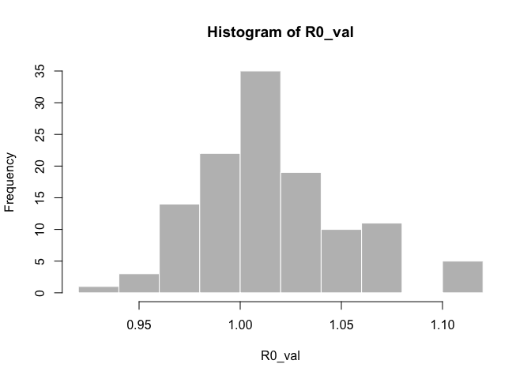
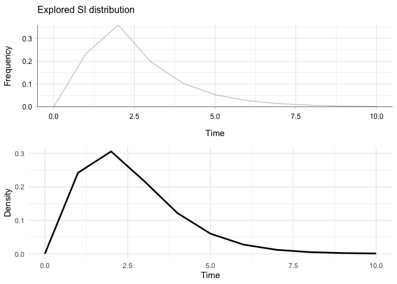
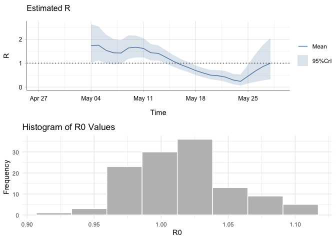

EpiEstim x epitrix testing
================
Christine Sangphet
2024-07-19

# **EpiEstim x epitrix**

``` r
# load environment

library(EpiEstim)
library(ggplot2)
library(incidence)
library(epitrix)
```

``` r
#load data

data(Flu2009)
```

### **Estimations with EpiEstim**

``` r
res_parametric_si <- estimate_R(Flu2009$incidence, 
                                method="parametric_si",
                                config = make_config(list(
                                  mean_si = 2.6, 
                                  std_si = 1.5))
)
```

    ## Default config will estimate R on weekly sliding windows.
    ##     To change this change the t_start and t_end arguments.

``` r
plot(res_parametric_si)
```

    ## Warning: The `guide` argument in `scale_*()` cannot be `FALSE`. This was deprecated in
    ## ggplot2 3.3.4.
    ## ℹ Please use "none" instead.
    ## ℹ The deprecated feature was likely used in the incidence package.
    ##   Please report the issue at <https://github.com/reconhub/incidence/issues>.
    ## This warning is displayed once every 8 hours.
    ## Call `lifecycle::last_lifecycle_warnings()` to see where this warning was
    ## generated.

<!-- -->

### **Estimations with epitrix**

#### SI

``` r
mu <- 2.6 # mean in days days
sigma <- 1.5 # standard deviation in days
cv <- sigma/mu # coefficient of variation
cv
```

    ## [1] 0.5769231

``` r
param <- gamma_mucv2shapescale(mu, cv) # convertion to Gamma parameters
param
```

    ## $shape
    ## [1] 3.004444
    ## 
    ## $scale
    ## [1] 0.8653846

``` r
library(distcrete)

si <- distcrete::distcrete("gamma", interval = 1,
               shape = param$shape,
               scale = param$scale, w = 0)
si
```

    ## A discrete distribution
    ##   name: gamma
    ##   parameters:
    ##     shape: 3.00444444444445
    ##     scale: 0.865384615384615

``` r
# Parameters for the gamma distribution

shape <- 3.00444444444445
scale <- 0.865384615384615

# Define a range of values

x <- seq(0, 10, by = 2) 

# Compute the density of the gamma distribution

density <- dgamma(x, shape = shape, scale = scale)

# Plot the distribution

epitrix_si <- plot(x, density, type = "l", lwd = 2,
     xlab = "Time", ylab = "Density",
)
```

<!-- -->

``` r
epitrix_si
```

    ## NULL

#### R

``` r
dates <- c("2009-04-27", "2009-04-28", "2009-04-29", "2009-04-30",
           "2009-05-01", "2009-05-02", "2009-05-03", "2009-05-04",
           "2009-05-05", "2009-05-06", "2009-05-07", "2009-05-08",
           "2009-05-09", "2009-05-10", "2009-05-11", "2009-05-12",
           "2009-05-13", "2009-05-14", "2009-05-15", "2009-05-16",
           "2009-05-17", "2009-05-18", "2009-05-19", "2009-05-20",
           "2009-05-21", "2009-05-22", "2009-05-23", "2009-05-24",
           "2009-05-25", "2009-05-26", "2009-05-27", "2009-05-28")

counts <- c(1, 1, 0, 2, 5, 3, 3, 3, 6, 2, 5, 9, 13, 12, 13, 11, 12, 6, 6, 6, 
            3, 1, 0, 2, 0, 0, 0, 0, 2, 0, 2, 0)

onset <- as.Date(rep(dates, counts))
```

``` r
i <- incidence(onset)
i
```

    ## <incidence object>
    ## [129 cases from days 2009-04-27 to 2009-05-27]
    ## 
    ## $counts: matrix with 31 rows and 1 columns
    ## $n: 129 cases in total
    ## $dates: 31 dates marking the left-side of bins
    ## $interval: 1 day
    ## $timespan: 31 days
    ## $cumulative: FALSE

``` r
f <- fit(i[1:31])
```

    ## Warning in fit(i[1:31]): 7 dates with incidence of 0 ignored for fitting

``` r
plot(i[1:31], fit = f, color = "#9fc2fc")
```

<!-- -->

The incidence package fits a log-linear model to incidence curves
(function fit), which estimates a growth rate r. This growth rate can be
converted to a basic reproduction number R0. However, the data in this
example resembles a binomial distribution rather than showing
exponential growth, which means the distribution of this data cannot be
modeled by a linear relationship model.

``` r
R0_val <- lm2R0_sample(f$model, si$d(1:129), n = 120)
head(R0_val)
```

    ## [1] 1.0669401 1.0088792 0.9998399 1.0097374 0.9670423 1.0580669

``` r
#> [1] 1.360925 1.357800 1.360150 1.367461 1.352716 1.352790
hist(R0_val, col = "grey", border = "white")
```

<!-- -->

### Comparison of SI estimation

#### Side-by-side

``` r
library(ggplot2)
library(cowplot)

#si for epitrix 
density <- dgamma(x, shape = shape, scale = scale)

data <- data.frame(x = x, density = density)

epitrix_si <- ggplot(data, aes(x = x, y = density)) +
  geom_line(size = 1) +
  labs(x = "Time", y = "Density") +
  theme_minimal()
```

    ## Warning: Using `size` aesthetic for lines was deprecated in ggplot2 3.4.0.
    ## ℹ Please use `linewidth` instead.
    ## This warning is displayed once every 8 hours.
    ## Call `lifecycle::last_lifecycle_warnings()` to see where this warning was
    ## generated.

``` r
#si for epiestim 
plot1 <- plot(res_parametric_si, "SI")

# Combine both plots using cowplot
combined_plot <- plot_grid(plot1, epitrix_si, ncol = 1)

print(combined_plot)
```

<!-- -->

#### Overlay

``` r
#turn epiestim SI into dataframe

si_data <- data.frame(si_distr = res_parametric_si$si_distr[0:11],
                      time = 0:10)

#turn epitrix SI into dataframe

time_values <- 0:10
gamma_values <- dgamma(time_values, shape = 3.00444444444445, scale = 0.865384615384615)

dist_gi_data <- data.frame(time = time_values, gi_distr = gamma_values)

plot <- ggplot() +
 geom_line(data = si_data, aes(x = time, y = si_distr, color = "EpiEstim"), size = 1) +
  geom_line(data = dist_gi_data, aes(x = time, y = gi_distr, color = "epitrix"), size = 1) +
  scale_color_manual(name = "Legend", values = c("EpiEstim" = "blue4", "epitrix" = "lightblue1")) +
  scale_x_continuous(breaks = 0:10) +
  theme_bw() +
  labs(title = "Serial Interval",
       x = "Days after onset",
       y = "Probability")

plot
```

<!-- -->

### R Estimation Analysis

``` r
# Plot for res_parametric_si
plot3 <- plot(res_parametric_si, "R")

# Plot for epitrix 
plot4 <- ggplot() +
  geom_histogram(aes(x = R0_val), fill = "grey", color = "white", bins =8) +
  labs(title = "Histogram of R0 Values", x = "R0", y = "Frequency") +
  theme_minimal()

combined_R <- plot_grid(plot3, plot4, ncol = 1)
print(combined_R)
```

<!-- -->

As shown on the graph, the R value that has the highest frequency is
1.01. This means that out of the 120 samples generated, 40 of them had a
R value of 1.01.
