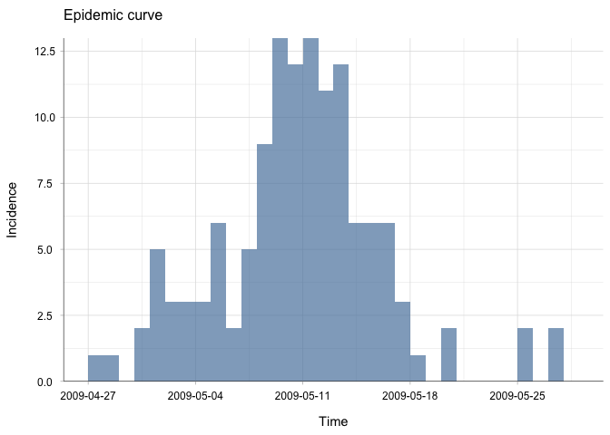
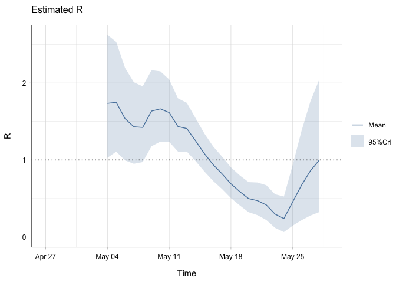
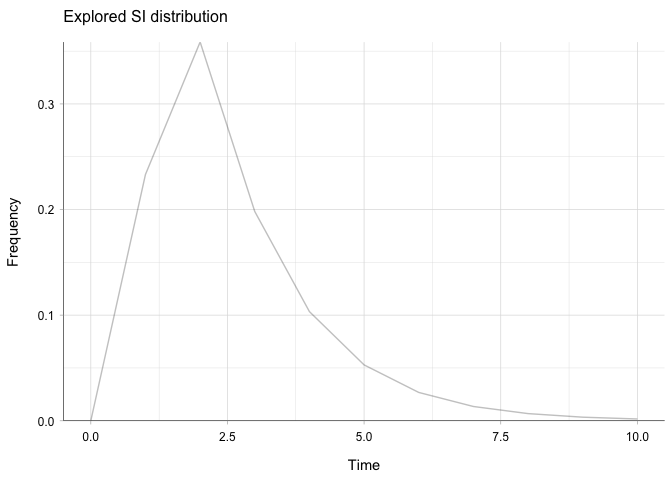
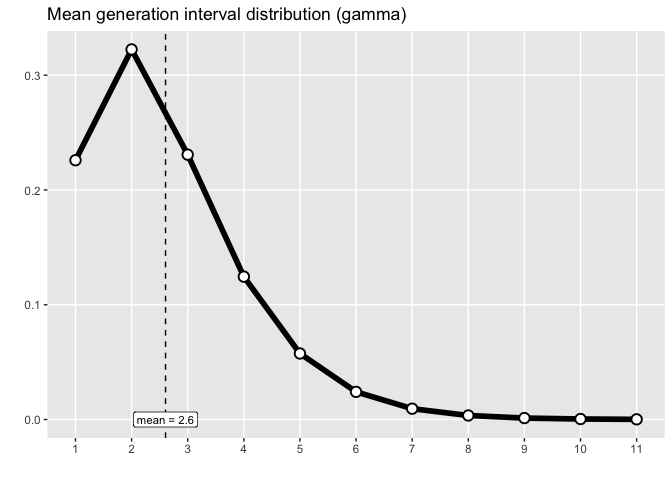
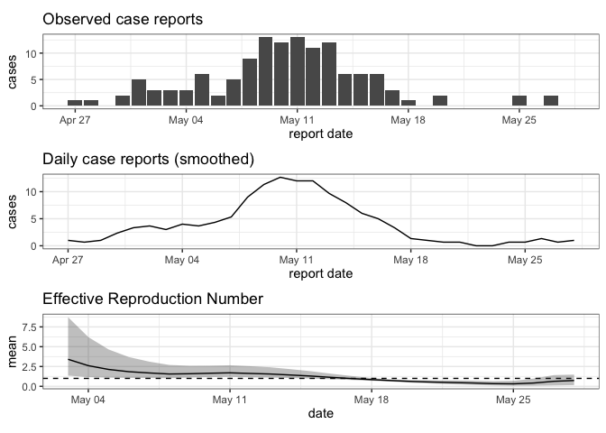
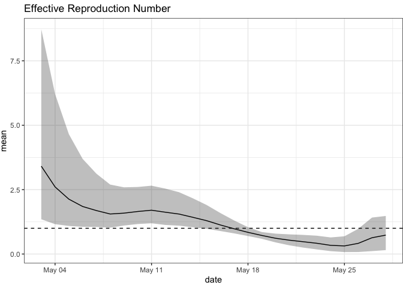
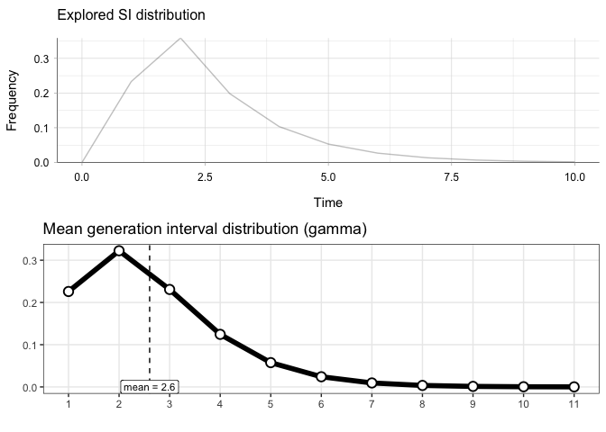
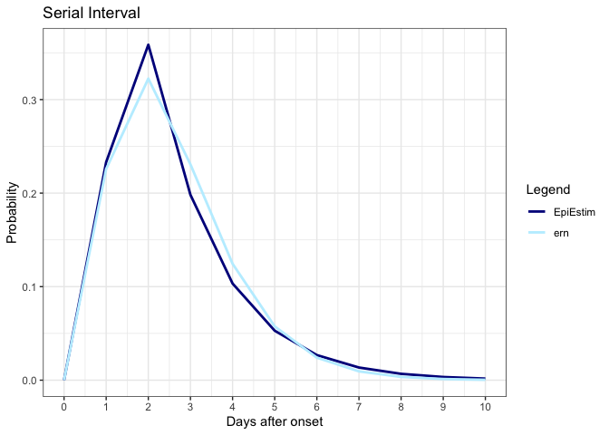
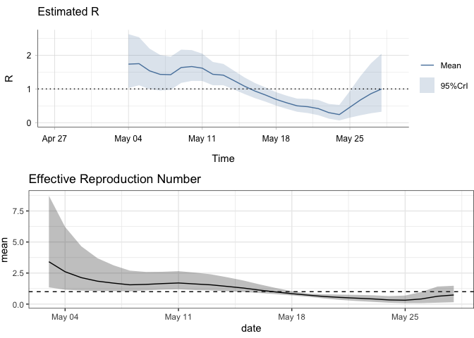
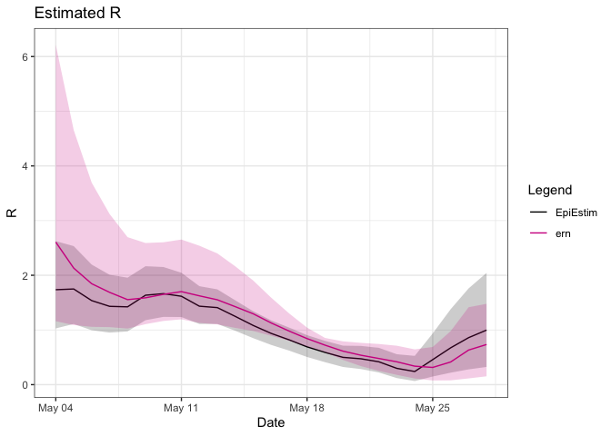

EpiEstim x ern testing
================
Christine Sangphet
2024-07-17

# **EpiEstim x ern**

``` r
#load environment

library(EpiEstim)
library(ggplot2)
library(incidence)
library(ern)
```

    ## 
    ## ern version: 2.0.0 
    ## 
    ## If not already installed, software JAGS is recommended. 
    ## (https://sourceforge.net/projects/mcmc-jags/files/)

``` r
#load data

data(Flu2009)
```

### **Estimations with EpiEstim**

``` r
res_parametric_si <- estimate_R(Flu2009$incidence, 
                                method="parametric_si",
                                config = make_config(list(
                                  mean_si = 2.6, 
                                  std_si = 1.5))
)
```

    ## Default config will estimate R on weekly sliding windows.
    ##     To change this change the t_start and t_end arguments.

``` r
plot(res_parametric_si, "incid")
```

    ## Warning: The `guide` argument in `scale_*()` cannot be `FALSE`. This was deprecated in
    ## ggplot2 3.3.4.
    ## ℹ Please use "none" instead.
    ## ℹ The deprecated feature was likely used in the incidence package.
    ##   Please report the issue at <https://github.com/reconhub/incidence/issues>.
    ## This warning is displayed once every 8 hours.
    ## Call `lifecycle::last_lifecycle_warnings()` to see where this warning was
    ## generated.

<!-- -->

``` r
plot(res_parametric_si, "R")
```

<!-- -->

``` r
plot(res_parametric_si, "SI")
```

<!-- -->

### **Estimations with ern**

#### **SI**

``` r
Flu2009$si_distr
```

    ##  [1] 0.000 0.233 0.359 0.198 0.103 0.053 0.027 0.014 0.007 0.003 0.002 0.001

``` r
si_distr <- c(0.000, 0.233, 0.359, 0.198, 0.103, 0.053, 0.027, 0.014, 0.007, 0.003, 0.002, 0.001)

# Create a vector of possible serial intervals (assuming the serial intervals are from 0 to length(si_distr) - 1)

intervals <- seq_along(si_distr) - 1

# Create a dataset with repeated intervals based on their weights

repeated_intervals <- rep(intervals, times = round(si_distr * 1000))

# Fit a gamma distribution to the repeated intervals

library(MASS) #for the code fitdistr

fit <- fitdistr(repeated_intervals, "gamma")

shape_si <- fit$estimate["shape"]
rate_si <- fit$estimate["rate"]

# Calculate the mean and standard deviation of the gamma distribution

mean_si <- shape_si / rate_si
mean_sd_si <- sqrt(shape_si) / rate_si

# Calculate the standard deviation of the shape (using the standard error from the fit)

shape_sd_si <- fit$sd["shape"]

# The maximum value in the serial interval distribution

max_si <- max(intervals[si_distr > 0])

# Print the results

cat("Mean SI:", mean_si, "\n")
```

    ## Mean SI: 2.595999

``` r
cat("Standard Deviation SI:", mean_sd_si, "\n")
```

    ## Standard Deviation SI: 1.414583

``` r
cat("Shape SI:", shape_si, "\n")
```

    ## Shape SI: 3.367848

``` r
cat("Rate SI:", rate_si, "\n")
```

    ## Rate SI: 1.297323

``` r
cat("Shape SD SI:", shape_sd_si, "\n")
```

    ## Shape SD SI: 0.1437798

``` r
cat("Maximum SI:", max_si, "\n")
```

    ## Maximum SI: 11

``` r
# define generation interval

dist.gi = ern::def_dist(
  dist     = "gamma",
  mean     = 2.6,
  mean_sd  = 1.5,
  shape    = 3.4,
  shape_sd = 0.2,
  max      = 11
)

plot_dist(dist.gi) + labs(title = paste0("Mean generation interval distribution (", dist.gi$dist, ")"))
```

<!-- -->

#### **R**

``` r
dat_Epi <- Flu2009$incidence

# Change column names
colnames(dat_Epi) <- c("date", "value")

dat_Epi
```

    ##          date value
    ## 1  2009-04-27     1
    ## 2  2009-04-28     1
    ## 3  2009-04-29     0
    ## 4  2009-04-30     2
    ## 5  2009-05-01     5
    ## 6  2009-05-02     3
    ## 7  2009-05-03     3
    ## 8  2009-05-04     3
    ## 9  2009-05-05     6
    ## 10 2009-05-06     2
    ## 11 2009-05-07     5
    ## 12 2009-05-08     9
    ## 13 2009-05-09    13
    ## 14 2009-05-10    12
    ## 15 2009-05-11    13
    ## 16 2009-05-12    11
    ## 17 2009-05-13    12
    ## 18 2009-05-14     6
    ## 19 2009-05-15     6
    ## 20 2009-05-16     6
    ## 21 2009-05-17     3
    ## 22 2009-05-18     1
    ## 23 2009-05-19     0
    ## 24 2009-05-20     2
    ## 25 2009-05-21     0
    ## 26 2009-05-22     0
    ## 27 2009-05-23     0
    ## 28 2009-05-24     0
    ## 29 2009-05-25     2
    ## 30 2009-05-26     0
    ## 31 2009-05-27     2
    ## 32 2009-05-28     0

``` r
#ern requires the following arguments to estimate R:
#reporting delay
#reporting fraction
#incubation period 
#generation interval (already determined)

#daily reporting inference 
#daily inferred reports
#Rt settings 
```

``` r
#simulate data


set.seed(123) 

n <- nrow(Flu2009$incidence) #number of data 

sim.repdelay <- rgamma(n, shape = 2, rate = 5) #gamma distribution

sim.repfrac <- runif(n, min = 0.1, max = 0.3) #uniform distribution

sim.incubation <- rgamma(n, shape = 2, rate = 5) #gamma distribution
```

``` r
# Define reporting delay distribution using simulated data

dist.repdelay <- ern::def_dist(
  dist = 'gamma',
  mean = mean(sim.repdelay), # Mean of the simulated reporting delay
  mean_sd = sd(sim.repdelay), # Standard deviation of the mean
  sd = sqrt(mean(sim.repdelay)), # Standard deviation of the gamma distribution (scale parameter)
  sd_sd = sd(sim.repdelay) / 2, # Standard deviation of the standard deviation
  max = max(sim.repdelay) # Maximum value for the distribution
)

# Define reporting fraction distribution using simulated data

dist.repfrac <- ern::def_dist(
  dist = "unif",
  min = min(sim.repfrac), # Minimum value of the simulated reporting fraction
  max = max(sim.repfrac) # Maximum value of the simulated reporting fraction
)

# Define incubation period distribution using simulated data

dist.incub <- ern::def_dist(
  dist = "gamma",
  mean = mean(sim.incubation), # Mean of the simulated incubation period
  mean_sd = sd(sim.incubation), # Standard deviation of the mean
  shape = 2, # Shape parameter of the gamma distribution (fixed in your case)
  shape_sd = 0.1, # Standard deviation of the shape parameter
  max = max(sim.incubation) # Maximum value for the distribution
)
```

``` r
# settings for daily report inference
prm.daily = list(
  method = "renewal",
  popsize = 1000,
  burn = 1000,
  iter = 3000,
  chains = 3,
  prior_R0_shape = 2,
  prior_R0_rate = 0.5,
  prior_alpha_shape = 1,
  prior_alpha_rate = 0.5
)

# settings for checks of daily inferred reports
prm.daily.check = list(
  agg.reldiff.tol = NULL
)

# smoothing settings for daily inferred reports
prm.smooth = list(
  method = "rollmean",
  window = 3,
  align = 'center'
)

# Rt settings
prm.R = list(
  iter = 10, # number of iterations in Rt ensemble
  CI = 0.95, # 95% confidence interval
  window = 7, # time window for each Rt estimate
  config.EpiEstim = NULL
)
```

``` r
# Estimating the reproduction number
r.estim <- estimate_R_cl(
  cl.data = dat_Epi,
  dist.repdelay = dist.repdelay,
  dist.repfrac = dist.repfrac,
  dist.incub = dist.incub,
  dist.gi = dist.gi,
  prm.daily = prm.daily,
  prm.daily.check = prm.daily.check,
  prm.smooth = prm.smooth,
  prm.R = prm.R,
  silent = TRUE # suppress output messages
)

# Display the estimated reproduction number
print(r.estim)
```

    ## $cl.data
    ##          date value
    ## 1  2009-04-27     1
    ## 2  2009-04-28     1
    ## 3  2009-04-29     0
    ## 4  2009-04-30     2
    ## 5  2009-05-01     5
    ## 6  2009-05-02     3
    ## 7  2009-05-03     3
    ## 8  2009-05-04     3
    ## 9  2009-05-05     6
    ## 10 2009-05-06     2
    ## 11 2009-05-07     5
    ## 12 2009-05-08     9
    ## 13 2009-05-09    13
    ## 14 2009-05-10    12
    ## 15 2009-05-11    13
    ## 16 2009-05-12    11
    ## 17 2009-05-13    12
    ## 18 2009-05-14     6
    ## 19 2009-05-15     6
    ## 20 2009-05-16     6
    ## 21 2009-05-17     3
    ## 22 2009-05-18     1
    ## 23 2009-05-19     0
    ## 24 2009-05-20     2
    ## 25 2009-05-21     0
    ## 26 2009-05-22     0
    ## 27 2009-05-23     0
    ## 28 2009-05-24     0
    ## 29 2009-05-25     2
    ## 30 2009-05-26     0
    ## 31 2009-05-27     2
    ## 32 2009-05-28     0
    ## 
    ## $cl.daily
    ## # A tibble: 32 × 4
    ##       id date       value     t
    ##    <int> <date>     <dbl> <int>
    ##  1     1 2009-04-27 1         1
    ##  2     1 2009-04-28 0.667     2
    ##  3     1 2009-04-29 1         3
    ##  4     1 2009-04-30 2.33      4
    ##  5     1 2009-05-01 3.33      5
    ##  6     1 2009-05-02 3.67      6
    ##  7     1 2009-05-03 3         7
    ##  8     1 2009-05-04 4         8
    ##  9     1 2009-05-05 3.67      9
    ## 10     1 2009-05-06 4.33     10
    ## # ℹ 22 more rows
    ## 
    ## $inferred.agg
    ## NULL
    ## 
    ## $R
    ## # A tibble: 27 × 5
    ##    date        mean   lwr   upr use  
    ##    <date>     <dbl> <dbl> <dbl> <lgl>
    ##  1 2009-05-03  3.41  1.35  8.72 FALSE
    ##  2 2009-05-04  2.61  1.16  6.21 FALSE
    ##  3 2009-05-05  2.13  1.09  4.65 FALSE
    ##  4 2009-05-06  1.85  1.06  3.69 FALSE
    ##  5 2009-05-07  1.69  1.05  3.12 FALSE
    ##  6 2009-05-08  1.55  1.03  2.70 FALSE
    ##  7 2009-05-09  1.59  1.11  2.59 FALSE
    ##  8 2009-05-10  1.65  1.17  2.60 FALSE
    ##  9 2009-05-11  1.70  1.19  2.65 FALSE
    ## 10 2009-05-12  1.62  1.13  2.54 FALSE
    ## # ℹ 17 more rows
    ## 
    ## $diagnostic.mcmc
    ## NULL

``` r
g = plot_diagnostic_cl(r.estim)
plot(g)
```

<!-- -->

``` r
print(g[[3]])
```

<!-- -->

### Comparison of SI estimation

#### Side-by-side

``` r
# Plot for res_parametric_si
plot1 <- plot(res_parametric_si, "SI")

# Plot for dist.gi
plot2 <- plot_dist(dist.gi) +
  labs(title = paste0("Mean generation interval distribution (", dist.gi$dist, ")"))

library(cowplot)

plot_grid(plot1, plot2, ncol = 1)
```

<!-- -->

#### overlaying

``` r
#turn epiestim SI into dataframe

si_data <- data.frame(si_distr = res_parametric_si$si_distr[0:11],
                      time = 0:10)

#create dataframe for gamma distribution dist.gi

time_values <- 0:10
gamma_values <- dgamma(time_values, shape = dist.gi$shape, scale = dist.gi$mean / dist.gi$shape)

dist_gi_data <- data.frame(time = time_values, gi_distr = gamma_values)


#combine the plots

plot <- ggplot() +
 geom_line(data = si_data, aes(x = time, y = si_distr, color = "EpiEstim"), size = 1) +
  geom_line(data = dist_gi_data, aes(x = time, y = gi_distr, color = "ern"), size = 1) +
  scale_color_manual(name = "Legend", values = c("EpiEstim" = "blue4", "ern" = "lightblue1")) +
  scale_x_continuous(breaks = 0:10) +
  theme_bw() +
  labs(title = "Serial Interval",
       x = "Days after onset",
       y = "Probability")
```

    ## Warning: Using `size` aesthetic for lines was deprecated in ggplot2 3.4.0.
    ## ℹ Please use `linewidth` instead.
    ## This warning is displayed once every 8 hours.
    ## Call `lifecycle::last_lifecycle_warnings()` to see where this warning was
    ## generated.

``` r
plot
```

<!-- -->

``` r
#scale_color_manual function can only be used once with a complete set of values for all colorw.otherwise it will override previous settings
```

### Comparison with R estimations

#### Side-by-side

``` r
plot3 <- plot(res_parametric_si, "R")

plot4 <- (g[[3]])

library(cowplot)

plot_grid(plot3, plot4, ncol = 1)
```

<!-- -->

#### Overlaying

``` r
#turn epiestim R into a dataframe 

names(res_parametric_si$R)
```

    ##  [1] "t_start"           "t_end"             "Mean(R)"          
    ##  [4] "Std(R)"            "Quantile.0.025(R)" "Quantile.0.05(R)" 
    ##  [7] "Quantile.0.25(R)"  "Median(R)"         "Quantile.0.75(R)" 
    ## [10] "Quantile.0.95(R)"  "Quantile.0.975(R)"

``` r
r_data <- data.frame(
  t = Flu2009$incidence$dates[8:32],
  mean_r = c(res_parametric_si$R$`Mean(R)`),
  quantile_0_025_r = c(res_parametric_si$R$`Quantile.0.025(R)`),
  quantile_0_975_r = c(res_parametric_si$R$`Quantile.0.975(R)`)
)

#dataframe for ern

ern_data <- data.frame(
  ern_t = g[[3]]$data$date[2:26],
  ern_mean = c(g[[3]]$data$mean[2:26]),
  ern_lwr = c(g[[3]]$data$lwr[2:26]),
  ern_upr = c(g[[3]]$data$upr[2:26])
)

#combine 

plot2 <- ggplot() +
  geom_line(data = r_data, aes(x = t, y = mean_r, color = "EpiEstim")) +
  geom_ribbon(data = r_data, aes(x = t, ymin = quantile_0_025_r, ymax = quantile_0_975_r), alpha = 0.2, fill = "black") +
  geom_line(data = ern_data, aes(x = ern_t, y = ern_mean, color = "ern")) + 
  geom_ribbon(data = ern_data, aes(x = ern_t, ymin = ern_lwr, ymax = ern_upr), alpha = 0.2, fill = "violetred") +
   scale_color_manual(name = "Legend", values = c("EpiEstim" = "black", "ern" = "violetred")) +
  theme_bw() +
  labs(title = "Estimated R",
       x = "Date",
       y = "R")
plot2
```

<!-- -->
