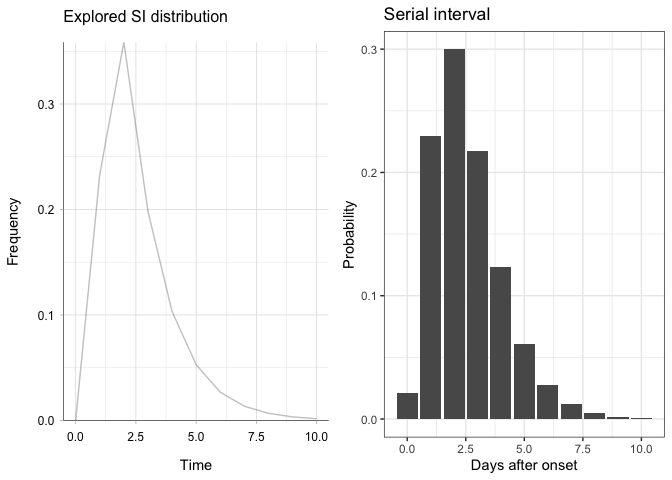
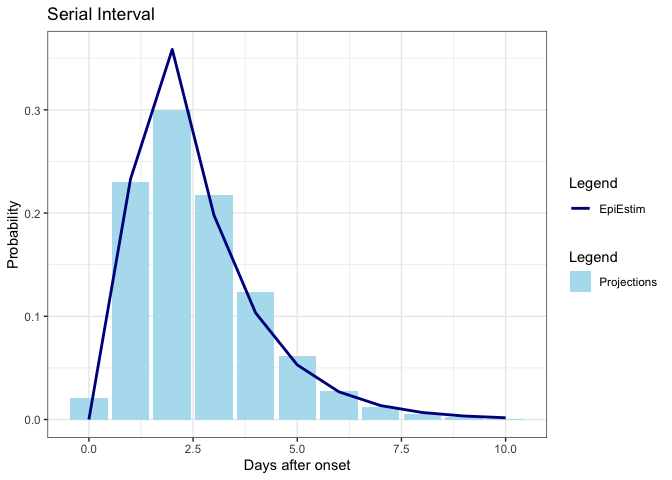

EpiEstim x projections testing
================
Christine Sangphet
2024-07-13

# EpiEstim x projections

``` r
#load environment 

library(EpiEstim)
library(ggplot2)
library(incidence)
library(outbreaks)
```

``` r
#load data

data(Flu2009)
```

### SI estimation with EpiEstim

``` r
res_parametric_si <- estimate_R(Flu2009$incidence, 
                                method="parametric_si",
                                config = make_config(list(
                                  mean_si = 2.6, 
                                  std_si = 1.5))
)
```

    ## Default config will estimate R on weekly sliding windows.
    ##     To change this change the t_start and t_end arguments.

``` r
plot(res_parametric_si, "SI")
```

<!-- -->

### SI estimation with projections

``` r
i <- (as.incidence(Flu2009$incidence$I, dates = Flu2009$incidence$dates))

plot(i) +
  theme_bw()
```

    ## Warning: The `guide` argument in `scale_*()` cannot be `FALSE`. This was deprecated in
    ## ggplot2 3.3.4.
    ## ℹ Please use "none" instead.
    ## ℹ The deprecated feature was likely used in the incidence package.
    ##   Please report the issue at <https://github.com/reconhub/incidence/issues>.
    ## This warning is displayed once every 8 hours.
    ## Call `lifecycle::last_lifecycle_warnings()` to see where this warning was
    ## generated.

<!-- -->

``` r
#create a serial interval

library(distcrete)
library(epitrix)

mu <- 2.6
sigma <- 1.5
cv <- sigma / mu
params <- gamma_mucv2shapescale(mu, cv)
params
```

    ## $shape
    ## [1] 3.004444
    ## 
    ## $scale
    ## [1] 0.8653846

``` r
si <- distcrete("gamma", shape = params$shape,
                scale = params$scale,
                interval = 1, w = 0.5)
si
```

    ## A discrete distribution
    ##   name: gamma
    ##   parameters:
    ##     shape: 3.00444444444445
    ##     scale: 0.865384615384615

``` r
si_df <- data.frame(t = 0:10,
                    p = si$d(0:10))
ggplot(si_df, aes(x = t, y = p)) +
   theme_bw() +
  geom_col() +
  labs(title = "Serial interval",
       x = "Days after onset",
       y = "Probability")
```

<!-- -->

### Side-by-side comparison of SI estimation

``` r
library(cowplot)

plot1 <- plot(res_parametric_si,"SI")

plot2 <- ggplot(si_df, aes(x = t, y = p)) +
   theme_bw() +
  geom_col() +
  labs(title = "Serial interval",
       x = "Days after onset",
       y = "Probability")

plot_grid(plot1, plot2, ncol = 2)
```

<!-- -->

### Overlaying comparison of SI estimation

``` r
#turn epiestim SI into dataframe

si_data <- data.frame(si_distr = res_parametric_si$si_distr[0:11],
                      time = 0:10)

# Create the plot

plot <- ggplot(si_df, aes(x = t, y = p)) +
  geom_col(aes(fill = "projections")) + 
  geom_line(data = si_data, aes(x = time, y = si_distr, color = "EpiEstim"), size = 1) + 
  scale_fill_manual(name = "Legend", values = "lightblue2", labels = "Projections") +
  scale_color_manual(name = "Legend", values = "blue4", labels = "EpiEstim") +
  theme_bw() +
  labs(title = "Serial Interval",
       x = "Days after onset",
       y = "Probability")
```

    ## Warning: Using `size` aesthetic for lines was deprecated in ggplot2 3.4.0.
    ## ℹ Please use `linewidth` instead.
    ## This warning is displayed once every 8 hours.
    ## Call `lifecycle::last_lifecycle_warnings()` to see where this warning was
    ## generated.

``` r
plot
```

<!-- -->

NOTE: projections uses other packages when estimating for SI (discrete,
epitrix). projections specializes in projecting future incidences, which
we are not testing in this part of the research. with that, the
estimations of SI for epitrix and projections will be the same
