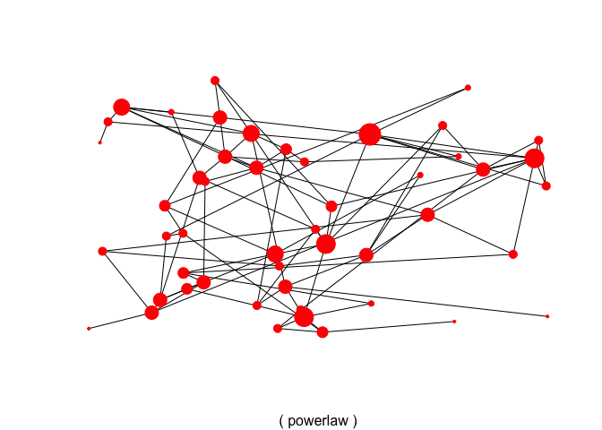
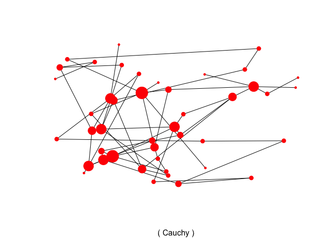
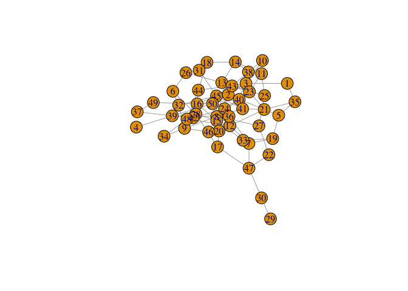
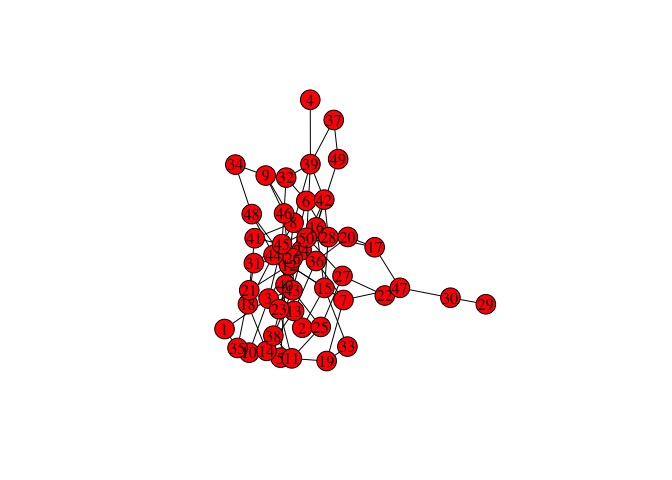
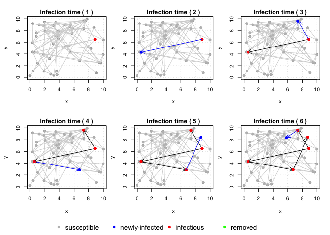
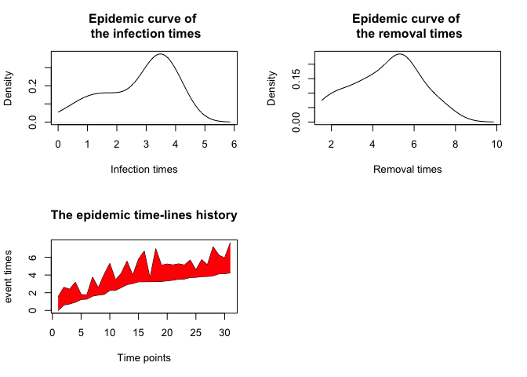
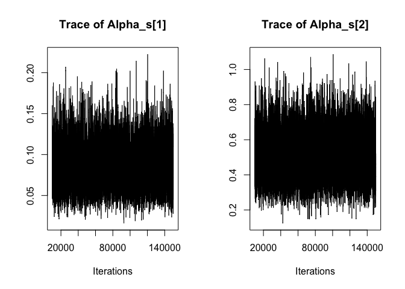

EpiILMCT Testing
================
Christine Sangphet
2024-07-06

``` r
#load environment 

library(EpiILMCT)
```

    ## Loading required package: coda

    ## Loading required package: parallel

# Simulation

### Contact networking: Different types of undirected unweighted contact networks can be generated through the function ***contactnet***

``` r
set.seed(22)

#to generate the XY coordinates of 50 individuals:

loc<- matrix(cbind(runif(50, 0, 10),runif(50, 0, 10)), ncol = 2, nrow = 50)
```

``` r
#power-law spatial contact network

net1<- contactnet(type = "powerlaw", location = loc, beta = 1.5, 
    nu = 0.5)
plot(net1)
```

<!-- -->

``` r
#Cauchy spatial contact network

net2<- contactnet(type = "Cauchy", location = loc, beta = 0.5)
plot(net2)
```

<!-- -->

``` r
#random contact network

net3<- contactnet(type = "random", num.id = 50, beta = 0.08)
plot(net3)  # the default options in igraph package.
```

<!-- -->

``` r
plot(net3, vertex.color = "red", vertex.size = 15, edge.color = "black",
vertex.label.cex = 1, vertex.label.color = "black") 
```

<!-- -->

### Epidemic data: The function ***datagen*** allows the user to generate epidemics from the continuous time ILMs under the SIR or SINR compartmental frameworks

``` r
set.seed(91938)

# To simulate the XY coordinate of 50 individuals and their corresponding binary covariate values:

loc <- matrix(cbind(runif(50, 0, 10), runif(50, 0, 10)), ncol = 2, nrow = 50)
cov <- cbind(rep(1, 50), rbinom(50, 1, 0.5))

# To simulate the contact network:

net <- contactnet(type = "powerlaw", location = loc, beta = 1.8, nu = 1)

# To simulate the epidemic:

epi <- datagen(type = "SIR", kerneltype = "network", kernelmatrix = net, suspar = c(0.08, 0.5), delta = c(4, 2), 
   suscov = cov)
```

``` r
plot(epi, plottype = "propagation", time.index = seq_len(6))
```

<!-- -->

``` r
plot(epi, plottype = "history")
```

<!-- -->

### Analyzing

``` r
#The following commands are to perform the MCMC for analyzing the above epidemic data set using the epictmcmc function

suscov <- list(NULL)
suscov[[1]] <- list(c(0.01, 0.1), matrix(c("gamma", "gamma", 1, 1, 0.1, 0.1, 0.5, 1), ncol = 4, nrow = 2))
suscov[[2]] <- cov
mcmc1 <- epictmcmc(object = epi, datatype = "known epidemic", nsim = 150000, control.sus = suscov)
```

    ## ************************************************ 
    ## Start performing MCMC for the  known epidemic  SIR ILM for 
    ## 150000 iterations 
    ## ************************************************

``` r
#The estimates of the model parameters can be then obtained either through using S3 summary function of the epictmcmc for the mcmc1, or using the summary function of coda package for mcmc1$parameter.samples

#The posterior means and 95% credible intervals of the model parameters using the former summary can be obtained via the following command

summary(mcmc1, start = 10000)
```

    ## 
    ## ********************************************************* 
    ## Model: SIR network-based continuous-time ILM 
    ## Method: Markov chain Monte Carlo (MCMC) 
    ## Data assumption: fully observed epidemic 
    ## number.chains : 1 chains 
    ## number.iteration : 140000 iterations 
    ## number.parameter : 2 parameters 
    ## 
    ## ********************************************************* 
    ## 
    ## 
    ##  1. Empirical mean and standard deviation for each variable,
    ## plus standard error of the mean:
    ##                 Mean        SD    Naive SE Time-series SE
    ## Alpha_s[1] 0.0851393 0.0268787 7.18362e-05    0.000279848
    ## Alpha_s[2] 0.5090538 0.1284466 3.43287e-04    0.000936706
    ## 
    ## 
    ## 
    ##  2. Quantiles for each variable:
    ##                 2.5%       25%       50%      75%    97.5%
    ## Alpha_s[1] 0.0409208 0.0656406 0.0825226 0.101275 0.144555
    ## Alpha_s[2] 0.2820138 0.4187457 0.4997392 0.590065 0.783330
    ## 
    ## 
    ## 
    ##  3. Empirical mean, standard deviation, and quantiles for the log likelihood,
    ##           Mean             SD       Naive SE Time-series SE 
    ##   -55.80474998     1.01640137     0.00271644     0.00958428 
    ## 
    ##     2.5%      25%      50%      75%    97.5% 
    ## -58.5354 -56.1984 -55.4910 -55.0804 -54.8096 
    ## 
    ## 
    ## 
    ##  4. acceptance.rate : 
    ## Alpha_s[1] Alpha_s[2] 
    ##   0.112127   0.223155

``` r
#The MCMC trace plots for the model parameters can be produced using the S3 method plot.epictmcmc as follows

plot(mcmc1, plottype = "parameter", start = 10000, thin = 10, density = FALSE)
```

<!-- -->
