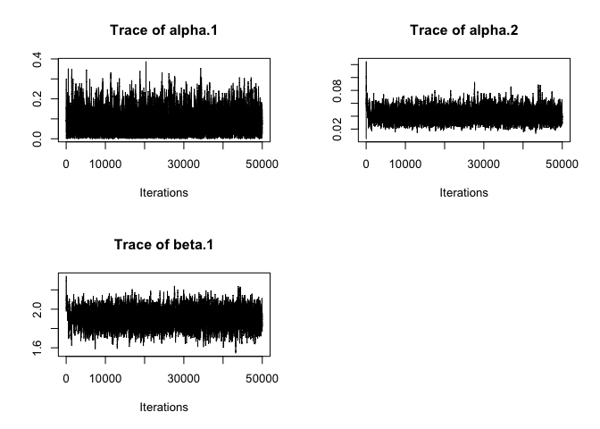

EpiILM Testing
================
Christine Sangphet
2024-07-06

``` r
#load environment

library(EpiILM)
```

    ## Loading required package: coda

    ## Loading required package: adaptMCMC

    ## Loading required package: parallel

    ## Loading required package: Matrix

    ## Loading required package: LaplacesDemon

``` r
# install.packages("devtools")

devtools::install_github("waleedalmutiry/EpiILMCT-package")
```

    ## Downloading GitHub repo waleedalmutiry/EpiILMCT-package@HEAD

    ## 
    ## ── R CMD build ─────────────────────────────────────────────────────────────────
    ##      checking for file ‘/private/var/folders/kz/vb4s2bzd5m59rdxjpt9vyk_h0000gn/T/Rtmpxb7Rmw/remotesfb0d3db4bb39/waleedalmutiry-EpiILMCT-63037c9/DESCRIPTION’ ...  ✔  checking for file ‘/private/var/folders/kz/vb4s2bzd5m59rdxjpt9vyk_h0000gn/T/Rtmpxb7Rmw/remotesfb0d3db4bb39/waleedalmutiry-EpiILMCT-63037c9/DESCRIPTION’
    ##   ─  preparing ‘EpiILMCT’:
    ##    checking      checking DESCRIPTION meta-information ...  ✔  checking DESCRIPTION meta-information
    ##   ─  cleaning src
    ##   ─  checking for LF line-endings in source and make files and shell scripts
    ##   ─  checking for empty or unneeded directories
    ##   ─  looking to see if a ‘data/datalist’ file should be added
    ##   ─  building ‘EpiILMCT_1.1.6.tar.gz’
    ##      
    ## 

    ## Warning in i.p(...): installation of package
    ## '/var/folders/kz/vb4s2bzd5m59rdxjpt9vyk_h0000gn/T//Rtmpxb7Rmw/filefb0d515bbcca/EpiILMCT_1.1.6.tar.gz'
    ## had non-zero exit status

# Spacial-based ILMs

``` r
#We start with generating the XY coordinates of 256 individuals coordinates uniformly across a 10 by 10 unit square area. This simulated population is for illustrative purposes, the population data usually being imported for real problems

set.seed(789)

# generating the XY coordinates of individuals:

x  <-  runif(256,  0, 100)
y  <-  runif(256,  0, 100)
```

``` r
#We consider the SI spatial-based ILMs with one susceptibility covariate and no transmissibility covariates to be simulated from. First, let us generate a susceptibility covariate

A <- round(rexp(256, 1/100))
```

``` r
#We can then generate the epidemic with two susceptibility parameters (sus.par), and one spatial parameter (beta)

out_cov <- epidata(type = "SI", n = 256, tmax = 10, x = x, y = y, 
    Sformula = ~A, sus.par = c(0.01, 0.05), beta = 2)
out_cov
```

    ## $type
    ## [1] "SI"
    ## 
    ## $XYcoordinates
    ##                 x           y
    ##   [1,] 69.9894364 45.35804866
    ##   [2,]  9.3498873 86.67553877
    ##   [3,]  1.1886818 61.74645401
    ##   [4,] 59.1606354 28.26118621
    ##   [5,] 49.2149437  9.89135392
    ##   [6,]  2.0163575 67.31158381
    ##   [7,] 57.2655877 69.35193231
    ##   [8,] 16.5764092 36.32766185
    ##   [9,] 35.8918359  6.24174736
    ##  [10,] 34.6263274 84.33721098
    ##  [11,] 31.4021208 58.60576495
    ##  [12,] 50.7489205 21.69593556
    ##  [13,] 25.2605546 50.68065366
    ##  [14,] 46.5857091  2.40163752
    ##  [15,] 43.0748338  2.33005416
    ##  [16,]  1.8364625 89.63283054
    ##  [17,] 15.6017863 23.62141430
    ##  [18,] 64.5234174  5.00806314
    ##  [19,] 77.0257779 71.45717442
    ##  [20,] 11.1212977 69.97341556
    ##  [21,] 34.3732989 47.48274498
    ##  [22,] 44.7346076 85.38171561
    ##  [23,] 15.7983432 99.88632903
    ##  [24,] 30.3173935  3.23644960
    ##  [25,] 42.9471753 13.10062290
    ##  [26,] 51.7349632 92.99237845
    ##  [27,] 31.2810495  3.39174003
    ##  [28,] 49.6274081 92.09704355
    ##  [29,] 82.3272193 45.14711420
    ##  [30,] 50.2763130 85.95235273
    ##  [31,] 21.9339688 72.36319047
    ##  [32,] 27.7707120 23.84959529
    ##  [33,] 66.3805354 39.57187249
    ##  [34,] 48.9618775 48.63129831
    ##  [35,] 27.1937605 20.89049432
    ##  [36,] 43.6466186 97.88488615
    ##  [37,] 58.2922242 69.49612242
    ##  [38,] 28.2622587 35.35305050
    ##  [39,] 21.8479928 88.32018871
    ##  [40,] 74.1040006 31.46509370
    ##  [41,] 24.1323955 96.80576480
    ##  [42,] 78.7594132 69.62588136
    ##  [43,] 75.2844783 25.20960919
    ##  [44,] 99.7994978 94.71146944
    ##  [45,] 19.5532507 29.07243215
    ##  [46,] 16.4692949 76.66248095
    ##  [47,] 64.3474207 31.71415268
    ##  [48,] 92.1318011 42.59631773
    ##  [49,]  7.6402709 57.41371596
    ##  [50,] 74.5296489 77.42757422
    ##  [51,] 30.4211851 91.78809728
    ##  [52,]  3.6477714 72.37479591
    ##  [53,] 39.4307179 22.19183131
    ##  [54,] 92.8485512 28.49716113
    ##  [55,] 42.1040586 55.87928484
    ##  [56,] 92.0166038 27.15692266
    ##  [57,] 80.4159894 34.37926809
    ##  [58,] 54.9303324 78.59538987
    ##  [59,] 43.3767893 25.17772343
    ##  [60,] 29.4972721 58.32516947
    ##  [61,] 35.3580540 46.86690960
    ##  [62,] 70.4465982 75.98493781
    ##  [63,] 12.8192505 76.11932762
    ##  [64,] 66.7283750 78.36857659
    ##  [65,] 72.8842084 86.09935318
    ##  [66,] 75.0277337  1.87606593
    ##  [67,] 71.4253929 34.71360093
    ##  [68,] 76.2605182 91.61547953
    ##  [69,] 23.0850566 21.14048591
    ##  [70,] 28.7833302 30.25107607
    ##  [71,] 14.4901953 49.23587695
    ##  [72,] 77.5871430 19.62813085
    ##  [73,]  9.3774543 87.24595865
    ##  [74,] 18.0501212 91.77761488
    ##  [75,] 41.9024458  8.08330213
    ##  [76,] 39.8898094 12.36903581
    ##  [77,] 27.3790485  4.86347987
    ##  [78,] 50.6047638 67.27926026
    ##  [79,] 74.5566399 24.88492897
    ##  [80,] 88.4832138 38.34312907
    ##  [81,] 43.4594060 93.70288725
    ##  [82,] 57.9822081 32.00739622
    ##  [83,] 96.0756319 51.43448391
    ##  [84,] 81.0617425 20.53057004
    ##  [85,] 94.6524117  7.79364088
    ##  [86,] 32.8678212 91.08496152
    ##  [87,] 78.9070021 31.14949637
    ##  [88,] 82.9891892 17.75460879
    ##  [89,] 89.7106493 54.41540005
    ##  [90,]  8.0423875 33.06216293
    ##  [91,] 69.5315649 97.63382613
    ##  [92,] 11.5257644 27.27938059
    ##  [93,]  0.1008831 89.26159809
    ##  [94,]  2.1108637 84.70281963
    ##  [95,] 68.2331741 20.29624789
    ##  [96,] 26.0801320 67.25598811
    ##  [97,] 73.4307765 59.44684797
    ##  [98,] 56.6916468 96.70432992
    ##  [99,] 83.6747179  1.36000041
    ## [100,] 27.1179813 63.03928767
    ## [101,] 48.0973741  2.90159027
    ## [102,] 31.4067703 83.96585346
    ## [103,]  6.4303898 69.79825585
    ## [104,] 89.0268426 18.18227277
    ## [105,] 78.6674762 95.48159796
    ## [106,] 16.3612837 77.14166364
    ## [107,] 44.2658436 47.29178709
    ## [108,] 42.9073575 87.22411369
    ## [109,] 23.9939274 75.36761928
    ## [110,] 48.0717396 33.55615304
    ## [111,] 72.9305026  6.75372372
    ## [112,] 62.7379564 94.39475008
    ## [113,] 86.1052825 67.83715652
    ## [114,] 43.1942185 87.13164884
    ## [115,] 23.8433923 93.65980062
    ## [116,] 11.6288023 53.86841770
    ## [117,] 87.6218324 49.33743414
    ## [118,] 37.7570311 98.30567744
    ## [119,] 89.1689435 27.09085525
    ## [120,] 64.6699490 88.62432393
    ## [121,] 37.3553893 49.39939354
    ## [122,] 98.7663090 82.68007617
    ## [123,] 76.8152284 38.82038919
    ## [124,] 71.0153073 92.67820052
    ## [125,] 38.6853715 16.36405759
    ## [126,] 83.3626929 18.63576306
    ## [127,] 99.0575734 18.24438146
    ## [128,] 76.2865062 96.12473797
    ## [129,] 63.5953743  7.29382802
    ## [130,] 16.4658475 75.19791182
    ## [131,] 36.4856438 95.10465425
    ## [132,] 62.6866641 85.28700280
    ## [133,] 18.3363777 84.88578473
    ## [134,] 24.6133753 97.39454440
    ## [135,] 34.6843823 84.72820523
    ## [136,] 78.3765875  8.70012834
    ## [137,] 16.7575069 16.77022267
    ## [138,] 72.4023275  7.33349221
    ## [139,] 77.9144904 47.62010241
    ## [140,]  6.2071754 89.07142216
    ## [141,] 70.7015333  1.57065706
    ## [142,] 57.7025101 28.36618833
    ## [143,] 85.3076608 36.65525527
    ## [144,] 56.8566803  8.69655642
    ## [145,] 88.3533302  0.07847089
    ## [146,] 37.4605790 54.11858680
    ## [147,] 36.7604156  4.88849813
    ## [148,]  3.0896417 32.34363657
    ## [149,] 14.5064761 12.13557085
    ## [150,]  7.3415471 90.60655029
    ## [151,] 39.5752901 97.96610465
    ## [152,] 73.4634024 91.48297191
    ## [153,] 93.3417748 33.41075392
    ## [154,] 46.1552909 78.90227009
    ## [155,] 78.4558167 20.75465857
    ## [156,]  3.2485696 91.40296516
    ## [157,] 63.1074264 45.77537091
    ## [158,] 22.8799744 37.02931963
    ## [159,]  5.1842430 82.89255286
    ## [160,] 59.1936233 36.36720707
    ## [161,] 96.7805406  4.85071230
    ## [162,] 76.0166392 76.63299991
    ## [163,] 68.2582716 59.21330575
    ## [164,] 53.6670371 96.53786174
    ## [165,] 16.1767725 41.49852756
    ## [166,] 62.7292611 55.72031352
    ## [167,] 60.0971392 50.62917641
    ## [168,] 12.4126470 75.53219816
    ## [169,]  7.9134255 80.58035241
    ## [170,] 48.9089372 74.00763643
    ## [171,] 53.4998789 43.89270949
    ## [172,] 74.5455722 34.29915097
    ## [173,] 62.3464901 41.45776792
    ## [174,] 63.8062928 44.39575248
    ## [175,] 33.0396689 79.41692732
    ## [176,] 78.5518610 65.46908179
    ## [177,]  7.3525282 84.11433015
    ## [178,] 29.1767192 39.15929813
    ## [179,] 90.7203166  5.35358549
    ## [180,] 73.5052732 12.68446688
    ## [181,] 31.6361764 39.49141363
    ## [182,] 66.3448614 90.23640619
    ## [183,] 85.3723099 52.29309236
    ## [184,] 85.5828973 49.24667180
    ## [185,] 20.6941315 29.27779162
    ## [186,] 25.8594381 59.73880868
    ## [187,] 12.7781545 84.96450575
    ## [188,]  9.5954916 32.69246072
    ## [189,]  0.4399840 21.95560040
    ## [190,] 78.8236760 40.32378949
    ## [191,] 83.7880040  5.39152650
    ## [192,] 25.1197346  4.59022750
    ## [193,] 57.8642501 34.64588493
    ## [194,] 54.2487449 48.77704084
    ## [195,] 26.6550133 68.85199137
    ## [196,] 18.1004151 74.87736903
    ## [197,] 67.3651453  4.84588316
    ## [198,] 39.3798942 82.44095377
    ## [199,] 93.3091048 90.44860776
    ## [200,] 28.7517833 97.79228722
    ## [201,] 29.2652393 30.13096571
    ## [202,]  9.3545717 82.94384412
    ## [203,] 34.4958042 54.84603432
    ## [204,] 21.5373531 33.00906736
    ## [205,] 72.0854094 50.95986731
    ## [206,] 92.6973267 23.46419869
    ## [207,] 56.5080271 90.94560414
    ## [208,] 83.1100536  8.82513106
    ## [209,] 55.6075070 25.08762605
    ## [210,] 11.5184955 50.34030399
    ## [211,] 71.6265559 86.89815821
    ## [212,] 93.6111045 71.42148302
    ## [213,] 76.0311171 28.68987720
    ## [214,] 71.0490535 14.00231300
    ## [215,] 14.0930263 60.94451188
    ## [216,] 13.7841048 63.05131961
    ## [217,] 75.3257561 79.48159904
    ## [218,] 37.0313359 13.24594750
    ## [219,] 43.0117459 73.48849119
    ## [220,] 58.5717152 94.23839066
    ## [221,] 59.4325551 25.97340986
    ## [222,]  1.2664270 68.69633915
    ## [223,]  2.5079072 11.33427240
    ## [224,] 58.2999485 97.71492057
    ## [225,]  0.1450636  5.70068443
    ## [226,] 79.2583788 93.30829952
    ## [227,] 76.1503366 69.53402681
    ## [228,] 82.5398858 16.07535915
    ## [229,] 36.2974001 36.41435744
    ## [230,] 65.5842416 27.56021677
    ## [231,] 80.7363100 22.04446963
    ## [232,] 43.5739989 12.22739629
    ## [233,] 65.0118321 57.53668409
    ## [234,] 29.3488699 38.44464521
    ## [235,] 21.4419149 91.69388255
    ## [236,] 52.3980819 42.15537796
    ## [237,] 63.3517235 79.61806925
    ## [238,] 23.6590456 32.96208614
    ## [239,] 91.6553140 60.59080034
    ## [240,] 82.2501829 38.16433153
    ## [241,] 20.8861304 43.06127981
    ## [242,] 50.4103618 16.29855514
    ## [243,] 64.2254828 81.42637277
    ## [244,] 48.0191778 42.73299933
    ## [245,] 65.9483213 26.84300991
    ## [246,] 86.9322597 47.51443327
    ## [247,] 83.1748954 55.94620821
    ## [248,] 79.7466421 83.26243679
    ## [249,] 42.0157694 49.19309621
    ## [250,] 42.5257711 35.95118311
    ## [251,] 71.4104157 10.93057054
    ## [252,] 85.9853937 90.08688747
    ## [253,] 66.7954131  6.76309464
    ## [254,] 59.7930202  3.99263238
    ## [255,] 50.5558176 78.47469698
    ## [256,] 96.7507122 24.02872422
    ## 
    ## $contact
    ## NULL
    ## 
    ## $inftime
    ##   [1]  4  6  5  7  4  8  9  6  5  9  9  7  5  7  7  8  0  3  5  5  4  6  6  5  7
    ##  [26]  9  7  8 10  7  5  6  4  8  0  7 10  5  7  5  8  6  6  0  2  5  9  5  8  5
    ##  [51]  9  7  7 10  6  8  4  8  0  7  5  6  4  5  8  6  6  9  6  5  4  8  7  6  7
    ##  [76]  6  4 10  5  5  8  0  7  6  9  0  3  6  3  6 10  4  9  8  5  6  8  7  9  4
    ## [101]  6  9  6  0  9  6  5  9  7  7  6  9  6  7  0  4  8  7  7  5  4  6  6  9  0
    ## [126]  7  6  0  1  6  6  0  7  9 10  7  5  5  5  6  5  7  6  7  6  5  6  6  8  6
    ## [151]  8  0  7  7  7  8 10  4  8  5  7  4  7  0  3  5 10  5  5  9  5  5  5  8  8
    ## [176]  4  6  5  5  4  5  6  2  3  3  5  0  5  0  0  7  5  0  5  8  6  6  8  8  8
    ## [201]  5  5  7  3  3  7  7  8  5  3  0  0  5  3  6  4  7  7  6  0  9  7 10  9  8
    ## [226]  7  0  8  6  5  8  6  7  4  7  7  6  6  8  6  5 10  7  0  6  6  7  5  6  5
    ## [251]  5  7  5  7  0  0
    ## 
    ## attr(,"class")
    ## [1] "epidata"

``` r
#illustrate the spread of the epidemic over time using curvetype

par(mfrow=c(2, 2))
plot(out_cov, plottype = "curve", curvetype = "complete")
```

<!-- -->

``` r
plot(out_cov, plottype = "curve", curvetype = "susceptible")
```

<!-- -->

``` r
plot(out_cov, plottype = "curve", curvetype = "totalinfect")
```

<!-- -->

``` r
plot(out_cov, plottype = "curve", curvetype = "newinfect")
```

<!-- -->

``` r
plot(out_cov, plottype = "spatial")
```

<!-- --><!-- -->

``` r
#Now, we show how to perform an MCMC analysis through the use of the epimcmc function that depends on the MCMC function from the adaptMCMC package

#to assign the tmax value of the epidemic

t_end <- max(out_cov$inftime)

#to assign prior distribution for the model parameters

unif_range <- matrix(c(0, 0, 1, 1), nrow =  2, ncol =  2)

#to perform the MCMC analysis

mcmcout_M8 <- epimcmc(out_cov, Sformula = ~A,
    tmax = t_end, niter = 50000,
    sus.par.ini = c(0.03, 0.005), beta.ini = 2,
    pro.sus.var = c(0.005, 0.005), pro.beta.var = 0.01,
    prior.sus.dist = c("uniform", "uniform"), 
    prior.sus.par = unif_range,
    prior.beta.dist = "uniform", prior.beta.par = c(0, 10),
    adapt = TRUE, acc.rate = 0.5)
```

    ##   generate 50000 samples

``` r
summary(mcmcout_M8, start = 1001)
```

    ## Model: SI distance-based discrete-time ILM 
    ## Method: Markov chain Monte Carlo (MCMC)

    ## 
    ## Iterations = 1001:50000
    ## Thinning interval = 1 
    ## Number of chains = 1 
    ## Sample size per chain = 49000 
    ## 
    ## 1. Empirical mean and standard deviation for each variable,
    ##    plus standard error of the mean:
    ## 
    ##            Mean      SD  Naive SE Time-series SE
    ## alpha.1 0.08383 0.05640 2.548e-04      0.0011732
    ## alpha.2 0.04127 0.01018 4.597e-05      0.0002205
    ## beta.1  1.90953 0.09091 4.107e-04      0.0018415
    ## 
    ## 2. Quantiles for each variable:
    ## 
    ##             2.5%     25%     50%     75%   97.5%
    ## alpha.1 0.005079 0.03986 0.07547 0.11606 0.21817
    ## alpha.2 0.024144 0.03398 0.04029 0.04758 0.06363
    ## beta.1  1.727576 1.84792 1.91001 1.97248 2.08330

``` r
plot(mcmcout_M8, partype = "parameter", density = FALSE )
```

<!-- -->

# Network-based ILM’s

``` r
#Now we consider SIR network-based ILMs containing both susceptibility and transmissibility covariates. So, we start with generating an undirected binary contact network for a population of 500 individuals (for illustration)

set.seed(101)
# sample size
n <- 500
# Generating an undirected binary contact network:
contact <- matrix(0, n, n)
for(i in 1:(n-1)) {
    contact[i, ((i+1):n)] <- rbinom((n-i), 1, 0.05)
    contact[((i+1):n), i] <- contact[i, ((i+1):n)]
    }
```

``` r
#we generate two covariates to be used as susceptibility covariates. We will also use these covariates as transmissibility covariates. As we are now in an SIR framework, we have to set the infectious period for each infective. Here, we set the infectious period to be three time points for each infected individual. The rest of the analysis follows the general framework we saw for spatial ILMs

#Generating the susceptibility and transmissibility covariates

library(EpiModel)
```

    ## Loading required package: deSolve

    ## Loading required package: networkDynamic

    ## Loading required package: network

    ## 
    ## 'network' 1.18.2 (2023-12-04), part of the Statnet Project
    ## * 'news(package="network")' for changes since last version
    ## * 'citation("network")' for citation information
    ## * 'https://statnet.org' for help, support, and other information

    ## 
    ## 'networkDynamic' 0.11.4 (2023-12-10?), part of the Statnet Project
    ## * 'news(package="networkDynamic")' for changes since last version
    ## * 'citation("networkDynamic")' for citation information
    ## * 'https://statnet.org' for help, support, and other information

    ## Loading required package: tergm

    ## Loading required package: ergm

    ## 
    ## 'ergm' 4.6.0 (2023-12-17), part of the Statnet Project
    ## * 'news(package="ergm")' for changes since last version
    ## * 'citation("ergm")' for citation information
    ## * 'https://statnet.org' for help, support, and other information

    ## 'ergm' 4 is a major update that introduces some backwards-incompatible
    ## changes. Please type 'news(package="ergm")' for a list of major
    ## changes.

    ## Registered S3 method overwritten by 'tergm':
    ##   method                   from
    ##   simulate_formula.network ergm

    ## 
    ## 'tergm' 4.2.0 (2023-05-30), part of the Statnet Project
    ## * 'news(package="tergm")' for changes since last version
    ## * 'citation("tergm")' for citation information
    ## * 'https://statnet.org' for help, support, and other information

    ## 
    ## Attaching package: 'tergm'

    ## The following object is masked from 'package:ergm':
    ## 
    ##     snctrl

    ## Loading required package: statnet.common

    ## 
    ## Attaching package: 'statnet.common'

    ## The following object is masked from 'package:ergm':
    ## 
    ##     snctrl

    ## The following objects are masked from 'package:base':
    ## 
    ##     attr, order

``` r
X1 <- round(rexp(n, 1/100))
X2 <- round(rgamma(n, 50, 0.5))

#Simulate epidemic form SIR network-based ILM

infp <- rep(3, n)
SIR.net <- epidata(type = "SIR", n = 500, tmax = 50, 
    sus.par = c(0.003, 0.002), trans.par = c(0.0003, 0.0002), 
    contact = contact, infperiod = infp,
    Sformula = ~ -1 + X1 + X2, Tformula = ~ -1 + X1 + X2)

# Epidemic curve for SIR.net

plot(SIR.net, plottype = "curve", curvetype = "complete")
```

<!-- -->

``` r
# epimcmc function to estimate the model parameters:
t_end <- max(SIR.net$inftime)
prior_par <- matrix(rep(1, 4), ncol = 2, nrow = 2)
# This took 305.7 seconds on an Apple MacBook Pro with i5-core Intel 2.4 GHz 
# processors with 8 GB of RAM.
mcmcout_SIR.net <- epimcmc(SIR.net, tmax = t_end, niter = 20000,
    Sformula = ~-1 + X1 + X2, Tformula = ~-1 + X1 + X2,  
    sus.par.ini = c(0.003, 0.01), trans.par.ini = c(0.01, 0.01),
    pro.sus.var = c(0.0, 0.1), pro.trans.var = c(0.1, 0.1),
    prior.sus.dist = c("gamma", "gamma"), prior.trans.dist = c("gamma", "gamma"), 
    prior.sus.par = prior_par, prior.trans.par = prior_par,
    adapt = TRUE, acc.rate = 0.5)
```

    ##   generate 20000 samples

``` r
# Summary of MCMC results
summary(mcmcout_SIR.net, start = 10001) 
```

    ## Model: SIR network-based discrete-time ILM 
    ## Method: Markov chain Monte Carlo (MCMC)

    ## 
    ## Iterations = 10001:20000
    ## Thinning interval = 1 
    ## Number of chains = 1 
    ## Sample size per chain = 10000 
    ## 
    ## 1. Empirical mean and standard deviation for each variable,
    ##    plus standard error of the mean:
    ## 
    ##              Mean        SD  Naive SE Time-series SE
    ## alpha.2 0.0020169 4.676e-04 4.676e-06      2.833e-05
    ## phi.1   0.0004338 6.791e-05 6.791e-07      3.189e-06
    ## phi.2   0.0001242 6.192e-05 6.192e-07      2.236e-06
    ## 
    ## 2. Quantiles for each variable:
    ## 
    ##              2.5%       25%       50%       75%     97.5%
    ## alpha.2 1.267e-03 0.0016953 0.0019510 0.0022695 0.0031048
    ## phi.1   3.067e-04 0.0003871 0.0004321 0.0004793 0.0005688
    ## phi.2   1.797e-05 0.0000792 0.0001187 0.0001641 0.0002588

``` r
plot(mcmcout_SIR.net, partype = "parameter", start = 10001, density = FALSE)
```

<!-- -->

``` r
#We can also consider forecasting from a fitted model. Here we see two examples, one uses data up to time point 5 to fit the model and then forecasts forward using a posterior predictive approach. The second does the same but using data up to time point 14 to fit the model before predicting forwards in time.

# Posterior predictive forecasting
# Posterior prediction starting from time point 5

pred.SIR.net.point.5 <- pred.epi(SIR.net, xx = mcmcout_SIR.net, tmin = 5, 
    Sformula = ~-1 + X1 + X2, Tformula = ~-1 + X1 + X2,  
    burnin = 1000, criterion = "newly infectious", 
    n.samples = 500)
```

    ##   generate 500 epidemics

``` r
# Posterior prediction starting from time point 14

pred.SIR.net.point.8 <- pred.epi(SIR.net, xx = mcmcout_SIR.net, tmin = 14, 
    Sformula = ~-1 + X1 + X2, Tformula = ~-1 + X1 + X2,  
    burnin = 1000, criterion = "newly infectious", 
    n.samples = 500)
```

    ##   generate 500 epidemics

``` r
# plot predictions

par(mfrow = c(2,1))
plot(pred.SIR.net.point.5, col = "red", lwd = 2, pch = 19)
plot(pred.SIR.net.point.8, col = "red", lwd = 2, pch = 19)
```

<!-- -->
