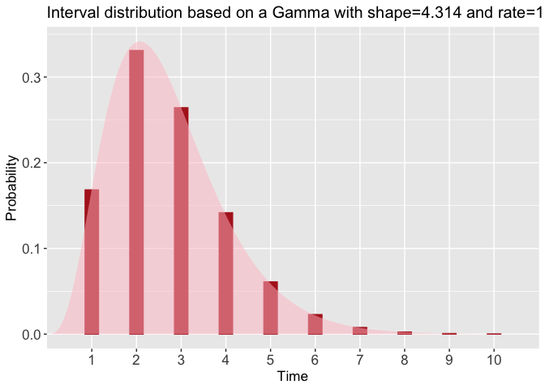
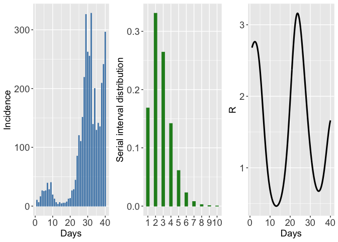
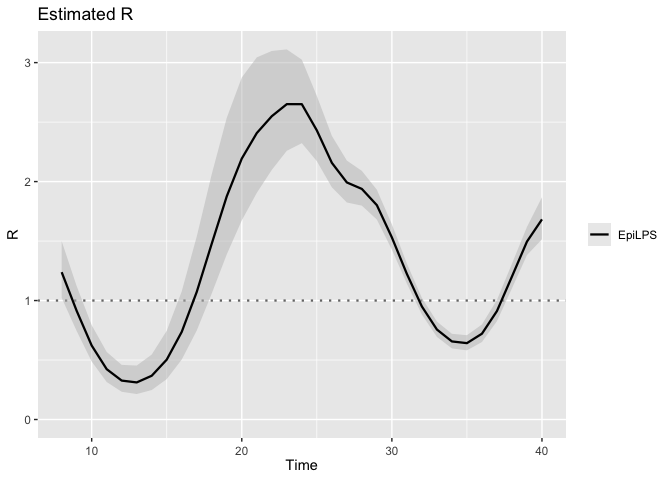
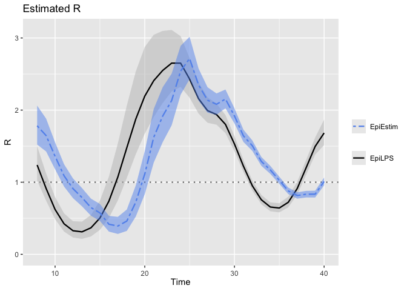
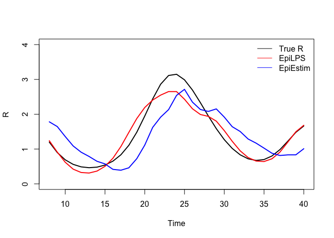
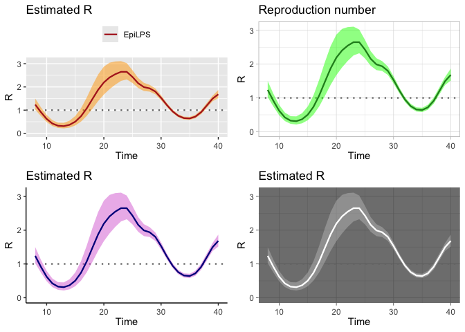
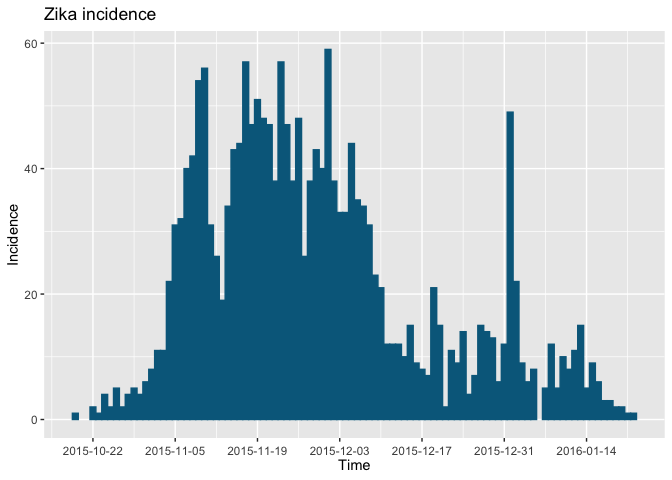
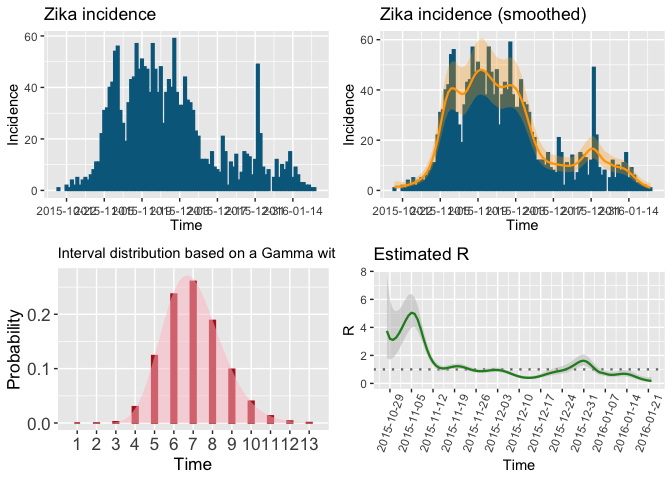
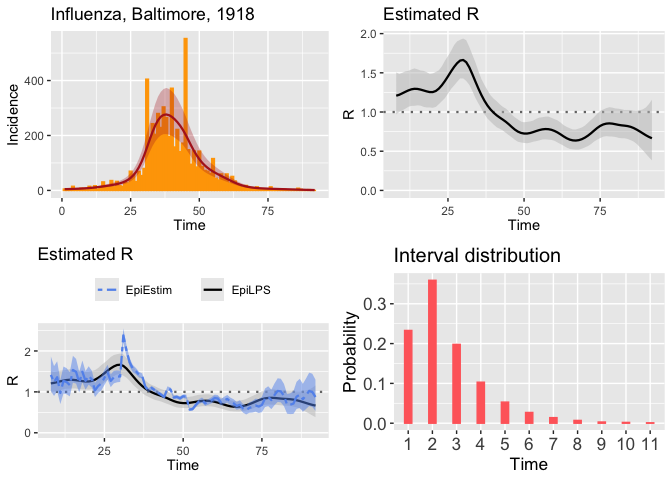

EpiLPS Testing
================
Christine Sangphet
2024-07-07

``` r
#load environment

devtools::install_github("oswaldogressani/EpiLPS")
```

    ## Downloading GitHub repo oswaldogressani/EpiLPS@HEAD

    ## RcppArmad... (0.12.8.4.0 -> 14.0.0-1) [CRAN]

    ## Installing 1 packages: RcppArmadillo

    ## 
    ## The downloaded binary packages are in
    ##  /var/folders/kz/vb4s2bzd5m59rdxjpt9vyk_h0000gn/T//RtmpFsUnxy/downloaded_packages
    ## ── R CMD build ─────────────────────────────────────────────────────────────────
    ##      checking for file ‘/private/var/folders/kz/vb4s2bzd5m59rdxjpt9vyk_h0000gn/T/RtmpFsUnxy/remotes11d3b11fafb93/oswaldogressani-EpiLPS-f84415a/DESCRIPTION’ ...  ✔  checking for file ‘/private/var/folders/kz/vb4s2bzd5m59rdxjpt9vyk_h0000gn/T/RtmpFsUnxy/remotes11d3b11fafb93/oswaldogressani-EpiLPS-f84415a/DESCRIPTION’
    ##   ─  preparing ‘EpiLPS’:
    ##      checking DESCRIPTION meta-information ...  ✔  checking DESCRIPTION meta-information
    ##   ─  cleaning src
    ##   ─  checking for LF line-endings in source and make files and shell scripts
    ##   ─  checking for empty or unneeded directories
    ##   ─  building ‘EpiLPS_1.3.0.tar.gz’
    ##      
    ## 

    ## Warning in i.p(...): installation of package
    ## '/var/folders/kz/vb4s2bzd5m59rdxjpt9vyk_h0000gn/T//RtmpFsUnxy/file11d3b36bfb4a/EpiLPS_1.3.0.tar.gz'
    ## had non-zero exit status

``` r
library(EpiLPS)
```

# Specification of a serial interval and data generation

``` r
#The Idist() function computes the probability density function and probability mass function for a disease interval based on the mean and standard deviation of the disease interval (expressed in days)

si_spec <- Idist(mean = 2.7, sd = 1.3, dist = "gamma")
si <- si_spec$pvec
si
```

    ##  [1] 0.1683155677 0.3309269357 0.2641722153 0.1416603809 0.0609478350
    ##  [6] 0.0228109990 0.0077559604 0.0024585172 0.0007387518 0.0002128371

``` r
plot(si_spec)
```

<!-- -->

``` r
#using the above serial interval, we can call the episim() routine to generate a time series of incidence data (say for an epidemic lasting 40 days).

set.seed(123)
datasim <- episim(si = si, Rpattern = 5, endepi = 40, dist = "negbin", overdisp = 15, plotsim = TRUE)
```

<!-- -->

``` r
incidence <- datasim$y
incidence
```

    ##  [1]  10   6  16  26  25  26  39  28  40  19  12   6   3   6   4   5   5   7  12
    ## [20]  13  26  28  44  85 120 110 151 219 326 262 255 328 139 200 129 141 135 209
    ## [39] 241 296

# Estimation of the reproduction number

``` r
#The code below defines an object called LPSfit from the estimR() routine. the latter object is a list with many different components summarizing the results of the fit. Among this list, the RLPS component is of particular interest as it gives a summary of the estimated reproduction number (point estimates and selected quantiles).

LPSfit <- estimR(incidence = incidence, si = si)
class(LPSfit)
```

    ## [1] "Rt"

``` r
knitr::kable(tail(LPSfit$RLPS[,1:7]))
```

|     | Time |         R |       Rsd |   Rq0.025 |    Rq0.05 |    Rq0.25 |    Rq0.50 |
|:----|-----:|----------:|----------:|----------:|----------:|----------:|----------:|
| 35  |   35 | 0.6419727 | 0.0324669 | 0.5815008 | 0.5908240 | 0.6204838 | 0.6419727 |
| 36  |   36 | 0.7212346 | 0.0376810 | 0.6511724 | 0.6619592 | 0.6963118 | 0.7212346 |
| 37  |   37 | 0.9116863 | 0.0455660 | 0.8267645 | 0.8398637 | 0.8815202 | 0.9116863 |
| 38  |   38 | 1.2018582 | 0.0529034 | 1.1026540 | 1.1180325 | 1.1667500 | 1.2018582 |
| 39  |   39 | 1.4957960 | 0.0603576 | 1.3821874 | 1.3998527 | 1.4556826 | 1.4957960 |
| 40  |   40 | 1.6824906 | 0.0903072 | 1.5148264 | 1.5406092 | 1.6227950 | 1.6824906 |

``` r
#The estimR() routine generates an object of class Rt and there are two S3 methods associated with an object of that class, namely a summary() method and a plot() method. The former gives:

summary(LPSfit)
```

    ## Estimation of the reproduction number with Laplacian-P-splines 
    ## -------------------------------------------------------------- 
    ## Total number of days:          40 
    ## Routine time (seconds):        0.062 
    ## Method:                        Maximum a posteriori (MAP) 
    ## Hyperparam. optim method:      Nelder-Mead 
    ## Hyperparam. optim convergence: TRUE 
    ## Mean reproduction number:      1.346 
    ## Min  reproduction number:      0.312 
    ## Max  reproduction number:      2.651 
    ## --------------------------------------------------------------

``` r
plot(LPSfit)
```

<!-- -->

``` r
#The estimRmcmcm() routine works similarly. By default it draws 5000 MCMC samples and uses a burn-in of size 2000. Being a fully stochastic approach, the latter routine is slower than estimR().

LPSfitmcmc <- estimRmcmc(incidence = incidence, si = si, niter = 5000, burnin = 2000)
```

    ## Metropolis-adjusted Langevin algorithm running for 5000 iterations 
    ##   |                                                                              |                                                                      |   0%  |                                                                              |                                                                      |   1%  |                                                                              |>                                                                     |   1%  |                                                                              |>                                                                     |   2%  |                                                                              |>>                                                                    |   2%  |                                                                              |>>                                                                    |   3%  |                                                                              |>>                                                                    |   4%  |                                                                              |>>>                                                                   |   4%  |                                                                              |>>>                                                                   |   5%  |                                                                              |>>>>                                                                  |   5%  |                                                                              |>>>>                                                                  |   6%  |                                                                              |>>>>>                                                                 |   6%  |                                                                              |>>>>>                                                                 |   7%  |                                                                              |>>>>>                                                                 |   8%  |                                                                              |>>>>>>                                                                |   8%  |                                                                              |>>>>>>                                                                |   9%  |                                                                              |>>>>>>>                                                               |   9%  |                                                                              |>>>>>>>                                                               |  10%  |                                                                              |>>>>>>>                                                               |  11%  |                                                                              |>>>>>>>>                                                              |  11%  |                                                                              |>>>>>>>>                                                              |  12%  |                                                                              |>>>>>>>>>                                                             |  12%  |                                                                              |>>>>>>>>>                                                             |  13%  |                                                                              |>>>>>>>>>                                                             |  14%  |                                                                              |>>>>>>>>>>                                                            |  14%  |                                                                              |>>>>>>>>>>                                                            |  15%  |                                                                              |>>>>>>>>>>>                                                           |  15%  |                                                                              |>>>>>>>>>>>                                                           |  16%  |                                                                              |>>>>>>>>>>>>                                                          |  16%  |                                                                              |>>>>>>>>>>>>                                                          |  17%  |                                                                              |>>>>>>>>>>>>                                                          |  18%  |                                                                              |>>>>>>>>>>>>>                                                         |  18%  |                                                                              |>>>>>>>>>>>>>                                                         |  19%  |                                                                              |>>>>>>>>>>>>>>                                                        |  19%  |                                                                              |>>>>>>>>>>>>>>                                                        |  20%  |                                                                              |>>>>>>>>>>>>>>                                                        |  21%  |                                                                              |>>>>>>>>>>>>>>>                                                       |  21%  |                                                                              |>>>>>>>>>>>>>>>                                                       |  22%  |                                                                              |>>>>>>>>>>>>>>>>                                                      |  22%  |                                                                              |>>>>>>>>>>>>>>>>                                                      |  23%  |                                                                              |>>>>>>>>>>>>>>>>                                                      |  24%  |                                                                              |>>>>>>>>>>>>>>>>>                                                     |  24%  |                                                                              |>>>>>>>>>>>>>>>>>                                                     |  25%  |                                                                              |>>>>>>>>>>>>>>>>>>                                                    |  25%  |                                                                              |>>>>>>>>>>>>>>>>>>                                                    |  26%  |                                                                              |>>>>>>>>>>>>>>>>>>>                                                   |  26%  |                                                                              |>>>>>>>>>>>>>>>>>>>                                                   |  27%  |                                                                              |>>>>>>>>>>>>>>>>>>>                                                   |  28%  |                                                                              |>>>>>>>>>>>>>>>>>>>>                                                  |  28%  |                                                                              |>>>>>>>>>>>>>>>>>>>>                                                  |  29%  |                                                                              |>>>>>>>>>>>>>>>>>>>>>                                                 |  29%  |                                                                              |>>>>>>>>>>>>>>>>>>>>>                                                 |  30%  |                                                                              |>>>>>>>>>>>>>>>>>>>>>                                                 |  31%  |                                                                              |>>>>>>>>>>>>>>>>>>>>>>                                                |  31%  |                                                                              |>>>>>>>>>>>>>>>>>>>>>>                                                |  32%  |                                                                              |>>>>>>>>>>>>>>>>>>>>>>>                                               |  32%  |                                                                              |>>>>>>>>>>>>>>>>>>>>>>>                                               |  33%  |                                                                              |>>>>>>>>>>>>>>>>>>>>>>>                                               |  34%  |                                                                              |>>>>>>>>>>>>>>>>>>>>>>>>                                              |  34%  |                                                                              |>>>>>>>>>>>>>>>>>>>>>>>>                                              |  35%  |                                                                              |>>>>>>>>>>>>>>>>>>>>>>>>>                                             |  35%  |                                                                              |>>>>>>>>>>>>>>>>>>>>>>>>>                                             |  36%  |                                                                              |>>>>>>>>>>>>>>>>>>>>>>>>>>                                            |  36%  |                                                                              |>>>>>>>>>>>>>>>>>>>>>>>>>>                                            |  37%  |                                                                              |>>>>>>>>>>>>>>>>>>>>>>>>>>                                            |  38%  |                                                                              |>>>>>>>>>>>>>>>>>>>>>>>>>>>                                           |  38%  |                                                                              |>>>>>>>>>>>>>>>>>>>>>>>>>>>                                           |  39%  |                                                                              |>>>>>>>>>>>>>>>>>>>>>>>>>>>>                                          |  39%  |                                                                              |>>>>>>>>>>>>>>>>>>>>>>>>>>>>                                          |  40%  |                                                                              |>>>>>>>>>>>>>>>>>>>>>>>>>>>>                                          |  41%  |                                                                              |>>>>>>>>>>>>>>>>>>>>>>>>>>>>>                                         |  41%  |                                                                              |>>>>>>>>>>>>>>>>>>>>>>>>>>>>>                                         |  42%  |                                                                              |>>>>>>>>>>>>>>>>>>>>>>>>>>>>>>                                        |  42%  |                                                                              |>>>>>>>>>>>>>>>>>>>>>>>>>>>>>>                                        |  43%  |                                                                              |>>>>>>>>>>>>>>>>>>>>>>>>>>>>>>                                        |  44%  |                                                                              |>>>>>>>>>>>>>>>>>>>>>>>>>>>>>>>                                       |  44%  |                                                                              |>>>>>>>>>>>>>>>>>>>>>>>>>>>>>>>                                       |  45%  |                                                                              |>>>>>>>>>>>>>>>>>>>>>>>>>>>>>>>>                                      |  45%  |                                                                              |>>>>>>>>>>>>>>>>>>>>>>>>>>>>>>>>                                      |  46%  |                                                                              |>>>>>>>>>>>>>>>>>>>>>>>>>>>>>>>>>                                     |  46%  |                                                                              |>>>>>>>>>>>>>>>>>>>>>>>>>>>>>>>>>                                     |  47%  |                                                                              |>>>>>>>>>>>>>>>>>>>>>>>>>>>>>>>>>                                     |  48%  |                                                                              |>>>>>>>>>>>>>>>>>>>>>>>>>>>>>>>>>>                                    |  48%  |                                                                              |>>>>>>>>>>>>>>>>>>>>>>>>>>>>>>>>>>                                    |  49%  |                                                                              |>>>>>>>>>>>>>>>>>>>>>>>>>>>>>>>>>>>                                   |  49%  |                                                                              |>>>>>>>>>>>>>>>>>>>>>>>>>>>>>>>>>>>                                   |  50%  |                                                                              |>>>>>>>>>>>>>>>>>>>>>>>>>>>>>>>>>>>                                   |  51%  |                                                                              |>>>>>>>>>>>>>>>>>>>>>>>>>>>>>>>>>>>>                                  |  51%  |                                                                              |>>>>>>>>>>>>>>>>>>>>>>>>>>>>>>>>>>>>                                  |  52%  |                                                                              |>>>>>>>>>>>>>>>>>>>>>>>>>>>>>>>>>>>>>                                 |  52%  |                                                                              |>>>>>>>>>>>>>>>>>>>>>>>>>>>>>>>>>>>>>                                 |  53%  |                                                                              |>>>>>>>>>>>>>>>>>>>>>>>>>>>>>>>>>>>>>                                 |  54%  |                                                                              |>>>>>>>>>>>>>>>>>>>>>>>>>>>>>>>>>>>>>>                                |  54%  |                                                                              |>>>>>>>>>>>>>>>>>>>>>>>>>>>>>>>>>>>>>>                                |  55%  |                                                                              |>>>>>>>>>>>>>>>>>>>>>>>>>>>>>>>>>>>>>>>                               |  55%  |                                                                              |>>>>>>>>>>>>>>>>>>>>>>>>>>>>>>>>>>>>>>>                               |  56%  |                                                                              |>>>>>>>>>>>>>>>>>>>>>>>>>>>>>>>>>>>>>>>>                              |  56%  |                                                                              |>>>>>>>>>>>>>>>>>>>>>>>>>>>>>>>>>>>>>>>>                              |  57%  |                                                                              |>>>>>>>>>>>>>>>>>>>>>>>>>>>>>>>>>>>>>>>>                              |  58%  |                                                                              |>>>>>>>>>>>>>>>>>>>>>>>>>>>>>>>>>>>>>>>>>                             |  58%  |                                                                              |>>>>>>>>>>>>>>>>>>>>>>>>>>>>>>>>>>>>>>>>>                             |  59%  |                                                                              |>>>>>>>>>>>>>>>>>>>>>>>>>>>>>>>>>>>>>>>>>>                            |  59%  |                                                                              |>>>>>>>>>>>>>>>>>>>>>>>>>>>>>>>>>>>>>>>>>>                            |  60%  |                                                                              |>>>>>>>>>>>>>>>>>>>>>>>>>>>>>>>>>>>>>>>>>>                            |  61%  |                                                                              |>>>>>>>>>>>>>>>>>>>>>>>>>>>>>>>>>>>>>>>>>>>                           |  61%  |                                                                              |>>>>>>>>>>>>>>>>>>>>>>>>>>>>>>>>>>>>>>>>>>>                           |  62%  |                                                                              |>>>>>>>>>>>>>>>>>>>>>>>>>>>>>>>>>>>>>>>>>>>>                          |  62%  |                                                                              |>>>>>>>>>>>>>>>>>>>>>>>>>>>>>>>>>>>>>>>>>>>>                          |  63%  |                                                                              |>>>>>>>>>>>>>>>>>>>>>>>>>>>>>>>>>>>>>>>>>>>>                          |  64%  |                                                                              |>>>>>>>>>>>>>>>>>>>>>>>>>>>>>>>>>>>>>>>>>>>>>                         |  64%  |                                                                              |>>>>>>>>>>>>>>>>>>>>>>>>>>>>>>>>>>>>>>>>>>>>>                         |  65%  |                                                                              |>>>>>>>>>>>>>>>>>>>>>>>>>>>>>>>>>>>>>>>>>>>>>>                        |  65%  |                                                                              |>>>>>>>>>>>>>>>>>>>>>>>>>>>>>>>>>>>>>>>>>>>>>>                        |  66%  |                                                                              |>>>>>>>>>>>>>>>>>>>>>>>>>>>>>>>>>>>>>>>>>>>>>>>                       |  66%  |                                                                              |>>>>>>>>>>>>>>>>>>>>>>>>>>>>>>>>>>>>>>>>>>>>>>>                       |  67%  |                                                                              |>>>>>>>>>>>>>>>>>>>>>>>>>>>>>>>>>>>>>>>>>>>>>>>                       |  68%  |                                                                              |>>>>>>>>>>>>>>>>>>>>>>>>>>>>>>>>>>>>>>>>>>>>>>>>                      |  68%  |                                                                              |>>>>>>>>>>>>>>>>>>>>>>>>>>>>>>>>>>>>>>>>>>>>>>>>                      |  69%  |                                                                              |>>>>>>>>>>>>>>>>>>>>>>>>>>>>>>>>>>>>>>>>>>>>>>>>>                     |  69%  |                                                                              |>>>>>>>>>>>>>>>>>>>>>>>>>>>>>>>>>>>>>>>>>>>>>>>>>                     |  70%  |                                                                              |>>>>>>>>>>>>>>>>>>>>>>>>>>>>>>>>>>>>>>>>>>>>>>>>>                     |  71%  |                                                                              |>>>>>>>>>>>>>>>>>>>>>>>>>>>>>>>>>>>>>>>>>>>>>>>>>>                    |  71%  |                                                                              |>>>>>>>>>>>>>>>>>>>>>>>>>>>>>>>>>>>>>>>>>>>>>>>>>>                    |  72%  |                                                                              |>>>>>>>>>>>>>>>>>>>>>>>>>>>>>>>>>>>>>>>>>>>>>>>>>>>                   |  72%  |                                                                              |>>>>>>>>>>>>>>>>>>>>>>>>>>>>>>>>>>>>>>>>>>>>>>>>>>>                   |  73%  |                                                                              |>>>>>>>>>>>>>>>>>>>>>>>>>>>>>>>>>>>>>>>>>>>>>>>>>>>                   |  74%  |                                                                              |>>>>>>>>>>>>>>>>>>>>>>>>>>>>>>>>>>>>>>>>>>>>>>>>>>>>                  |  74%  |                                                                              |>>>>>>>>>>>>>>>>>>>>>>>>>>>>>>>>>>>>>>>>>>>>>>>>>>>>                  |  75%  |                                                                              |>>>>>>>>>>>>>>>>>>>>>>>>>>>>>>>>>>>>>>>>>>>>>>>>>>>>>                 |  75%  |                                                                              |>>>>>>>>>>>>>>>>>>>>>>>>>>>>>>>>>>>>>>>>>>>>>>>>>>>>>                 |  76%  |                                                                              |>>>>>>>>>>>>>>>>>>>>>>>>>>>>>>>>>>>>>>>>>>>>>>>>>>>>>>                |  76%  |                                                                              |>>>>>>>>>>>>>>>>>>>>>>>>>>>>>>>>>>>>>>>>>>>>>>>>>>>>>>                |  77%  |                                                                              |>>>>>>>>>>>>>>>>>>>>>>>>>>>>>>>>>>>>>>>>>>>>>>>>>>>>>>                |  78%  |                                                                              |>>>>>>>>>>>>>>>>>>>>>>>>>>>>>>>>>>>>>>>>>>>>>>>>>>>>>>>               |  78%  |                                                                              |>>>>>>>>>>>>>>>>>>>>>>>>>>>>>>>>>>>>>>>>>>>>>>>>>>>>>>>               |  79%  |                                                                              |>>>>>>>>>>>>>>>>>>>>>>>>>>>>>>>>>>>>>>>>>>>>>>>>>>>>>>>>              |  79%  |                                                                              |>>>>>>>>>>>>>>>>>>>>>>>>>>>>>>>>>>>>>>>>>>>>>>>>>>>>>>>>              |  80%  |                                                                              |>>>>>>>>>>>>>>>>>>>>>>>>>>>>>>>>>>>>>>>>>>>>>>>>>>>>>>>>              |  81%  |                                                                              |>>>>>>>>>>>>>>>>>>>>>>>>>>>>>>>>>>>>>>>>>>>>>>>>>>>>>>>>>             |  81%  |                                                                              |>>>>>>>>>>>>>>>>>>>>>>>>>>>>>>>>>>>>>>>>>>>>>>>>>>>>>>>>>             |  82%  |                                                                              |>>>>>>>>>>>>>>>>>>>>>>>>>>>>>>>>>>>>>>>>>>>>>>>>>>>>>>>>>>            |  82%  |                                                                              |>>>>>>>>>>>>>>>>>>>>>>>>>>>>>>>>>>>>>>>>>>>>>>>>>>>>>>>>>>            |  83%  |                                                                              |>>>>>>>>>>>>>>>>>>>>>>>>>>>>>>>>>>>>>>>>>>>>>>>>>>>>>>>>>>            |  84%  |                                                                              |>>>>>>>>>>>>>>>>>>>>>>>>>>>>>>>>>>>>>>>>>>>>>>>>>>>>>>>>>>>           |  84%  |                                                                              |>>>>>>>>>>>>>>>>>>>>>>>>>>>>>>>>>>>>>>>>>>>>>>>>>>>>>>>>>>>           |  85%  |                                                                              |>>>>>>>>>>>>>>>>>>>>>>>>>>>>>>>>>>>>>>>>>>>>>>>>>>>>>>>>>>>>          |  85%  |                                                                              |>>>>>>>>>>>>>>>>>>>>>>>>>>>>>>>>>>>>>>>>>>>>>>>>>>>>>>>>>>>>          |  86%  |                                                                              |>>>>>>>>>>>>>>>>>>>>>>>>>>>>>>>>>>>>>>>>>>>>>>>>>>>>>>>>>>>>>         |  86%  |                                                                              |>>>>>>>>>>>>>>>>>>>>>>>>>>>>>>>>>>>>>>>>>>>>>>>>>>>>>>>>>>>>>         |  87%  |                                                                              |>>>>>>>>>>>>>>>>>>>>>>>>>>>>>>>>>>>>>>>>>>>>>>>>>>>>>>>>>>>>>         |  88%  |                                                                              |>>>>>>>>>>>>>>>>>>>>>>>>>>>>>>>>>>>>>>>>>>>>>>>>>>>>>>>>>>>>>>        |  88%  |                                                                              |>>>>>>>>>>>>>>>>>>>>>>>>>>>>>>>>>>>>>>>>>>>>>>>>>>>>>>>>>>>>>>        |  89%  |                                                                              |>>>>>>>>>>>>>>>>>>>>>>>>>>>>>>>>>>>>>>>>>>>>>>>>>>>>>>>>>>>>>>>       |  89%  |                                                                              |>>>>>>>>>>>>>>>>>>>>>>>>>>>>>>>>>>>>>>>>>>>>>>>>>>>>>>>>>>>>>>>       |  90%  |                                                                              |>>>>>>>>>>>>>>>>>>>>>>>>>>>>>>>>>>>>>>>>>>>>>>>>>>>>>>>>>>>>>>>       |  91%  |                                                                              |>>>>>>>>>>>>>>>>>>>>>>>>>>>>>>>>>>>>>>>>>>>>>>>>>>>>>>>>>>>>>>>>      |  91%  |                                                                              |>>>>>>>>>>>>>>>>>>>>>>>>>>>>>>>>>>>>>>>>>>>>>>>>>>>>>>>>>>>>>>>>      |  92%  |                                                                              |>>>>>>>>>>>>>>>>>>>>>>>>>>>>>>>>>>>>>>>>>>>>>>>>>>>>>>>>>>>>>>>>>     |  92%  |                                                                              |>>>>>>>>>>>>>>>>>>>>>>>>>>>>>>>>>>>>>>>>>>>>>>>>>>>>>>>>>>>>>>>>>     |  93%  |                                                                              |>>>>>>>>>>>>>>>>>>>>>>>>>>>>>>>>>>>>>>>>>>>>>>>>>>>>>>>>>>>>>>>>>     |  94%  |                                                                              |>>>>>>>>>>>>>>>>>>>>>>>>>>>>>>>>>>>>>>>>>>>>>>>>>>>>>>>>>>>>>>>>>>    |  94%  |                                                                              |>>>>>>>>>>>>>>>>>>>>>>>>>>>>>>>>>>>>>>>>>>>>>>>>>>>>>>>>>>>>>>>>>>    |  95%  |                                                                              |>>>>>>>>>>>>>>>>>>>>>>>>>>>>>>>>>>>>>>>>>>>>>>>>>>>>>>>>>>>>>>>>>>>   |  95%  |                                                                              |>>>>>>>>>>>>>>>>>>>>>>>>>>>>>>>>>>>>>>>>>>>>>>>>>>>>>>>>>>>>>>>>>>>   |  96%  |                                                                              |>>>>>>>>>>>>>>>>>>>>>>>>>>>>>>>>>>>>>>>>>>>>>>>>>>>>>>>>>>>>>>>>>>>>  |  96%  |                                                                              |>>>>>>>>>>>>>>>>>>>>>>>>>>>>>>>>>>>>>>>>>>>>>>>>>>>>>>>>>>>>>>>>>>>>  |  97%  |                                                                              |>>>>>>>>>>>>>>>>>>>>>>>>>>>>>>>>>>>>>>>>>>>>>>>>>>>>>>>>>>>>>>>>>>>>  |  98%  |                                                                              |>>>>>>>>>>>>>>>>>>>>>>>>>>>>>>>>>>>>>>>>>>>>>>>>>>>>>>>>>>>>>>>>>>>>> |  98%  |                                                                              |>>>>>>>>>>>>>>>>>>>>>>>>>>>>>>>>>>>>>>>>>>>>>>>>>>>>>>>>>>>>>>>>>>>>> |  99%  |                                                                              |>>>>>>>>>>>>>>>>>>>>>>>>>>>>>>>>>>>>>>>>>>>>>>>>>>>>>>>>>>>>>>>>>>>>>>|  99%  |                                                                              |>>>>>>>>>>>>>>>>>>>>>>>>>>>>>>>>>>>>>>>>>>>>>>>>>>>>>>>>>>>>>>>>>>>>>>| 100%

``` r
summary(LPSfitmcmc)
```

    ## Estimation of the reproduction number with Laplacian-P-splines 
    ## -------------------------------------------------------------- 
    ## Total number of days:          40 
    ## Routine time (seconds):        1.125 
    ## Method:                        MCMC (with Langevin diffusion) 
    ## Hyperparam. optim method:      Nelder-Mead 
    ## Hyperparam. optim convergence: TRUE 
    ## Mean reproduction number:      1.359 
    ## Min  reproduction number:      0.314 
    ## Max  reproduction number:      2.715 
    ## --------------------------------------------------------------

``` r
#By specifying the addfit = "Cori" option in the S3 plot method, we can overlay both estimates

LPSfit2 <- estimR(incidence = incidence, si = si, CoriR = TRUE)
knitr::kable(tail(LPSfit2$RCori[,1:7]))
```

|     | t_start | t_end |   Mean(R) |    Std(R) | Quantile.0.025(R) | Quantile.0.05(R) | Quantile.0.25(R) |
|:----|--------:|------:|----------:|----------:|------------------:|-----------------:|-----------------:|
| 28  |      29 |    35 | 1.0269038 | 0.0253576 |         0.9777996 |        0.9855533 |        1.0096885 |
| 29  |      30 |    36 | 0.8799678 | 0.0230693 |         0.8353282 |        0.8423690 |        0.8642998 |
| 30  |      31 |    37 | 0.8153488 | 0.0223740 |         0.7720809 |        0.7788991 |        0.8001483 |
| 31  |      32 |    38 | 0.8335788 | 0.0232811 |         0.7885677 |        0.7956581 |        0.8177601 |
| 32  |      33 |    39 | 0.8342298 | 0.0241325 |         0.7875957 |        0.7949362 |        0.8178283 |
| 33  |      34 |    40 | 1.0094248 | 0.0274527 |         0.9563291 |        0.9646975 |        0.9907751 |

``` r
plot(LPSfit2, addfit = "Cori")
```

<!-- -->

``` r
#the estimated reproduction number can also be potted by extracting values from the LPSfit2 object in a traditional way as shown below

tt <- seq(8, 40, by = 1)
Rtrue <- sapply(tt, datasim$Rtrue)
plot(tt, Rtrue, type = "l", xlab = "Time", ylab = "R", ylim = c(0,4),
     lwd = 2)
lines(tt, LPSfit2$RLPS$R[-(1:7)], col = "red", lwd = 2)
lines(tt, LPSfit2$RCori$`Mean(R)`, col = "blue", lwd = 2)
legend("topright", col = c("black","red","blue"), 
       c("True R","EpiLPS","EpiEstim"), bty = "n", lty = c(1,1,1))
```

<!-- -->

# Customizing graphical output

``` r
library(ggplot2)

gridExtra::grid.arrange(
  plot(LPSfit, col = "firebrick", legendpos = "top", cicol = "orange"),
  plot(LPSfit, col = "forestgreen", legendpos = "none", cicol = "green",
       theme = "light", title = "Reproduction number"),
  plot(LPSfit, col = "darkblue", legendpos = "none", cicol = "orchid",
       theme = "classic"),
  plot(LPSfit, col = "white", legendpos = "none", cicol = "gray",
       theme = "dark"),
  nrow = 2, ncol = 2)
```

<!-- -->

# Illustration on the Zika virus in Girardot, Colombia (2015)

``` r
library(outbreaks)

#the data is loaded and the epidemic curve is visualized with the epicurve() routine

zika <- zika_girardot_2015
plotIncidence <- epicurve(zika$cases, dates = zika$date, datelab = "14d", title = "Zika incidence")
plotIncidence
```

<!-- -->

``` r
#A serial interval distribution of mean 7 days (SD=1.5 days) is specified and the estimR() routine is used to estimate the reproduction number

si <- Idist(mean = 7, sd = 1.5)
siplot <- plot(si, titlesize = 11)
epifit <- estimR(zika$cases, dates = zika$date, si = si$pvec)
summary(epifit)
```

    ## Estimation of the reproduction number with Laplacian-P-splines 
    ## -------------------------------------------------------------- 
    ## Total number of days:          93 
    ## Routine time (seconds):        0.038 
    ## Method:                        Maximum a posteriori (MAP) 
    ## Hyperparam. optim method:      Nelder-Mead 
    ## Hyperparam. optim convergence: TRUE 
    ## Mean reproduction number:      1.355 
    ## Min  reproduction number:      0.177 
    ## Max  reproduction number:      5.047 
    ## --------------------------------------------------------------

``` r
#the estimation results are summarized into a single plot

plotsmooth <- epicurve(zika$cases, dates = zika$date, datelab = "14d", smooth = epifit, smoothcol = "orange", title = "Zika incidence (smoothed)")

# Plot of the estimated reproduction number
Rplot <- plot(epifit, datelab = "7d", xtickangle = 70, legendpos = "none", col = "forestgreen")

# Show all plots together
gridExtra::grid.arrange(plotIncidence, plotsmooth, siplot, Rplot, nrow = 2, ncol = 2)
```

<!-- -->

# Illustration on outbreaks considered in Cori et al. (2013)

``` r
library(EpiEstim)
library(epiR)
```

    ## Loading required package: survival

    ## Package epiR 2.0.75 is loaded

    ## Type help(epi.about) for summary information

    ## Type browseVignettes(package = 'epiR') to learn how to use epiR for applied epidemiological analyses

    ## 

``` r
library(gridExtra) 
```

``` r
data("Flu1918")

fluDAT <- Flu1918

flu_incid <- fluDAT$incidence

flu_si <- fluDAT$si_distr[-1]

epifit_flu <- estimR(flu_incid, si = flu_si, CoriR = TRUE)

epicurve_flu <- epicurve(flu_incid, datelab = "7d", title = "Influenza, Baltimore, 1918",
                            col = "orange", smooth = epifit_flu, smoothcol = "firebrick")

Rplot_flu <- plot(epifit_flu, legendpos = "none")

Rplot_flu2 <- plot(epifit_flu, addfit = "Cori", legendpos = "top")

siplot_flu <- plot(Idist(probs = flu_si), barcol = "indianred1")

gridExtra::grid.arrange(epicurve_flu, Rplot_flu, Rplot_flu2, 
                        siplot_flu, nrow = 2, ncol = 2)
```

<!-- -->
