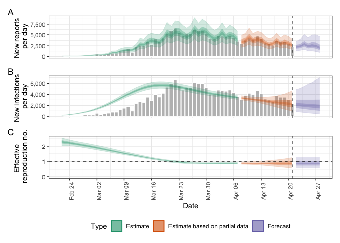
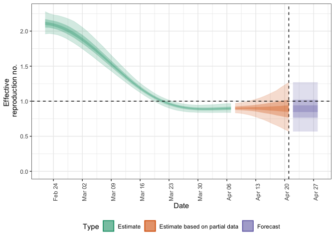
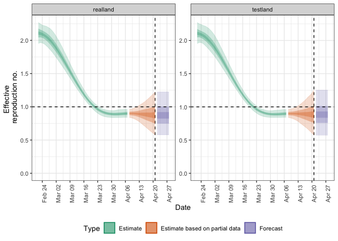
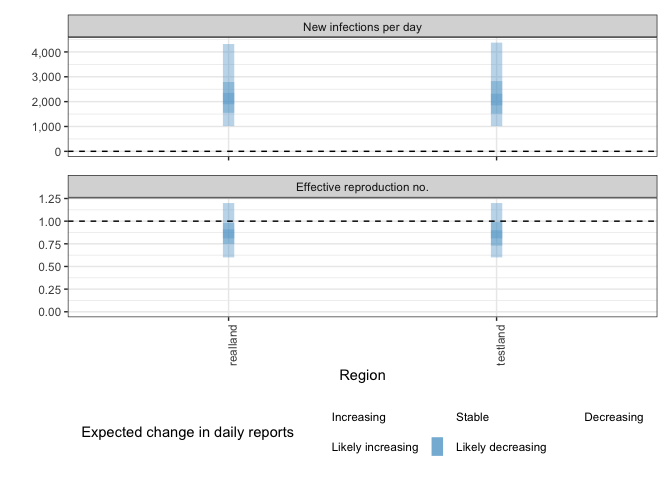
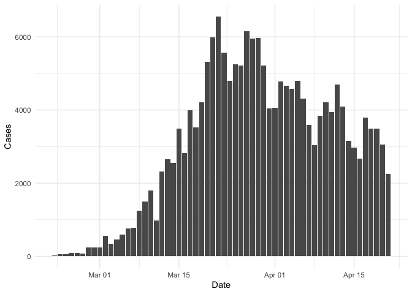

EpiNow2 Testing
================
Christine Sangphet
2024-06-28

# Reporting delays, incubation period, and generation time

``` r
#load environment

library(EpiNow2)
```

    ## 
    ## Attaching package: 'EpiNow2'

    ## The following object is masked from 'package:stats':
    ## 
    ##     Gamma

``` r
#if data on the delay between onset and infection was available we could fit a distribution to it, using estimate_delay(), with appropriate uncertainty as follows

reporting_delay <- estimate_delay(
  rlnorm(1000, log(2), 1),
  max_value = 14, bootstraps = 1
)
```

``` r
#If data was not available we could instead specify an informed estimate of the likely delay using the distribution functions Gamma or LogNormal. To demonstrate, we choose a lognormal distribution with mean 2, standard deviation 1 and a maximum of 10

reporting_delay <- LogNormal(mean = 2, sd = 1, max = 10)
reporting_delay
```

    ## - lognormal distribution (max: 10):
    ##   meanlog:
    ##     0.58
    ##   sdlog:
    ##     0.47

``` r
example_generation_time
```

    ## - gamma distribution (max: 14):
    ##   shape:
    ##     - normal distribution:
    ##       mean:
    ##         1.4
    ##       sd:
    ##         0.48
    ##   rate:
    ##     - normal distribution:
    ##       mean:
    ##         0.38
    ##       sd:
    ##         0.25

``` r
example_incubation_period
```

    ## - lognormal distribution (max: 14):
    ##   meanlog:
    ##     - normal distribution:
    ##       mean:
    ##         1.6
    ##       sd:
    ##         0.064
    ##   sdlog:
    ##     - normal distribution:
    ##       mean:
    ##         0.42
    ##       sd:
    ##         0.069

# function epinow()

### This function represents the core functionality of the package and includes results reporting, plotting, and optional saving. It requires a data frame of cases by date of report and the distributions defined above.

``` r
#Load example case data

reported_cases <- example_confirmed[1:60]
head(reported_cases)
```

    ##          date confirm
    ##        <Date>   <num>
    ## 1: 2020-02-22      14
    ## 2: 2020-02-23      62
    ## 3: 2020-02-24      53
    ## 4: 2020-02-25      97
    ## 5: 2020-02-26      93
    ## 6: 2020-02-27      78

### Estimate cases by date of infection, the time-varying reproduction number, the rate of growth, and forecast these estimates into the future by 7 days.

### Summarize the posterior and return a summary table and plots for reporting purposes. Here we use the default model parameterisation that prioritizes real-time performance over run-time or other considerations.

``` r
estimates <- epinow(
  data = reported_cases,
  generation_time = generation_time_opts(example_generation_time),
  delays = delay_opts(example_incubation_period + reporting_delay),
  rt = rt_opts(prior = list(mean = 2, sd = 0.2)),
  stan = stan_opts(cores = 4, control = list(adapt_delta = 0.99)),
  verbose = interactive()
)
```

    ## Logging threshold set at INFO for the EpiNow2 logger

    ## Writing EpiNow2 logs to the console and: /var/folders/kz/vb4s2bzd5m59rdxjpt9vyk_h0000gn/T//RtmpQkY9o1/regional-epinow/2020-04-21.log

    ## Logging threshold set at INFO for the EpiNow2.epinow logger

    ## Writing EpiNow2.epinow logs to the console and: /var/folders/kz/vb4s2bzd5m59rdxjpt9vyk_h0000gn/T//RtmpQkY9o1/epinow/2020-04-21.log

    ## WARN [2024-07-02 14:06:12] epinow: There were 1 divergent transitions after warmup. See
    ## https://mc-stan.org/misc/warnings.html#divergent-transitions-after-warmup
    ## to find out why this is a problem and how to eliminate them. - 
    ## WARN [2024-07-02 14:06:12] epinow: Examine the pairs() plot to diagnose sampling problems
    ##  -

``` r
names(estimates)
```

    ## [1] "estimates"                "estimated_reported_cases"
    ## [3] "summary"                  "plots"                   
    ## [5] "timing"

``` r
#both summary measures and posterior samples are returned for all parameters in an easily explored format which can be accessed using summary

knitr::kable(summary(estimates))
```

| measure                          | estimate              |
|:---------------------------------|:----------------------|
| New infections per day           | 2232 (965 – 4635)     |
| Expected change in daily reports | Likely decreasing     |
| Effective reproduction no.       | 0.88 (0.57 – 1.2)     |
| Rate of growth                   | -0.033 (-0.15 – 0.08) |
| Doubling/halving time (days)     | -21 (8.7 – -4.5)      |

``` r
#summarised parameter estimates can also easily be returned, either filtered for a single parameter or for all parameters

head(summary(estimates, type = "parameters", params = "R"))
```

    ##          date variable  strat     type   median     mean        sd lower_90
    ##        <Date>   <char> <char>   <char>    <num>    <num>     <num>    <num>
    ## 1: 2020-02-22        R   <NA> estimate 2.289336 2.291994 0.1584514 2.039638
    ## 2: 2020-02-23        R   <NA> estimate 2.251975 2.257056 0.1368260 2.039228
    ## 3: 2020-02-24        R   <NA> estimate 2.216405 2.219622 0.1210237 2.022265
    ## 4: 2020-02-25        R   <NA> estimate 2.177895 2.179774 0.1105998 2.005882
    ## 5: 2020-02-26        R   <NA> estimate 2.133485 2.137654 0.1044996 1.974951
    ## 6: 2020-02-27        R   <NA> estimate 2.089368 2.093460 0.1013130 1.933637
    ##    lower_50 lower_20 upper_20 upper_50 upper_90
    ##       <num>    <num>    <num>    <num>    <num>
    ## 1: 2.181838 2.248492 2.330130 2.400121 2.552004
    ## 2: 2.160783 2.221697 2.292842 2.348608 2.484301
    ## 3: 2.135424 2.184760 2.250287 2.300691 2.426346
    ## 4: 2.102917 2.145077 2.204305 2.254695 2.370555
    ## 5: 2.064829 2.105103 2.161528 2.207571 2.315112
    ## 6: 2.022302 2.063634 2.116085 2.160087 2.262392

``` r
#reported cases are returned in a separate data frame in order to streamline the reporting of forecasts and for model evaluation

head(summary(estimates, output = "estimated_reported_cases"))
```

    ##          date   type median     mean       sd lower_90 lower_50 lower_20
    ##        <Date> <char>  <num>    <num>    <num>    <num>    <num>    <num>
    ## 1: 2020-02-22  gp_rt     76  78.4005 21.90801    46.00       63       71
    ## 2: 2020-02-23  gp_rt     88  90.7800 24.24821    55.95       74       82
    ## 3: 2020-02-24  gp_rt     87  90.1485 25.15593    53.95       73       83
    ## 4: 2020-02-25  gp_rt     79  82.7415 23.46873    50.00       66       74
    ## 5: 2020-02-26  gp_rt     79  81.8890 22.67763    49.00       66       74
    ## 6: 2020-02-27  gp_rt    108 110.8880 29.94556    68.00       90      100
    ##    upper_20 upper_50 upper_90
    ##       <num>    <num>    <num>
    ## 1:     82.0    92.00   118.00
    ## 2:     94.0   105.25   134.05
    ## 3:     93.0   104.00   135.00
    ## 4:     85.4    97.00   125.00
    ## 5:     85.0    96.00   121.00
    ## 6:    115.0   130.00   165.00

``` r
# a range of plots are returned (with the single summary plot shown below). These plots can also be generated using the following plot method

plot(estimates)
```

<!-- -->

# Alternative way: single region

``` r
#Here we use the example delay and generation time distributions that come with the package. This should be replaced with parameters relevant to the system that is being studied

options(mc.cores = 4)
reported_cases <- example_confirmed[1:60]
reporting_delay <- LogNormal(mean = 2, sd = 1, max = 10)
delay <- example_incubation_period + reporting_delay
rt_prior <- list(mean = 2, sd = 0.1)
```

``` r
#We can then run the epinow() function with the same arguments as estimate_infections()

res <- epinow(reported_cases,
  generation_time = generation_time_opts(example_generation_time),
  delays = delay_opts(delay),
  rt = rt_opts(prior = rt_prior)
)
```

    ## Logging threshold set at INFO for the EpiNow2 logger

    ## Writing EpiNow2 logs to the console and: /var/folders/kz/vb4s2bzd5m59rdxjpt9vyk_h0000gn/T//RtmpQkY9o1/regional-epinow/2020-04-21.log

    ## Logging threshold set at INFO for the EpiNow2.epinow logger

    ## Writing EpiNow2.epinow logs to the console and: /var/folders/kz/vb4s2bzd5m59rdxjpt9vyk_h0000gn/T//RtmpQkY9o1/epinow/2020-04-21.log

    ## WARN [2024-07-02 14:07:32] epinow: There were 9 divergent transitions after warmup. See
    ## https://mc-stan.org/misc/warnings.html#divergent-transitions-after-warmup
    ## to find out why this is a problem and how to eliminate them. - 
    ## WARN [2024-07-02 14:07:32] epinow: Examine the pairs() plot to diagnose sampling problems
    ##  -

``` r
res$plots$R
```

<!-- -->

# **Running the model simultaneously on multiple regions**

``` r
#say, for example, we construct a dataset containing two regions, testland and realland (in this simple example both containing the same case data)

cases <- example_confirmed[1:60]
cases <- data.table::rbindlist(list(
  data.table::copy(cases)[, region := "testland"],
  cases[, region := "realland"]
 ))
```

``` r
#To then run this on multiple regions using the default options above, we could use

region_rt <- regional_epinow(
  data = cases,
  generation_time = generation_time_opts(example_generation_time),
  delays = delay_opts(delay),
  rt = rt_opts(prior = rt_prior)
)
```

    ## INFO [2024-07-02 14:07:33] Producing following optional outputs: regions, summary, samples, plots, latest

    ## Logging threshold set at INFO for the EpiNow2 logger

    ## Writing EpiNow2 logs to the console and: /var/folders/kz/vb4s2bzd5m59rdxjpt9vyk_h0000gn/T//RtmpQkY9o1/regional-epinow/2020-04-21.log

    ## Logging threshold set at INFO for the EpiNow2.epinow logger

    ## Writing EpiNow2.epinow logs to: /var/folders/kz/vb4s2bzd5m59rdxjpt9vyk_h0000gn/T//RtmpQkY9o1/epinow/2020-04-21.log

    ## INFO [2024-07-02 14:07:33] Reporting estimates using data up to: 2020-04-21
    ## INFO [2024-07-02 14:07:33] No target directory specified so returning output
    ## INFO [2024-07-02 14:07:33] Producing estimates for: testland, realland
    ## INFO [2024-07-02 14:07:33] Regions excluded: none
    ## INFO [2024-07-02 14:08:08] Completed estimates for: testland
    ## INFO [2024-07-02 14:08:59] Completed estimates for: realland
    ## INFO [2024-07-02 14:08:59] Completed regional estimates
    ## INFO [2024-07-02 14:08:59] Regions with estimates: 2
    ## INFO [2024-07-02 14:08:59] Regions with runtime errors: 0
    ## INFO [2024-07-02 14:08:59] Producing summary
    ## INFO [2024-07-02 14:08:59] No summary directory specified so returning summary output
    ## INFO [2024-07-02 14:08:59] No target directory specified so returning timings

``` r
region_rt$summary$summarised_results$table
```

    ##      Region New infections per day Expected change in daily reports
    ##      <char>                 <char>                           <fctr>
    ## 1: realland     2160 (975 -- 4860)                Likely decreasing
    ## 2: testland     2237 (983 -- 4937)                Likely decreasing
    ##    Effective reproduction no.          Rate of growth
    ##                        <char>                  <char>
    ## 1:         0.87 (0.58 -- 1.2) -0.039 (-0.15 -- 0.075)
    ## 2:         0.89 (0.57 -- 1.3) -0.034 (-0.16 -- 0.083)
    ##    Doubling/halving time (days)
    ##                          <char>
    ## 1:            -18 (9.3 -- -4.5)
    ## 2:            -21 (8.3 -- -4.4)

``` r
region_rt$summary$plots$R
```

<!-- -->

# function regional_epinow()

### The regional_epinow() function runs the epinow() function across multiple regions in an efficient manner.

``` r
#Define cases in multiple regions delineated by the region variable

reported_cases <- data.table::rbindlist(list(
  data.table::copy(reported_cases)[, region := "testland"],
  reported_cases[, region := "realland"]
))
head(reported_cases)
```

    ##          date confirm   region
    ##        <Date>   <num>   <char>
    ## 1: 2020-02-22      14 testland
    ## 2: 2020-02-23      62 testland
    ## 3: 2020-02-24      53 testland
    ## 4: 2020-02-25      97 testland
    ## 5: 2020-02-26      93 testland
    ## 6: 2020-02-27      78 testland

``` r
#Calling regional_epinow() runs the epinow() on each region in turn (or in parallel depending on the settings used). Here we switch to using a weekly random walk rather than the full Gaussian process model giving us piecewise constant estimates by week

estimates <- regional_epinow(
  data = reported_cases,
  generation_time = generation_time_opts(example_generation_time),
  delays = delay_opts(example_incubation_period + reporting_delay),
  rt = rt_opts(prior = list(mean = 2, sd = 0.2), rw = 7),
  gp = NULL,
  stan = stan_opts(cores = 4, warmup = 250, samples = 1000)
)
```

    ## INFO [2024-07-02 14:08:59] Producing following optional outputs: regions, summary, samples, plots, latest

    ## Logging threshold set at INFO for the EpiNow2 logger

    ## Writing EpiNow2 logs to the console and: /var/folders/kz/vb4s2bzd5m59rdxjpt9vyk_h0000gn/T//RtmpQkY9o1/regional-epinow/2020-04-21.log

    ## Logging threshold set at INFO for the EpiNow2.epinow logger

    ## Writing EpiNow2.epinow logs to: /var/folders/kz/vb4s2bzd5m59rdxjpt9vyk_h0000gn/T//RtmpQkY9o1/epinow/2020-04-21.log

    ## INFO [2024-07-02 14:08:59] Reporting estimates using data up to: 2020-04-21
    ## INFO [2024-07-02 14:08:59] No target directory specified so returning output
    ## INFO [2024-07-02 14:08:59] Producing estimates for: testland, realland
    ## INFO [2024-07-02 14:08:59] Regions excluded: none
    ## INFO [2024-07-02 14:09:09] Completed estimates for: testland
    ## INFO [2024-07-02 14:09:19] Completed estimates for: realland
    ## INFO [2024-07-02 14:09:19] Completed regional estimates
    ## INFO [2024-07-02 14:09:19] Regions with estimates: 2
    ## INFO [2024-07-02 14:09:19] Regions with runtime errors: 0
    ## INFO [2024-07-02 14:09:19] Producing summary
    ## INFO [2024-07-02 14:09:19] No summary directory specified so returning summary output
    ## INFO [2024-07-02 14:09:19] No target directory specified so returning timings

``` r
#summary measures that are returned include a table formatted for reporting (along with raw results for further processing). Futures updated will extend the S3 methods used above to smooth access to this output

knitr::kable(estimates$summary$summarised_results$table)
```

| Region   | New infections per day | Expected change in daily reports | Effective reproduction no. | Rate of growth         | Doubling/halving time (days) |
|:---------|:-----------------------|:---------------------------------|:---------------------------|:-----------------------|:-----------------------------|
| realland | 2119 (1014 – 4318)     | Likely decreasing                | 0.86 (0.6 – 1.2)           | -0.038 (-0.11 – 0.048) | -18 (14 – -6.1)              |
| testland | 2084 (1013 – 4374)     | Likely decreasing                | 0.86 (0.6 – 1.2)           | -0.04 (-0.11 – 0.053)  | -18 (13 – -6.1)              |

``` r
#a range of plots are again returned (with the single summary plot shown below)

estimates$summary$summary_plot
```

<!-- -->

# function estimate_infections()

``` r
#load environment 

library("rstan")
```

    ## Loading required package: StanHeaders

    ## 
    ## rstan version 2.32.6 (Stan version 2.32.2)

    ## For execution on a local, multicore CPU with excess RAM we recommend calling
    ## options(mc.cores = parallel::detectCores()).
    ## To avoid recompilation of unchanged Stan programs, we recommend calling
    ## rstan_options(auto_write = TRUE)
    ## For within-chain threading using `reduce_sum()` or `map_rect()` Stan functions,
    ## change `threads_per_chain` option:
    ## rstan_options(threads_per_chain = 1)

``` r
#set the number of cores to use to 4 but the optimal value here will depend on the computing resources available

options(mc.cores = 4)
```

``` r
#we will use an example data set that is included in the package, representing an outbreak of COVID-19 with an initial rapid increase followed by decreasing incidence

library("ggplot2")
reported_cases <- example_confirmed[1:60]
ggplot(reported_cases, aes(x =  date, y = confirm)) +
  geom_col() +
  theme_minimal() +
  xlab("Date") +
  ylab("Cases")
```

<!-- -->

# 
