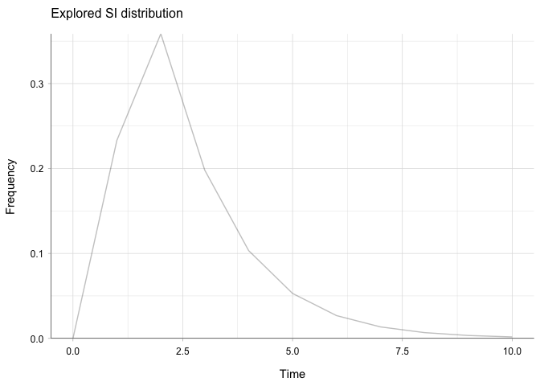
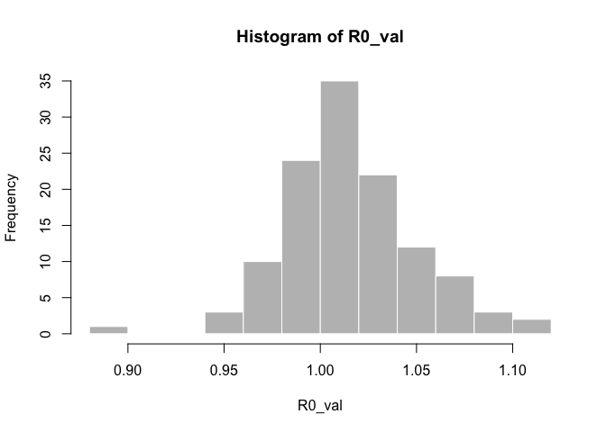
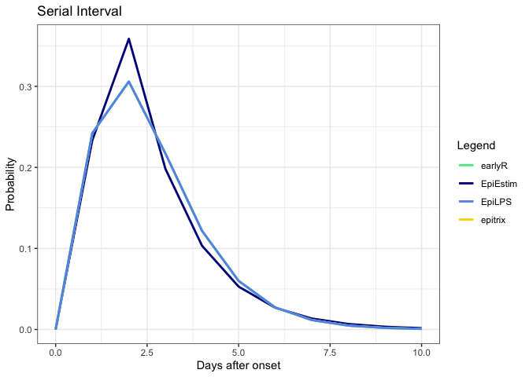

Package Estimations with EpiEstim’s Data
================
Christine Sangphet
2024-08-08

We use the Flu2009 data set from EpiEstim’s vignette to test the
estimation capabilities of other packages for the serial interval and
reproduction number. We will also compare the graphs generated by the
different packages with those from EpiEstim.

## Load the Data

``` r
data(Flu2009)
```

    ## Warning in data(Flu2009): data set 'Flu2009' not found

## Estimations with EpiEstim

``` r
#load environment 

library(EpiEstim)
library(outbreaks)
```

### SI and R(t)

``` r
data("Flu2009")

#we set mean_si to 2.6 and std_si to 1.5

res_parametric_si <- estimate_R(Flu2009$incidence, 
                                method="parametric_si",
                                config = make_config(list(
                                  mean_si = 2.6, 
                                  std_si = 1.5))
)
```

    ## Default config will estimate R on weekly sliding windows.
    ##     To change this change the t_start and t_end arguments.

``` r
plot(res_parametric_si, "SI")
```

<!-- -->

``` r
plot(res_parametric_si, "R")
```

<!-- -->

## Estimations with ern

``` r
#load environment 

library(ern)
```

    ## 
    ## ern version: 2.0.0 
    ## 
    ## If not already installed, software JAGS is recommended. 
    ## (https://sourceforge.net/projects/mcmc-jags/files/)

``` r
library(ggplot2)
```

### SI

``` r
#Determine the characteristics of the generation interval by doing the following: 

si_distr_ern <- c(0.000, 0.233, 0.359, 0.198, 0.103, 0.053, 0.027, 0.014, 0.007, 0.003, 0.002, 0.001)

# Create a vector of possible serial intervals (assuming the serial intervals are from 0 to length(si_distr) - 1)

intervals_ern <- seq_along(si_distr_ern) - 1

# Create a dataset with repeated intervals based on their weights

repeated_intervals_ern <- rep(intervals_ern, times = round(si_distr_ern * 1000))

# Fit a gamma distribution to the repeated intervals

library(MASS) #for the code fitdistr

fit_ern <- fitdistr(repeated_intervals_ern, "gamma")

shape_si_ern <- fit_ern$estimate["shape"]
rate_si_ern <- fit_ern$estimate["rate"]

# Calculate the mean and standard deviation of the gamma distribution

mean_si_ern <- shape_si_ern / rate_si_ern
mean_sd_si_ern <- sqrt(shape_si_ern) / rate_si_ern

# Calculate the standard deviation of the shape (using the standard error from the fit)

shape_sd_si_ern <- fit_ern$sd["shape"]

# The maximum value in the serial interval distribution

max_si_ern <- max(intervals_ern[si_distr_ern > 0])

# Print the results

cat("Mean SI:", mean_si_ern, "\n")
```

    ## Mean SI: 2.595999

``` r
cat("Standard Deviation SI:", mean_sd_si_ern, "\n")
```

    ## Standard Deviation SI: 1.414583

``` r
cat("Shape SI:", shape_si_ern, "\n")
```

    ## Shape SI: 3.367848

``` r
cat("Rate SI:", rate_si_ern, "\n")
```

    ## Rate SI: 1.297323

``` r
cat("Shape SD SI:", shape_sd_si_ern, "\n")
```

    ## Shape SD SI: 0.1437798

``` r
cat("Maximum SI:", max_si_ern, "\n")
```

    ## Maximum SI: 11

``` r
#define the generation interval and plot 

dist.gi_ern = ern::def_dist(
  dist     = "gamma",
  mean     = 2.6,
  mean_sd  = 1.5,
  shape    = 3.4,
  shape_sd = 0.2,
  max      = 11
)

plot_dist(dist.gi_ern) + labs(title = paste0("Mean generation interval distribution (", dist.gi_ern$dist, ")"))
```

<!-- -->

### R(t)

NOTE: ern requires the column names to be “date” and “value”. We change
the dataframe accordingly.

``` r
dat_ern <- Flu2009$incidence

# Change column names

colnames(dat_ern) <- c("date", "value")

dat_ern
```

    ##          date value
    ## 1  2009-04-27     1
    ## 2  2009-04-28     1
    ## 3  2009-04-29     0
    ## 4  2009-04-30     2
    ## 5  2009-05-01     5
    ## 6  2009-05-02     3
    ## 7  2009-05-03     3
    ## 8  2009-05-04     3
    ## 9  2009-05-05     6
    ## 10 2009-05-06     2
    ## 11 2009-05-07     5
    ## 12 2009-05-08     9
    ## 13 2009-05-09    13
    ## 14 2009-05-10    12
    ## 15 2009-05-11    13
    ## 16 2009-05-12    11
    ## 17 2009-05-13    12
    ## 18 2009-05-14     6
    ## 19 2009-05-15     6
    ## 20 2009-05-16     6
    ## 21 2009-05-17     3
    ## 22 2009-05-18     1
    ## 23 2009-05-19     0
    ## 24 2009-05-20     2
    ## 25 2009-05-21     0
    ## 26 2009-05-22     0
    ## 27 2009-05-23     0
    ## 28 2009-05-24     0
    ## 29 2009-05-25     2
    ## 30 2009-05-26     0
    ## 31 2009-05-27     2
    ## 32 2009-05-28     0

NOTE: ern requires the following arguments to estimate R(t): reporting
delay, reporting fraction, incubation period, generation interval
(already determined), daily reporting inference, daily inferred reports,
and Rt settings. We simulate the data to define these arguments.

``` r
#simulate data


set.seed(123) 

n <- nrow(Flu2009$incidence) #number of data 

sim.repdelay <- rgamma(n, shape = 2, rate = 5) #gamma distribution

sim.repfrac <- runif(n, min = 0.1, max = 0.3) #uniform distribution

sim.incubation <- rgamma(n, shape = 2, rate = 5) #gamma distribution
```

``` r
# Define reporting delay distribution using simulated data

dist.repdelay <- ern::def_dist(
  dist = 'gamma',
  mean = mean(sim.repdelay), # Mean of the simulated reporting delay
  mean_sd = sd(sim.repdelay), # Standard deviation of the mean
  sd = sqrt(mean(sim.repdelay)), # Standard deviation of the gamma distribution (scale parameter)
  sd_sd = sd(sim.repdelay) / 2, # Standard deviation of the standard deviation
  max = max(sim.repdelay) # Maximum value for the distribution
)

# Define reporting fraction distribution using simulated data

dist.repfrac <- ern::def_dist(
  dist = "unif",
  min = min(sim.repfrac), # Minimum value of the simulated reporting fraction
  max = max(sim.repfrac) # Maximum value of the simulated reporting fraction
)

# Define incubation period distribution using simulated data

dist.incub <- ern::def_dist(
  dist = "gamma",
  mean = mean(sim.incubation), # Mean of the simulated incubation period
  mean_sd = sd(sim.incubation), # Standard deviation of the mean
  shape = 2, # Shape parameter of the gamma distribution (fixed in your case)
  shape_sd = 0.1, # Standard deviation of the shape parameter
  max = max(sim.incubation) # Maximum value for the distribution
)
```

``` r
# settings for daily report inference

prm.daily = list(
  method = "renewal",
  popsize = 1000,
  burn = 1000,
  iter = 3000,
  chains = 3,
  prior_R0_shape = 2,
  prior_R0_rate = 0.5,
  prior_alpha_shape = 1,
  prior_alpha_rate = 0.5
)

# settings for checks of daily inferred reports

prm.daily.check = list(
  agg.reldiff.tol = NULL
)

# smoothing settings for daily inferred reports

prm.smooth = list(
  method = "rollmean",
  window = 3,
  align = 'center'
)

# Rt settings

prm.R = list(
  iter = 10, # number of iterations in Rt ensemble
  CI = 0.95, # 95% confidence interval
  window = 7, # time window for each Rt estimate
  config.EpiEstim = NULL
)
```

``` r
# Estimating the reproduction number

r.estim <- estimate_R_cl(
  cl.data = dat_ern,
  dist.repdelay = dist.repdelay,
  dist.repfrac = dist.repfrac,
  dist.incub = dist.incub,
  dist.gi = dist.gi_ern,
  prm.daily = prm.daily,
  prm.daily.check = prm.daily.check,
  prm.smooth = prm.smooth,
  prm.R = prm.R,
  silent = TRUE # suppress output messages
)

# Display the estimated reproduction number

print(r.estim)
```

    ## $cl.data
    ##          date value
    ## 1  2009-04-27     1
    ## 2  2009-04-28     1
    ## 3  2009-04-29     0
    ## 4  2009-04-30     2
    ## 5  2009-05-01     5
    ## 6  2009-05-02     3
    ## 7  2009-05-03     3
    ## 8  2009-05-04     3
    ## 9  2009-05-05     6
    ## 10 2009-05-06     2
    ## 11 2009-05-07     5
    ## 12 2009-05-08     9
    ## 13 2009-05-09    13
    ## 14 2009-05-10    12
    ## 15 2009-05-11    13
    ## 16 2009-05-12    11
    ## 17 2009-05-13    12
    ## 18 2009-05-14     6
    ## 19 2009-05-15     6
    ## 20 2009-05-16     6
    ## 21 2009-05-17     3
    ## 22 2009-05-18     1
    ## 23 2009-05-19     0
    ## 24 2009-05-20     2
    ## 25 2009-05-21     0
    ## 26 2009-05-22     0
    ## 27 2009-05-23     0
    ## 28 2009-05-24     0
    ## 29 2009-05-25     2
    ## 30 2009-05-26     0
    ## 31 2009-05-27     2
    ## 32 2009-05-28     0
    ## 
    ## $cl.daily
    ## # A tibble: 32 × 4
    ##       id date       value     t
    ##    <int> <date>     <dbl> <int>
    ##  1     1 2009-04-27 1         1
    ##  2     1 2009-04-28 0.667     2
    ##  3     1 2009-04-29 1         3
    ##  4     1 2009-04-30 2.33      4
    ##  5     1 2009-05-01 3.33      5
    ##  6     1 2009-05-02 3.67      6
    ##  7     1 2009-05-03 3         7
    ##  8     1 2009-05-04 4         8
    ##  9     1 2009-05-05 3.67      9
    ## 10     1 2009-05-06 4.33     10
    ## # ℹ 22 more rows
    ## 
    ## $inferred.agg
    ## NULL
    ## 
    ## $R
    ## # A tibble: 27 × 5
    ##    date        mean   lwr   upr use  
    ##    <date>     <dbl> <dbl> <dbl> <lgl>
    ##  1 2009-05-03  3.41  1.35  8.72 FALSE
    ##  2 2009-05-04  2.61  1.16  6.21 FALSE
    ##  3 2009-05-05  2.13  1.09  4.65 FALSE
    ##  4 2009-05-06  1.85  1.06  3.69 FALSE
    ##  5 2009-05-07  1.69  1.05  3.12 FALSE
    ##  6 2009-05-08  1.55  1.03  2.70 FALSE
    ##  7 2009-05-09  1.59  1.11  2.59 FALSE
    ##  8 2009-05-10  1.65  1.17  2.60 FALSE
    ##  9 2009-05-11  1.70  1.19  2.65 FALSE
    ## 10 2009-05-12  1.62  1.13  2.54 FALSE
    ## # ℹ 17 more rows
    ## 
    ## $diagnostic.mcmc
    ## NULL

``` r
g = plot_diagnostic_cl(r.estim)
print(g[[3]])
```

<!-- -->

### Comparison Between ern and EpiEstim

``` r
#turn epiestim SI into dataframe

si_data <- data.frame(si_distr = res_parametric_si$si_distr[0:11],
                      time = 0:10)

#create dataframe for gamma distribution dist.gi

time_values_ern <- 0:10
gamma_values_ern <- dgamma(time_values_ern, shape = dist.gi_ern$shape, scale = dist.gi_ern$mean / dist.gi_ern$shape)

dist_gi_data_ern <- data.frame(time = time_values_ern, gi_distr = gamma_values_ern)


#combine the plots

plot <- ggplot() +
 geom_line(data = si_data, aes(x = time, y = si_distr, color = "EpiEstim"), size = 1) +
  geom_line(data = dist_gi_data_ern, aes(x = time_values_ern, y = gamma_values_ern, color = "ern"), size = 1) +
  scale_color_manual(name = "Legend", values = c("EpiEstim" = "blue4", "ern" = "lightblue1")) +
  scale_x_continuous(breaks = 0:10) +
  theme_bw() +
  labs(title = "Serial Interval",
       x = "Days after onset",
       y = "Probability")
```

    ## Warning: Using `size` aesthetic for lines was deprecated in ggplot2 3.4.0.
    ## ℹ Please use `linewidth` instead.
    ## This warning is displayed once every 8 hours.
    ## Call `lifecycle::last_lifecycle_warnings()` to see where this warning was
    ## generated.

``` r
plot
```

<!-- -->

``` r
#scale_color_manual function can only be used once with a complete set of values for all colors. otherwise it will override previous settings
```

``` r
#turn epiestim R into a dataframe 

names(res_parametric_si$R)
```

    ##  [1] "t_start"           "t_end"             "Mean(R)"          
    ##  [4] "Std(R)"            "Quantile.0.025(R)" "Quantile.0.05(R)" 
    ##  [7] "Quantile.0.25(R)"  "Median(R)"         "Quantile.0.75(R)" 
    ## [10] "Quantile.0.95(R)"  "Quantile.0.975(R)"

``` r
r_data <- data.frame(
  t = Flu2009$incidence$dates[8:32],
  mean_r = c(res_parametric_si$R$`Mean(R)`),
  quantile_0_025_r = c(res_parametric_si$R$`Quantile.0.025(R)`),
  quantile_0_975_r = c(res_parametric_si$R$`Quantile.0.975(R)`)
)

#dataframe for ern

ern_data <- data.frame(
  ern_t = g[[3]]$data$date[2:26],
  ern_mean = c(g[[3]]$data$mean[2:26]),
  ern_lwr = c(g[[3]]$data$lwr[2:26]),
  ern_upr = c(g[[3]]$data$upr[2:26])
)

#combine 

plot2 <- ggplot() +
  geom_line(data = r_data, aes(x = t, y = mean_r, color = "EpiEstim")) +
  geom_ribbon(data = r_data, aes(x = t, ymin = quantile_0_025_r, ymax = quantile_0_975_r), alpha = 0.2, fill = "black") +
  geom_line(data = ern_data, aes(x = ern_t, y = ern_mean, color = "ern")) + 
  geom_ribbon(data = ern_data, aes(x = ern_t, ymin = ern_lwr, ymax = ern_upr), alpha = 0.2, fill = "violetred") +
   scale_color_manual(name = "Legend", values = c("EpiEstim" = "black", "ern" = "violetred")) +
  theme_bw() +
  labs(title = "Estimated R",
       x = "Date",
       y = "R")
plot2
```

<!-- -->

## Estimations with earlyR

``` r
#load environment 

library(earlyR)
```

### SI

``` r
Flu2009$incidence
```

    ##         dates  I
    ## 1  2009-04-27  1
    ## 2  2009-04-28  1
    ## 3  2009-04-29  0
    ## 4  2009-04-30  2
    ## 5  2009-05-01  5
    ## 6  2009-05-02  3
    ## 7  2009-05-03  3
    ## 8  2009-05-04  3
    ## 9  2009-05-05  6
    ## 10 2009-05-06  2
    ## 11 2009-05-07  5
    ## 12 2009-05-08  9
    ## 13 2009-05-09 13
    ## 14 2009-05-10 12
    ## 15 2009-05-11 13
    ## 16 2009-05-12 11
    ## 17 2009-05-13 12
    ## 18 2009-05-14  6
    ## 19 2009-05-15  6
    ## 20 2009-05-16  6
    ## 21 2009-05-17  3
    ## 22 2009-05-18  1
    ## 23 2009-05-19  0
    ## 24 2009-05-20  2
    ## 25 2009-05-21  0
    ## 26 2009-05-22  0
    ## 27 2009-05-23  0
    ## 28 2009-05-24  0
    ## 29 2009-05-25  2
    ## 30 2009-05-26  0
    ## 31 2009-05-27  2
    ## 32 2009-05-28  0

``` r
dates <- c("2009-04-27", "2009-04-28", "2009-04-29", "2009-04-30",
           "2009-05-01", "2009-05-02", "2009-05-03", "2009-05-04",
           "2009-05-05", "2009-05-06", "2009-05-07", "2009-05-08",
           "2009-05-09", "2009-05-10", "2009-05-11", "2009-05-12",
           "2009-05-13", "2009-05-14", "2009-05-15", "2009-05-16",
           "2009-05-17", "2009-05-18", "2009-05-19", "2009-05-20",
           "2009-05-21", "2009-05-22", "2009-05-23", "2009-05-24",
           "2009-05-25", "2009-05-26", "2009-05-27", "2009-05-28")

counts <- c(1, 1, 0, 2, 5, 3, 3, 3, 6, 2, 5, 9, 13, 12, 13, 11, 12, 6, 6, 6, 
            3, 1, 0, 2, 0, 0, 0, 0, 2, 0, 2, 0)

onset <- as.Date(rep(dates, counts))
```

``` r
library(incidence)
i <- incidence(onset)
i
```

    ## <incidence object>
    ## [129 cases from days 2009-04-27 to 2009-05-27]
    ## 
    ## $counts: matrix with 31 rows and 1 columns
    ## $n: 129 cases in total
    ## $dates: 31 dates marking the left-side of bins
    ## $interval: 1 day
    ## $timespan: 31 days
    ## $cumulative: FALSE

``` r
#we set the values of mean_si and std_si to be the same as EpiEstim 

mu <- 2.6 # mean in days days
sigma <- 1.5 # sd in days 

#the function get_R is then used to estimate the most likely values of R:

res <- get_R(i, si_mean = mu, si_sd = sigma)
res
```

    ## 
    ## /// Early estimate of reproduction number (R) //
    ##  // class: earlyR, list
    ## 
    ##  // Maximum-Likelihood estimate of R ($R_ml):
    ## [1] 1.011011
    ## 
    ## 
    ##  // $lambda:
    ##   NA 0.4479748 0.7292102 0.4291974 1.114021 2.903453...
    ## 
    ##  // $dates:
    ## [1] "2009-04-27" "2009-04-28" "2009-04-29" "2009-04-30" "2009-05-01"
    ## [6] "2009-05-02"
    ## ...
    ## 
    ##  // $si (serial interval):
    ## A discrete distribution
    ##   name: gamma
    ##   parameters:
    ##     shape: 3.00444444444445
    ##     scale: 0.865384615384615

``` r
#We look at res$si to define the serial interval 

shape_earlyR <- 3.00444444444445
scale_earlyR <- 0.865384615384615

# Generate a sequence of values

x_earlyR <- seq(0, 10)

# Calculate the density of the gamma distribution

y_earlyR <- dgamma(x_earlyR, shape = shape_earlyR, scale = scale_earlyR)

# Create a data frame for plotting

si_df_earlyR <- data.frame(x = x_earlyR, y = y_earlyR)

# Plot using ggplot2

si_earlyR <- ggplot(si_df_earlyR, aes(x = x, y = y)) +
  geom_line() +
  labs(title = "Serial Interval Distribution",
       x = "Time",
       y = "Density") +
  theme_minimal()

print(si_earlyR)
```

<!-- -->

### R(t)

``` r
plot(res)
```

<!-- -->

NOTE: This is not a function of time

### Comparison Between earlyR and EpiEstim

``` r
#turn epiestim SI into dataframe

si_data <- data.frame(si_distr = res_parametric_si$si_distr[0:11],
                      time = 0:10)
#plot 

plot <- ggplot() + 
  geom_line(data = si_df_earlyR, aes(x = x_earlyR, y = y_earlyR, color = "earlyR"), size = 1) +
  geom_line(data = si_data, aes(x = time, y = si_distr, color = "EpiEstim"), size = 1) + 
  scale_color_manual(name = "Legend", values = c("EpiEstim" = "blue4", "earlyR" = "lightblue1")) +
  theme_bw() +
  labs(title = "Serial Interval",
       x = "Days after onset",
       y = "Probability")

plot
```

<!-- -->

``` r
plot1 <- plot(res_parametric_si, "R")

# Plot for dist.gi
plot2 <- plot(res)

library(cowplot)

plot_grid(plot1, plot2, ncol = 1)
```

<!-- -->

NOTE: Given R is equal to 1.01 as shown on the second graph, it means
that a person who already contracted the disease is likely to spread the
disease to, at least, one other individual and the respective maximum
likelihood for that is about 4.5%.

## Estimations with epitrix

``` r
#load data 

library(epitrix)
```

### SI

``` r
#we set the values of mean_si and std_si to be the same as EpiEstim

mu <- 2.6 # mean in days days
sigma <- 1.5 # standard deviation in days
cv <- sigma/mu # coefficient of variation
cv
```

    ## [1] 0.5769231

``` r
param <- gamma_mucv2shapescale(mu, cv) # convertion to Gamma parameters
param
```

    ## $shape
    ## [1] 3.004444
    ## 
    ## $scale
    ## [1] 0.8653846

``` r
library(distcrete)

si_epitrix <- distcrete::distcrete("gamma", interval = 1,
               shape = param$shape,
               scale = param$scale, w = 0)
si_epitrix
```

    ## A discrete distribution
    ##   name: gamma
    ##   parameters:
    ##     shape: 3.00444444444445
    ##     scale: 0.865384615384615

``` r
# Parameters for the gamma distribution

shape_epitrix <- 3.00444444444445
scale_epitrix <- 0.865384615384615

# Define a range of values

x_epitrix <- seq(0, 10)

# Compute the density of the gamma distribution

density <- dgamma(x_epitrix, shape = shape_epitrix, scale = scale_epitrix)

# Plot the distribution

epitrix_si <- plot(x_epitrix, density, type = "l",
     xlab = "Time", ylab = "Density",
)
```

<!-- -->

``` r
epitrix_si
```

    ## NULL

### R(t)

``` r
dates <- c("2009-04-27", "2009-04-28", "2009-04-29", "2009-04-30",
           "2009-05-01", "2009-05-02", "2009-05-03", "2009-05-04",
           "2009-05-05", "2009-05-06", "2009-05-07", "2009-05-08",
           "2009-05-09", "2009-05-10", "2009-05-11", "2009-05-12",
           "2009-05-13", "2009-05-14", "2009-05-15", "2009-05-16",
           "2009-05-17", "2009-05-18", "2009-05-19", "2009-05-20",
           "2009-05-21", "2009-05-22", "2009-05-23", "2009-05-24",
           "2009-05-25", "2009-05-26", "2009-05-27", "2009-05-28")

counts <- c(1, 1, 0, 2, 5, 3, 3, 3, 6, 2, 5, 9, 13, 12, 13, 11, 12, 6, 6, 6, 
            3, 1, 0, 2, 0, 0, 0, 0, 2, 0, 2, 0)

onset <- as.Date(rep(dates, counts))
```

``` r
i_epitrix <- incidence(onset)
i_epitrix 
```

    ## <incidence object>
    ## [129 cases from days 2009-04-27 to 2009-05-27]
    ## 
    ## $counts: matrix with 31 rows and 1 columns
    ## $n: 129 cases in total
    ## $dates: 31 dates marking the left-side of bins
    ## $interval: 1 day
    ## $timespan: 31 days
    ## $cumulative: FALSE

``` r
f_epitrix <- fit(i[1:31])
```

    ## Warning in fit(i[1:31]): 7 dates with incidence of 0 ignored for fitting

``` r
set.seed(123)
R0_val <- lm2R0_sample(f_epitrix$model, si_epitrix$d(1:129), n = 120)
head(R0_val)
```

    ## [1] 0.9937994 0.9667881 1.0090022 0.9668932 1.0634787 1.0882973

``` r
#> [1] 1.360925 1.357800 1.360150 1.367461 1.352716 1.352790
hist(R0_val, col = "grey", border = "white")
```

<!-- -->

NOTE: This is not a function of time

### Comparison Between epitrix and EpiEstim

``` r
#turn epiestim SI into dataframe

si_data <- data.frame(si_distr = res_parametric_si$si_distr[0:11],
                      time = 0:10)

#turn epitrix SI into dataframe

time_values_epitrix <- 0:10
gamma_values_epitrix <- dgamma(time_values_epitrix, shape = 3.004444, scale = 0.8653846)

dist_gi_data_epitrix <- data.frame(time = time_values_epitrix, gi_distr = gamma_values_epitrix)

plot <- ggplot() +
 geom_line(data = si_data, aes(x = time, y = si_distr, color = "EpiEstim"), size = 1) +
  geom_line(data = dist_gi_data_epitrix, aes(x = time_values_epitrix, y = gamma_values_epitrix, color = "epitrix"), size = 1) +
  scale_color_manual(name = "Legend", values = c("EpiEstim" = "blue4", "epitrix" = "lightblue1")) +
  scale_x_continuous(breaks = 0:10) +
  theme_bw() +
  labs(title = "Serial Interval",
       x = "Days after onset",
       y = "Probability")

plot
```

<!-- -->

``` r
# Plot for res_parametric_si
plot3 <- plot(res_parametric_si, "R")

# Plot for epitrix 
plot4 <- ggplot() +
  geom_histogram(aes(x = R0_val), fill = "grey", color = "white", bins =10) +
  labs(title = "Histogram of R0 Values", x = "R0", y = "Frequency") +
  theme_minimal()

combined_R <- plot_grid(plot3, plot4, ncol = 1)
print(combined_R)
```

<!-- -->

NOTE: The R0 value that has the highest frequency is 1.01. This means
that out of the 120 samples generated, 40 of them had a R0 value of
1.01.

## Estimations with R0

``` r
#load environment 

library(R0)
```

### SI

``` r
Flu2009$si_distr
```

    ##  [1] 0.000 0.233 0.359 0.198 0.103 0.053 0.027 0.014 0.007 0.003 0.002 0.001

``` r
GT.chld.hsld1<-generation.time("gamma", c(2.6, 1.5))

GT.chld.hsld1
```

    ## Discretized Generation Time distribution
    ## mean: 2.656065 , sd: 1.490568 
    ##  [1] 0.0000000000 0.2347607172 0.3061130999 0.2217949514 0.1258257345
    ##  [6] 0.0624515217 0.0284937595 0.0122689922 0.0050642269 0.0020240933
    ## [11] 0.0007887430 0.0003011238 0.0001130366

``` r
plot(GT.chld.hsld1)
```

<!-- -->

### R(t)

NOTE: R0 requires the data to be in the following format:

``` r
data("Germany.1918")
print(Germany.1918)
```

    ## 1918-09-29 1918-09-30 1918-10-01 1918-10-02 1918-10-03 1918-10-04 1918-10-05 
    ##         10          4          4         19          6         13         28 
    ## 1918-10-06 1918-10-07 1918-10-08 1918-10-09 1918-10-10 1918-10-11 1918-10-12 
    ##         23         35         27         42         51         43         78 
    ## 1918-10-13 1918-10-14 1918-10-15 1918-10-16 1918-10-17 1918-10-18 1918-10-19 
    ##         86         80        109        126        126        159        190 
    ## 1918-10-20 1918-10-21 1918-10-22 1918-10-23 1918-10-24 1918-10-25 1918-10-26 
    ##        209        161        199        227        246        269        243 
    ## 1918-10-27 1918-10-28 1918-10-29 1918-10-30 1918-10-31 1918-11-01 1918-11-02 
    ##        259        264        243        289        247        289        263 
    ## 1918-11-03 1918-11-04 1918-11-05 1918-11-06 1918-11-07 1918-11-08 1918-11-09 
    ##        230        235        227        208        184        179        139 
    ## 1918-11-10 1918-11-11 1918-11-12 1918-11-13 1918-11-14 1918-11-15 1918-11-16 
    ##        157        141        128        142        129         99        109 
    ## 1918-11-17 1918-11-18 1918-11-19 1918-11-20 1918-11-21 1918-11-22 1918-11-23 
    ##         79         86         73         86         71         80         71 
    ## 1918-11-24 1918-11-25 1918-11-26 1918-11-27 1918-11-28 1918-11-29 1918-11-30 
    ##         58         56         42         61         48         47         47 
    ## 1918-12-01 1918-12-02 1918-12-03 1918-12-04 1918-12-05 1918-12-06 1918-12-07 
    ##         40         36         47         31         39         23         29 
    ## 1918-12-08 1918-12-09 1918-12-10 1918-12-11 1918-12-12 1918-12-13 1918-12-14 
    ##         27         28         20         30         21         24         28 
    ## 1918-12-15 1918-12-16 1918-12-17 1918-12-18 1918-12-19 1918-12-20 1918-12-21 
    ##         16         13         15         21         16         17         16 
    ## 1918-12-22 1918-12-23 1918-12-24 1918-12-25 1918-12-26 1918-12-27 1918-12-28 
    ##         13         32          5          9         14         25         17 
    ## 1918-12-29 1918-12-30 1918-12-31 1919-01-01 1919-01-02 1919-01-03 1919-01-04 
    ##         15         14         12         13         23         13         21 
    ## 1919-01-05 1919-01-06 1919-01-07 1919-01-08 1919-01-09 1919-01-10 1919-01-11 
    ##         12         11         12          7         11         15         12 
    ## 1919-01-12 1919-01-13 1919-01-14 1919-01-15 1919-01-16 1919-01-17 1919-01-18 
    ##          3         22          8         10         10          6          7 
    ## 1919-01-19 1919-01-20 1919-01-21 1919-01-22 1919-01-23 1919-01-24 1919-01-25 
    ##         15         15          1         20          2          2          2 
    ## 1919-01-26 1919-01-27 1919-01-28 1919-01-29 1919-01-30 1919-01-31 1919-02-01 
    ##         17         16         15         11          3          1          3

We change the format accordingly:

``` r
library(dplyr)
```

    ## 
    ## Attaching package: 'dplyr'

    ## The following object is masked from 'package:MASS':
    ## 
    ##     select

    ## The following objects are masked from 'package:stats':
    ## 
    ##     filter, lag

    ## The following objects are masked from 'package:base':
    ## 
    ##     intersect, setdiff, setequal, union

``` r
# Create a new dataframe with selected columns and new column names

incid_new <- Flu2009$incidence %>%
  select(dates, incid = I)

# Convert the dates column to character format for the vector

date_vector <- as.character(incid_new$dates)
incid_vector <- incid_new$incid

# Create a named vector for the incidence data

incid_new_format <- setNames(incid_vector, date_vector)

print(incid_new_format, quote = FALSE)
```

    ## 2009-04-27 2009-04-28 2009-04-29 2009-04-30 2009-05-01 2009-05-02 2009-05-03 
    ##          1          1          0          2          5          3          3 
    ## 2009-05-04 2009-05-05 2009-05-06 2009-05-07 2009-05-08 2009-05-09 2009-05-10 
    ##          3          6          2          5          9         13         12 
    ## 2009-05-11 2009-05-12 2009-05-13 2009-05-14 2009-05-15 2009-05-16 2009-05-17 
    ##         13         11         12          6          6          6          3 
    ## 2009-05-18 2009-05-19 2009-05-20 2009-05-21 2009-05-22 2009-05-23 2009-05-24 
    ##          1          0          2          0          0          0          0 
    ## 2009-05-25 2009-05-26 2009-05-27 2009-05-28 
    ##          2          0          2          0

``` r
mGT<-generation.time("gamma", c(2.6, 1.5))
est.R0.ML(incid_new_format, mGT, begin=1, end=32)
```

    ## Reproduction number estimate using  Maximum Likelihood  method.
    ## R :  1.007973[ 0.7807748 , 1.275485 ]

``` r
res_R0 = est.R0.ML(incid_new_format, mGT, begin=1, end=27, range=c(0.01,50))
plot(res_R0)
```

<!-- -->

``` r
TD <- est.R0.TD(incid_new_format, mGT, begin=8, end=30, nsim=1000)
```

    ## Warning in est.R0.TD(incid_new_format, mGT, begin = 8, end = 30, nsim = 1000):
    ## Simulations may take several minutes.

    ## Warning in est.R0.TD(incid_new_format, mGT, begin = 8, end = 30, nsim = 1000):
    ## Using initial incidence as initial number of cases.

``` r
plot(TD)
```

<!-- -->

### Comparision Between R0 and EpiEstim

``` r
#turn epiestim SI into dataframe

si_data <- data.frame(si_distr = res_parametric_si$si_distr[0:11],
                      time = 0:10)

#turn R0 SI into dataframe

mean_gt_R0 <- 2.656065
sd_gt_R0 <- 1.490568 

shape_R0 <- (mean_gt_R0 / sd_gt_R0)^2
scale_R0 <- (sd_gt_R0^2) / mean_gt_R0

time_values_R0 <- 0:10
gamma_values_R0 <- dgamma(time_values_R0, shape = shape_R0, scale = scale_R0)

r0_data <- data.frame(time = time_values_R0, r0_values = gamma_values_R0)

#combine the plots

plot <- ggplot() +
 geom_line(data = si_data, aes(x = time, y = si_distr, color = "EpiEstim"), size = 1) +
  geom_line(data = r0_data, aes(x = time_values_R0, y = gamma_values_R0, color = "R0"), size = 1) +
  scale_color_manual(name = "Legend", values = c("EpiEstim" = "blue4", "R0" = "lightblue1")) +
  theme_bw() +
  labs(title = "Serial Interval",
       x = "Days after onset",
       y = "Probability")

plot
```

<!-- -->

``` r
#turn TD$R into a dataframe

dates <- c("2009-05-04", "2009-05-05", "2009-05-06", "2009-05-07", "2009-05-08", "2009-05-09", 
           "2009-05-10", "2009-05-11", "2009-05-12", "2009-05-13", "2009-05-14", "2009-05-15", 
           "2009-05-16", "2009-05-17", "2009-05-18", "2009-05-19", "2009-05-20", "2009-05-21", 
           "2009-05-22", "2009-05-23", "2009-05-24", "2009-05-25", "2009-05-26")

R_values <- c(1.4431534, 1.5281943, 1.9150867, 1.9332333, 1.5755135, 1.1801216, 
              0.9678166, 0.7906301, 0.6478225, 0.5225889, 0.4846133, 0.3834813, 
              0.2713710, 0.2770432, 0.3921351, 0.0000000, 0.7650676, 0.0000000, 
              0.0000000, 0.0000000, 0.0000000, 1.2471919, 0.0000000)


df_r0 <- data.frame(dates, R_values)


#turn epiestim R into a dataframe 

names(res_parametric_si$R)
```

    ##  [1] "t_start"           "t_end"             "Mean(R)"          
    ##  [4] "Std(R)"            "Quantile.0.025(R)" "Quantile.0.05(R)" 
    ##  [7] "Quantile.0.25(R)"  "Median(R)"         "Quantile.0.75(R)" 
    ## [10] "Quantile.0.95(R)"  "Quantile.0.975(R)"

``` r
r_data <- data.frame(
  t = Flu2009$incidence$dates[8:30],
  mean_r = c(res_parametric_si$R$`Mean(R)`)[1:23],
  quantile_0_025_r = c(res_parametric_si$R$`Quantile.0.025(R)`)[1:23],
  quantile_0_975_r = c(res_parametric_si$R$`Quantile.0.975(R)`)[1:23]
)

#dataframe for R0

r0_r <- data.frame(
  r0_t = as.Date(c(df_r0$dates)),
  r0_mean = c(df_r0$R_values),
  r0_lwr = c(TD$conf.int$lower),
  r0_upr = c(TD$conf.int$upper)
)

#combine

plot2 <- ggplot() +
  geom_line(data = r_data, aes(x = t, y = mean_r, color = "EpiEstim")) +
  geom_ribbon(data = r_data, aes(x = t, ymin = quantile_0_025_r, ymax = quantile_0_975_r), alpha = 0.2, fill = "black") +
  geom_line(data = r0_r, aes(x = r0_t, y = r0_mean, color = "R0")) +
  geom_ribbon(data = r0_r, aes(x = r0_t, ymin = r0_lwr, ymax = r0_upr), alpha = 0.2, fill = "violetred") +
   scale_color_manual(name = "Legend", values = c("EpiEstim" = "black", "R0" = "violetred")) +
  
  labs(title = "Estimated R",
       x = "Date",
       y = "R")

plot2
```

<!-- -->

## Estimations with EpiNow2

``` r
#load environment 

library(EpiNow2)
```

    ## 
    ## Attaching package: 'EpiNow2'

    ## The following object is masked from 'package:dplyr':
    ## 
    ##     collapse

    ## The following object is masked from 'package:stats':
    ## 
    ##     Gamma

### SI

``` r
si_distr_epinow <- c(0.000, 0.233, 0.359, 0.198, 0.103, 0.053, 0.027, 0.014, 0.007, 0.003, 0.002, 0.001)

intervals_epinow <- seq_along(si_distr_epinow) - 1

# The maximum value in the serial interval distribution

max_si_epinow <- max(intervals_epinow[si_distr_epinow > 0])

cat("Maximum SI:", max_si_epinow, "\n")
```

    ## Maximum SI: 11

``` r
generation_time_est_epinow <- generation_time_opts(Gamma(mean = 2.6, sd = 1.5, max = 11))

generation_time_est_epinow
```

    ## - gamma distribution (max: 11):
    ##   shape:
    ##     3
    ##   rate:
    ##     1.2

``` r
shape_epinow <- 3
rate_epinow <- 1.2
max_x_epinow <- 11

# Generate data for gamma distribution
x_epinow <- seq(0, max_x_epinow)
y_epinow <- dgamma(x_epinow, shape = shape_epinow, rate = rate_epinow)

# Create a data frame for plotting
data_epinow <- data.frame(x = x_epinow, y = y_epinow)

# Plot using ggplot2
epinow_si <- ggplot(data_epinow, aes(x = x, y = y)) +
  geom_line() +
  labs(title = paste("Gamma Distribution (Shape:", shape_epinow, ", Rate:", rate_epinow, ")"),
       x = "Time",
       y = "Density") +
  theme_minimal()

plot(epinow_si)
```

<!-- -->

### R(t)

NOTE: EpiNow2 requires the column names to be “date” and “confirm”. We
change the dataframe accordingly.

``` r
reported_cases_epinow <- Flu2009$incidence

# Change column names to required names 

colnames(reported_cases_epinow) <- c("date", "confirm")
```

NOTE: EpiNow2 requires the following arguments to estimate R: reporting
delay, incubation period, delay (incubation period + reporting delay),
and rt_prior. We use the simulated data from epiestim x ern to define
these arguments.

``` r
options(mc.cores = 4)

reporting_delay_epinow <- Gamma(mean = 0.3143663, sd = 0.5606837, max = 0.8671758) #values from epiestim x ern
incubation_period_epinow <- Gamma(mean = 0.3589284, sd = 0.5991064, max = 1.057728) #values from epiestim x ern
delay_epinow <- incubation_period_epinow + reporting_delay_epinow
rt_prior_epinow <- list(mean = 4, sd = 2.9) #from epiestim x ern prior_R0_shape = 2 and prior_R0_rate = 0.5

res_epinow <- epinow(reported_cases_epinow,
  generation_time = generation_time_opts(generation_time_est_epinow),
  delays = delay_opts(delay_epinow),
  rt = rt_opts(prior = rt_prior_epinow)
)
```

    ## Logging threshold set at INFO for the EpiNow2 logger

    ## Writing EpiNow2 logs to the console and: /var/folders/kz/vb4s2bzd5m59rdxjpt9vyk_h0000gn/T//RtmpfVnaai/regional-epinow/2009-05-28.log

    ## Logging threshold set at INFO for the EpiNow2.epinow logger

    ## Writing EpiNow2.epinow logs to the console and: /var/folders/kz/vb4s2bzd5m59rdxjpt9vyk_h0000gn/T//RtmpfVnaai/epinow/2009-05-28.log

``` r
res_epinow$plots$R
```

<!-- -->

### Comparison Between EpiEstim and EpiNow2

``` r
plot <- ggplot() + 
  geom_line(data = data_epinow, aes(x = x_epinow, y = y_epinow, color = "EpiNow2"), size = 1) +
  geom_line(data = si_data, aes(x = time, y = si_distr, color = "EpiEstim"), size = 1) + 
  scale_color_manual(name = "Legend", values = c("EpiEstim" = "blue4", "EpiNow2" = "lightblue1")) +
  theme_bw() +
  labs(title = "Serial Interval",
       x = "Days after onset",
       y = "Probability")

plot
```

<!-- -->

## Esimations with EpiLPS

``` r
#load environment

library(EpiLPS)
```

### SI

``` r
si_spec_LPS <- Idist(mean = 2.6, sd = 1.5, dist = "gamma")
si_LPS <- si_spec_LPS$pvec
si_LPS
```

    ##  [1] 0.2347607172 0.3061130999 0.2217949514 0.1258257345 0.0624515217
    ##  [6] 0.0284937595 0.0122689922 0.0050642269 0.0020240933 0.0007887430
    ## [11] 0.0003011238 0.0001130366

``` r
plot(si_spec_LPS)
```

<!-- -->

### R(t)

``` r
incidence_LPS <- Flu2009$incidence$I
incidence_LPS
```

    ##  [1]  1  1  0  2  5  3  3  3  6  2  5  9 13 12 13 11 12  6  6  6  3  1  0  2  0
    ## [26]  0  0  0  2  0  2  0

``` r
LPSfit <- estimR(incidence = incidence_LPS, si = si_LPS)
summary(LPSfit)
```

    ## Estimation of the reproduction number with Laplacian-P-splines 
    ## -------------------------------------------------------------- 
    ## Total number of days:          32 
    ## Routine time (seconds):        0.042 
    ## Method:                        Maximum a posteriori (MAP) 
    ## Hyperparam. optim method:      Nelder-Mead 
    ## Hyperparam. optim convergence: TRUE 
    ## Mean reproduction number:      0.963 
    ## Min  reproduction number:      0.260 
    ## Max  reproduction number:      1.936 
    ## --------------------------------------------------------------

``` r
plot(LPSfit)
```

<!-- -->

### Comparison Between EpiLPS and EpiEstim

``` r
#turn epiestim SI into dataframe

si_data <- data.frame(si_distr = res_parametric_si$si_distr[0:11],
                      time = 0:10)

#turn epiLPS into data frame

shape_LPS <- si_spec_LPS$shape
rate_LPS <- si_spec_LPS$rate

time_values_LPS <- 0:10
gamma_values_LPS <- dgamma(time_values_LPS, shape = shape_LPS, rate = rate_LPS)

epiLPS_data <- data.frame(time = time_values_LPS, epi_values = gamma_values_LPS)

#combine the plots

plot <- ggplot() +
 geom_line(data = si_data, aes(x = time, y = si_distr, color = "EpiEstim"), size = 1) +
  geom_line(data = epiLPS_data, aes(x = time_values_LPS, y = gamma_values_LPS, color = "EpiLPS"), size = 1) +
  scale_color_manual(name = "Legend", values = c("EpiEstim" = "blue4", "EpiLPS" = "lightblue1")) +
  theme_bw() +
  labs(title = "Serial Interval",
       x = "Days after onset",
       y = "Probability")

plot
```

<!-- -->

``` r
#EpiLPS already has EpiEstim's R estimation with the argument CoriR 

LPSfit2 <- estimR(incidence = incidence_LPS, si = si_LPS, CoriR = TRUE)
plot(LPSfit2, addfit = "Cori")
```

<!-- -->

## Summary

Let us take a look at all of the SI estimations on one graph.

``` r
plot_all <- ggplot() +
  geom_line(data = si_data, aes(x = time, y = si_distr, color = "EpiEstim"), size = 1) +
  geom_line(data = dist_gi_data_ern, aes(x = time_values_ern, y = gamma_values_ern, color = "ern"), size = 1) +
  geom_line(data = si_df_earlyR, aes(x = x_earlyR, y = y_earlyR, color = "earlyR"), size = 1) +
  geom_line(data = dist_gi_data_epitrix, aes(x = time_values_epitrix, y = gamma_values_epitrix, color = "epitrix"), size = 1) +
  geom_line(data = r0_data, aes(x = time_values_R0, y = gamma_values_R0, color = "R0"), size = 1) +
  geom_line(data = epiLPS_data, aes(x = time_values_LPS, y = gamma_values_LPS, color = "EpiLPS"), size = 1) +
  geom_line(data = data_epinow, aes(x = x_epinow, y = y_epinow, color = "EpiNow2"), size = 1) +
  scale_color_manual(name = "Legend", values = c("EpiEstim" = "blue4", 
                                                 "ern" = "mediumpurple1", 
                                                 "earlyR" = "seagreen2",
                                                 "epitrix" = "gold1",
                                                 "R0" = "plum1",
                                                 "EpiNow2" = "red4",
                                                 "EpiLPS" = "cornflowerblue")) +
  
theme_bw() +
  labs(title = "Serial Interval",
       x = "Days after onset",
       y = "Probability")

plot_all
```

<!-- -->

NOTE: Notice that the SI from Epitrix and earlyR doesn’t appear on the
graph. Here’s why:

``` r
plot_all_test3 <- ggplot() +
  geom_line(data = si_data, aes(x = time, y = si_distr, color = "EpiEstim"), size = 1) +
  geom_line(data = dist_gi_data_epitrix, aes(x = time_values_epitrix, y = gamma_values_epitrix, color = "epitrix"), size = 1) +
  geom_line(data = si_df_earlyR, aes(x = x_earlyR, y = y_earlyR, color = "earlyR"), size = 1) +
  geom_line(data = epiLPS_data, aes(x = time_values_LPS, y = gamma_values_LPS, color = "EpiLPS"), size = 1) +
  scale_color_manual(name = "Legend", values = c("EpiEstim" = "blue4", 
                                                
                                                
                                                 "epitrix" = "gold1",
                                                "earlyR" = "seagreen2",
                                              
                                                 "EpiLPS" = "cornflowerblue")) +
  
theme_bw() +
  labs(title = "Serial Interval",
       x = "Days after onset",
       y = "Probability")

plot_all_test3
```

<!-- -->
