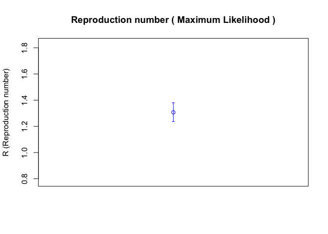
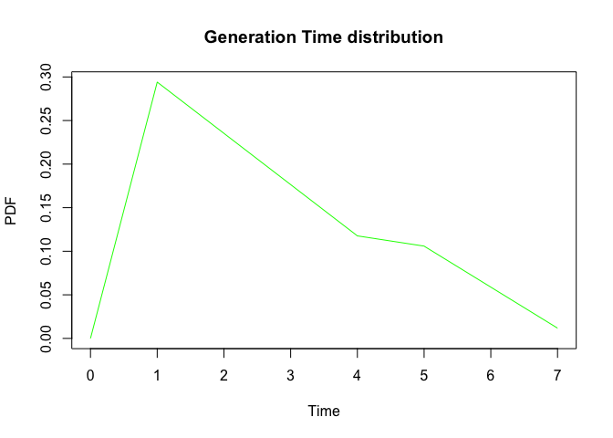
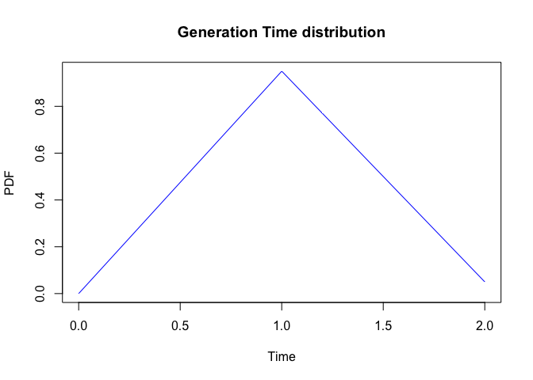
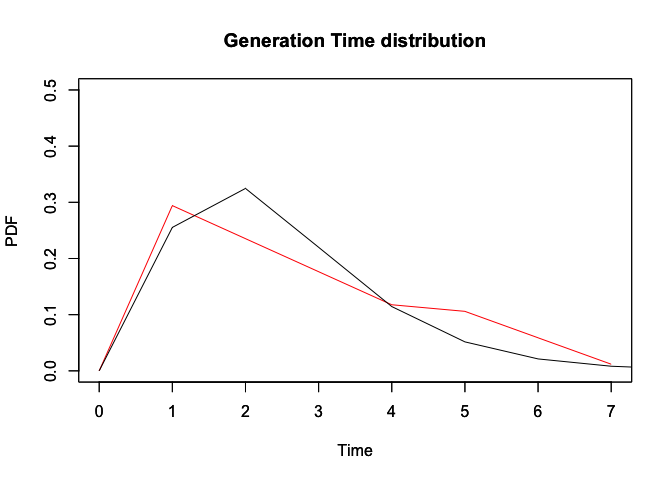

R0 Testing
================
Christine Sangphet
2024-06-27

# est.GT: Find the best-fitting GT distribution for a series of serial interval

``` r
#load environment 

library(R0)
```

``` r
# Data taken from traced cases of H1N1 viruses.

data(H1N1.serial.interval)
est.GT(serial.interval=H1N1.serial.interval)
```

    ## Warning in densfun(x, parm[1], parm[2], ...): NaNs produced
    ## Warning in densfun(x, parm[1], parm[2], ...): NaNs produced

    ## Best fitting GT distribution is a gamma distribution with mean = 3.039437 and sd = 1.676551 .

    ## Discretized Generation Time distribution
    ## mean: 3.070303 , sd: 1.676531 
    ##  [1] 0.0000000000 0.1621208802 0.2704857362 0.2358751176 0.1561845680
    ##  [6] 0.0888997193 0.0459909903 0.0222778094 0.0102848887 0.0045773285
    ## [11] 0.0019791984 0.0008360608 0.0003464431 0.0001412594

``` r
#the same result can be achieved with two vectors of dates of onset.

# Here we use the same data, but trick the function into thinking onset dates are all "0".

est.GT(infector.onset.dates=rep(0,length(H1N1.serial.interval)),
infectee.onset.dates=H1N1.serial.interval)
```

    ## Warning in densfun(x, parm[1], parm[2], ...): NaNs produced
    ## Warning in densfun(x, parm[1], parm[2], ...): NaNs produced

    ## Best fitting GT distribution is a gamma distribution with mean = 3.039437 and sd = 1.676551 .

    ## Discretized Generation Time distribution
    ## mean: 3.070303 , sd: 1.676531 
    ##  [1] 0.0000000000 0.1621208802 0.2704857362 0.2358751176 0.1561845680
    ##  [6] 0.0888997193 0.0459909903 0.0222778094 0.0102848887 0.0045773285
    ## [11] 0.0019791984 0.0008360608 0.0003464431 0.0001412594

# est.R0.AR: Estimate R0 from attack rate of an epidemic

### Woodall reported an attack rate of 0.31 in a population of 1732 during the 1957 H2N2 influenza pandemic (’Age and Asian Influenza, 1957’, BMJ, 1958)

``` r
est.R0.AR(pop.size=1732, AR=0.31)
```

    ## Reproduction number estimate using  Attack Rate  method.
    ## R :  1.19698[ 1.179606 , 1.215077 ]

``` r
est.R0.AR(AR=0.31)
```

    ## Reproduction number estimate using  Attack Rate  method.
    ## R :  1.19698

``` r
est.R0.AR(pop.size=1732, incid=31)
```

    ## Reproduction number estimate using  Attack Rate  method.
    ## R :  1.009057[ 1.005873 , 1.012269 ]

``` r
est.R0.AR(pop.size=1732, incid=c(2,3,4,7,4,2,4,5))
```

    ## Reproduction number estimate using  Attack Rate  method.
    ## R :  1.009057[ 1.005873 , 1.012269 ]

``` r
est.R0.AR(pop.size=1732, incid=c(2,3,0,7,4,2,0,5))
```

    ## Reproduction number estimate using  Attack Rate  method.
    ## R :  1.006699[ 1.003965 , 1.009453 ]

# est.R0.EG: Estimate R from exponential growth rate

### Data is taken from the paper by Nishiura for key transmission parameters of an institutional outbreak during 1918 influenza pandemic in Germany)

``` r
data(Germany.1918)
mGT<-generation.time("gamma", c(3, 1.5))
est.R0.EG(Germany.1918, mGT, begin=1, end=27)
```

    ## Waiting for profiling to be done...

    ## Reproduction number estimate using  Exponential Growth  method.
    ## R :  1.525895[ 1.494984 , 1.557779 ]

# est.R0.ML: Estimate the reproduction number by maximum likelihood

### Data is taken from paper by Nishiura for key transmission parameters of an institutional outbreak during the 1918 influenza pandemic in Germany)

``` r
data(Germany.1918)
mGT<-generation.time("gamma", c(2.45, 1.38))
est.R0.ML(Germany.1918, mGT, begin=1, end=27, range=c(0.01,50))
```

    ## Reproduction number estimate using  Maximum Likelihood  method.
    ## R :  1.307222[ 1.236913 , 1.380156 ]

``` r
res=est.R0.ML(Germany.1918, mGT, begin=1, end=27, range=c(0.01,50))
plot(res)
```

<!-- -->

# est.R0.TD: Estimate the time dependent reproduction number

### Data is taken from the paper by Nishiura for key transmission parameters of an institutional outbreak during 1918 influenza pandemic in Germany)

``` r
data(Germany.1918)
mGT<-generation.time("gamma", c(3, 1.5))
TD <- est.R0.TD(Germany.1918, mGT, begin=1, end=126, nsim=100)
```

    ## Warning in est.R0.TD(Germany.1918, mGT, begin = 1, end = 126, nsim = 100):
    ## Accurate confidence interval for R(t) requires a large number of simulations.
    ## Consider increasing 'nsim'

    ## Warning in est.R0.TD(Germany.1918, mGT, begin = 1, end = 126, nsim = 100):
    ## Using initial incidence as initial number of cases.

``` r
TD
```

    ## Reproduction number estimate using  Time-Dependent  method.
    ## 2.322239 2.272013 1.998474 1.843703 2.019297 1.867488 1.644993 1.553265 1.553317 1.601317 ...

# estimate.R: Estimate R0 for one incidence dataset using several methods

``` r
#Outbreak during 1918 influenza pandemic in Germany

data(Germany.1918)
mGT<-generation.time("gamma", c(3, 1.5))
estR0<-estimate.R(Germany.1918, mGT, begin=1, end=27, methods=c("EG", "ML", "TD", "AR", "SB"),
pop.size=100000, nsim=100)
```

    ## Waiting for profiling to be done...

    ## Warning in est.R0.TD(epid = c(`1918-09-29` = 10, `1918-09-30` = 4, `1918-10-01`
    ## = 4, : Accurate confidence interval for R(t) requires a large number of
    ## simulations. Consider increasing 'nsim'

    ## Warning in est.R0.TD(epid = c(`1918-09-29` = 10, `1918-09-30` = 4, `1918-10-01`
    ## = 4, : Using initial incidence as initial number of cases.

``` r
attributes(estR0)
```

    ## $names
    ## [1] "epid"      "GT"        "begin"     "end"       "estimates"
    ## 
    ## $class
    ## [1] "R0.sR"

``` r
#Estimates results are stored in the $estimates object

estR0
```

    ## Reproduction number estimate using  Exponential Growth  method.
    ## R :  1.525895[ 1.494984 , 1.557779 ]
    ## 
    ## Reproduction number estimate using  Maximum Likelihood  method.
    ## R :  1.383996[ 1.309545 , 1.461203 ]
    ## 
    ## Reproduction number estimate using  Attack Rate  method.
    ## R :  1.047392[ 1.046394 , 1.048393 ]
    ## 
    ## Reproduction number estimate using  Time-Dependent  method.
    ## 2.322239 2.272013 1.998474 1.843703 2.019297 1.867488 1.644993 1.553265 1.553317 1.601317 ...
    ## 
    ## Reproduction number estimate using  Sequential Bayesian  method.
    ## 0 0 2.22 0.66 1.2 1.84 1.43 1.63 1.34 1.52 ...

# generation.time: Generation Time distribution

``` r
#GT for children at house(from Cauchemez PNAS 2011)

GT.chld.hsld1<-generation.time("empirical", c(0,0.25,0.2,0.15,0.1,0.09,0.05,0.01))
plot(GT.chld.hsld1, col="green")
```

<!-- -->

``` r
GT.chld.hsld1
```

    ## Discretized Generation Time distribution
    ## mean: 2.729412 , sd: 1.611636 
    ## [1] 0.00000000 0.29411765 0.23529412 0.17647059 0.11764706 0.10588235 0.05882353
    ## [8] 0.01176471

``` r
GT.chld.hsld2<-generation.time("gamma", c(2.45, 1.38))
GT.chld.hsld2
```

    ## Discretized Generation Time distribution
    ## mean: 2.504038 , sd: 1.37276 
    ##  [1] 0.0000000000 0.2553188589 0.3247178420 0.2199060781 0.1144367560
    ##  [6] 0.0515687896 0.0212246257 0.0082077973 0.0030329325 0.0010825594
    ## [11] 0.0003760069 0.0001277537

``` r
# T for school & community

GTs1 <- generation.time("empirical", c(0, 0.95, 0.05))
plot(GTs1, col='blue')
```

<!-- -->

``` r
plot(GT.chld.hsld1, ylim=c(0,0.5), col="red")
par(new=TRUE)
plot(GT.chld.hsld2, xlim=c(0,7), ylim=c(0,0.5), col="black")
```

<!-- -->

# impute.incid: Optimization routine for incidence imputation

### Data is taken from the paper by Nishiura for key transmission parameters of an institutional outbreak during 1918 influenza pandemic in Germany

``` r
#load environment

library(linelist)
library(epitrix)
```

``` r
data(Germany.1918)
mGT<-generation.time("gamma", c(2.6,1))
```

``` r
sen = sensitivity.analysis(sa.type="time", incid=Germany.1918, GT=mGT, begin=1:15, end=16:30,
est.method="EG")
```

    ## Warning: If 'begin' and 'end' overlap, cases where begin >= end are skipped.
    ## These cases often return Rsquared = 1 and are thus ignored.

    ## Waiting for profiling to be done...
    ## Waiting for profiling to be done...
    ## Waiting for profiling to be done...
    ## Waiting for profiling to be done...
    ## Waiting for profiling to be done...
    ## Waiting for profiling to be done...
    ## Waiting for profiling to be done...
    ## Waiting for profiling to be done...
    ## Waiting for profiling to be done...
    ## Waiting for profiling to be done...
    ## Waiting for profiling to be done...
    ## Waiting for profiling to be done...
    ## Waiting for profiling to be done...
    ## Waiting for profiling to be done...
    ## Waiting for profiling to be done...
    ## Waiting for profiling to be done...
    ## Waiting for profiling to be done...
    ## Waiting for profiling to be done...
    ## Waiting for profiling to be done...
    ## Waiting for profiling to be done...
    ## Waiting for profiling to be done...
    ## Waiting for profiling to be done...
    ## Waiting for profiling to be done...
    ## Waiting for profiling to be done...
    ## Waiting for profiling to be done...
    ## Waiting for profiling to be done...
    ## Waiting for profiling to be done...
    ## Waiting for profiling to be done...
    ## Waiting for profiling to be done...
    ## Waiting for profiling to be done...
    ## Waiting for profiling to be done...
    ## Waiting for profiling to be done...
    ## Waiting for profiling to be done...
    ## Waiting for profiling to be done...
    ## Waiting for profiling to be done...
    ## Waiting for profiling to be done...
    ## Waiting for profiling to be done...
    ## Waiting for profiling to be done...
    ## Waiting for profiling to be done...
    ## Waiting for profiling to be done...
    ## Waiting for profiling to be done...
    ## Waiting for profiling to be done...
    ## Waiting for profiling to be done...
    ## Waiting for profiling to be done...
    ## Waiting for profiling to be done...
    ## Waiting for profiling to be done...
    ## Waiting for profiling to be done...
    ## Waiting for profiling to be done...
    ## Waiting for profiling to be done...
    ## Waiting for profiling to be done...
    ## Waiting for profiling to be done...
    ## Waiting for profiling to be done...
    ## Waiting for profiling to be done...
    ## Waiting for profiling to be done...
    ## Waiting for profiling to be done...
    ## Waiting for profiling to be done...
    ## Waiting for profiling to be done...
    ## Waiting for profiling to be done...
    ## Waiting for profiling to be done...
    ## Waiting for profiling to be done...
    ## Waiting for profiling to be done...
    ## Waiting for profiling to be done...
    ## Waiting for profiling to be done...
    ## Waiting for profiling to be done...
    ## Waiting for profiling to be done...
    ## Waiting for profiling to be done...
    ## Waiting for profiling to be done...
    ## Waiting for profiling to be done...
    ## Waiting for profiling to be done...
    ## Waiting for profiling to be done...
    ## Waiting for profiling to be done...
    ## Waiting for profiling to be done...
    ## Waiting for profiling to be done...
    ## Waiting for profiling to be done...
    ## Waiting for profiling to be done...
    ## Waiting for profiling to be done...
    ## Waiting for profiling to be done...
    ## Waiting for profiling to be done...
    ## Waiting for profiling to be done...
    ## Waiting for profiling to be done...
    ## Waiting for profiling to be done...
    ## Waiting for profiling to be done...
    ## Waiting for profiling to be done...
    ## Waiting for profiling to be done...
    ## Waiting for profiling to be done...
    ## Waiting for profiling to be done...
    ## Waiting for profiling to be done...
    ## Waiting for profiling to be done...
    ## Waiting for profiling to be done...
    ## Waiting for profiling to be done...
    ## Waiting for profiling to be done...
    ## Waiting for profiling to be done...
    ## Waiting for profiling to be done...
    ## Waiting for profiling to be done...
    ## Waiting for profiling to be done...
    ## Waiting for profiling to be done...
    ## Waiting for profiling to be done...
    ## Waiting for profiling to be done...
    ## Waiting for profiling to be done...
    ## Waiting for profiling to be done...
    ## Waiting for profiling to be done...
    ## Waiting for profiling to be done...
    ## Waiting for profiling to be done...
    ## Waiting for profiling to be done...
    ## Waiting for profiling to be done...
    ## Waiting for profiling to be done...
    ## Waiting for profiling to be done...
    ## Waiting for profiling to be done...
    ## Waiting for profiling to be done...
    ## Waiting for profiling to be done...
    ## Waiting for profiling to be done...
    ## Waiting for profiling to be done...
    ## Waiting for profiling to be done...
    ## Waiting for profiling to be done...
    ## Waiting for profiling to be done...
    ## Waiting for profiling to be done...
    ## Waiting for profiling to be done...
    ## Waiting for profiling to be done...
    ## Waiting for profiling to be done...
    ## Waiting for profiling to be done...
    ## Waiting for profiling to be done...
    ## Waiting for profiling to be done...
    ## Waiting for profiling to be done...
    ## Waiting for profiling to be done...
    ## Waiting for profiling to be done...
    ## Waiting for profiling to be done...
    ## Waiting for profiling to be done...
    ## Waiting for profiling to be done...
    ## Waiting for profiling to be done...
    ## Waiting for profiling to be done...
    ## Waiting for profiling to be done...
    ## Waiting for profiling to be done...
    ## Waiting for profiling to be done...
    ## Waiting for profiling to be done...
    ## Waiting for profiling to be done...
    ## Waiting for profiling to be done...
    ## Waiting for profiling to be done...
    ## Waiting for profiling to be done...
    ## Waiting for profiling to be done...
    ## Waiting for profiling to be done...
    ## Waiting for profiling to be done...
    ## Waiting for profiling to be done...
    ## Waiting for profiling to be done...
    ## Waiting for profiling to be done...
    ## Waiting for profiling to be done...
    ## Waiting for profiling to be done...
    ## Waiting for profiling to be done...
    ## Waiting for profiling to be done...
    ## Waiting for profiling to be done...
    ## Waiting for profiling to be done...
    ## Waiting for profiling to be done...
    ## Waiting for profiling to be done...
    ## Waiting for profiling to be done...
    ## Waiting for profiling to be done...
    ## Waiting for profiling to be done...
    ## Waiting for profiling to be done...
    ## Waiting for profiling to be done...
    ## Waiting for profiling to be done...
    ## Waiting for profiling to be done...
    ## Waiting for profiling to be done...
    ## Waiting for profiling to be done...
    ## Waiting for profiling to be done...
    ## Waiting for profiling to be done...
    ## Waiting for profiling to be done...
    ## Waiting for profiling to be done...
    ## Waiting for profiling to be done...
    ## Waiting for profiling to be done...
    ## Waiting for profiling to be done...
    ## Waiting for profiling to be done...
    ## Waiting for profiling to be done...
    ## Waiting for profiling to be done...
    ## Waiting for profiling to be done...
    ## Waiting for profiling to be done...
    ## Waiting for profiling to be done...
    ## Waiting for profiling to be done...
    ## Waiting for profiling to be done...
    ## Waiting for profiling to be done...
    ## Waiting for profiling to be done...
    ## Waiting for profiling to be done...
    ## Waiting for profiling to be done...
    ## Waiting for profiling to be done...
    ## Waiting for profiling to be done...
    ## Waiting for profiling to be done...
    ## Waiting for profiling to be done...
    ## Waiting for profiling to be done...
    ## Waiting for profiling to be done...
    ## Waiting for profiling to be done...
    ## Waiting for profiling to be done...
    ## Waiting for profiling to be done...
    ## Waiting for profiling to be done...
    ## Waiting for profiling to be done...
    ## Waiting for profiling to be done...
    ## Waiting for profiling to be done...
    ## Waiting for profiling to be done...
    ## Waiting for profiling to be done...
    ## Waiting for profiling to be done...
    ## Waiting for profiling to be done...
    ## Waiting for profiling to be done...
    ## Waiting for profiling to be done...
    ## Waiting for profiling to be done...
    ## Waiting for profiling to be done...
    ## Waiting for profiling to be done...
    ## Waiting for profiling to be done...
    ## Waiting for profiling to be done...
    ## Waiting for profiling to be done...
    ## Waiting for profiling to be done...
    ## Waiting for profiling to be done...
    ## Waiting for profiling to be done...
    ## Waiting for profiling to be done...
    ## Waiting for profiling to be done...
    ## Waiting for profiling to be done...
    ## Waiting for profiling to be done...
    ## Waiting for profiling to be done...
    ## Waiting for profiling to be done...
    ## Waiting for profiling to be done...
    ## Waiting for profiling to be done...
    ## Waiting for profiling to be done...
    ## Waiting for profiling to be done...
    ## Waiting for profiling to be done...
    ## Waiting for profiling to be done...
    ## Waiting for profiling to be done...
    ## Waiting for profiling to be done...
    ## Waiting for profiling to be done...
    ## Waiting for profiling to be done...
    ## Waiting for profiling to be done...

``` r
plot(sen, what=c("criterion","heatmap"))
```

    ## $max.Rsquared
    ##     Time.period Begin.dates  End.dates         R Growth.rate  Rsquared
    ## 211           1  1918-10-13 1918-10-14 0.7966431 -0.07232066 1.0000000
    ## 212           2  1918-10-13 1918-10-15 1.4638654  0.12578511 0.5780246
    ## 213           3  1918-10-13 1918-10-16 1.5701682  0.14956841 0.8301796
    ## 198           4  1918-10-12 1918-10-16 1.4607124  0.12505680 0.8366304
    ## 215           5  1918-10-13 1918-10-18 1.4880327  0.13132209 0.9102327
    ## 216           6  1918-10-13 1918-10-19 1.5323805  0.14128057 0.9471691
    ## 217           7  1918-10-13 1918-10-20 1.5261663  0.13990050 0.9658279
    ## 202           8  1918-10-12 1918-10-20 1.4978208  0.13354223 0.9661954
    ## 187           9  1918-10-11 1918-10-20 1.5517552  0.14555209 0.9529012
    ## 172          10  1918-10-10 1918-10-20 1.5483504  0.14480483 0.9615177
    ## 157          11  1918-10-09 1918-10-20 1.5514000  0.14547419 0.9683531
    ## 142          12  1918-10-08 1918-10-20 1.5752136  0.15066175 0.9684254
    ## 127          13  1918-10-07 1918-10-20 1.5649826  0.14844150 0.9711261
    ## 112          14  1918-10-06 1918-10-20 1.5733082  0.15024920 0.9744284
    ## 97           15  1918-10-05 1918-10-20 1.5621823  0.14783160 0.9752564
    ## 82           16  1918-10-04 1918-10-20 1.5766385  0.15096994 0.9749691
    ## 67           17  1918-10-03 1918-10-20 1.5985892  0.15568739 0.9683783
    ## 52           18  1918-10-02 1918-10-20 1.5868765  0.15317733 0.9684990
    ## 37           19  1918-10-01 1918-10-20 1.6030326  0.15663542 0.9655641
    ## 22           20  1918-09-30 1918-10-20 1.6148899  0.15915397 0.9654262
    ## 7            21  1918-09-29 1918-10-20 1.6103334  0.15818806 0.9672862
    ## 8            22  1918-09-29 1918-10-21 1.5542958  0.14610872 0.9448535
    ## 57           23  1918-10-02 1918-10-25 1.4394676  0.12011333 0.9449942
    ## 10           24  1918-09-29 1918-10-23 1.4997967  0.13398885 0.9424691
    ## 11           25  1918-09-29 1918-10-24 1.4792914  0.12932852 0.9437630
    ## 12           26  1918-09-29 1918-10-25 1.4615201  0.12524349 0.9456652
    ## 13           27  1918-09-29 1918-10-26 1.4329356  0.11858051 0.9354416
    ## 14           28  1918-09-29 1918-10-27 1.4088026  0.11286372 0.9281762
    ## 15           29  1918-09-29 1918-10-28 1.3858604  0.10734878 0.9199849
    ##      CI.lower CI.upper
    ## 211 0.2829317 1.993745
    ## 212 0.9419193 2.229713
    ## 213 1.2073751 2.029051
    ## 198 1.2066743 1.762760
    ## 215 1.3038296 1.696242
    ## 216 1.3863578 1.693025
    ## 217 1.4102434 1.651379
    ## 202 1.3991827 1.603384
    ## 187 1.4602558 1.649198
    ## 172 1.4661091 1.635517
    ## 157 1.4761521 1.630877
    ## 142 1.5042459 1.650019
    ## 127 1.4995570 1.633778
    ## 112 1.5114270 1.638288
    ## 97  1.5044350 1.622720
    ## 82  1.5209417 1.635001
    ## 67  1.5440707 1.655724
    ## 52  1.5352480 1.640930
    ## 37  1.5523158 1.656148
    ## 22  1.5650942 1.667056
    ## 7   1.5622559 1.660686
    ## 8   1.5125261 1.597855
    ## 57  1.4110750 1.468726
    ## 10  1.4665869 1.534212
    ## 11  1.4493938 1.510194
    ## 12  1.4344734 1.489413
    ## 13  1.4085967 1.457980
    ## 14  1.3867572 1.431443
    ## 15  1.3658166 1.406409
    ## 
    ## $best.R0.values
    ##  [1] 0.7966431 1.4638654 1.5701682 1.4607124 1.4880327 1.5323805 1.5261663
    ##  [8] 1.4978208 1.5517552 1.5483504 1.5514000 1.5752136 1.5649826 1.5733082
    ## [15] 1.5621823 1.5766385 1.5985892 1.5868765 1.6030326 1.6148899 1.6103334
    ## [22] 1.5542958 1.4394676 1.4997967 1.4792914 1.4615201 1.4329356 1.4088026
    ## [29] 1.3858604
    ## 
    ## $best.fit
    ##    Time.period Begin.dates  End.dates        R Growth.rate  Rsquared CI.lower
    ## 97          15  1918-10-05 1918-10-20 1.562182   0.1478316 0.9752564 1.504435
    ##    CI.upper
    ## 97  1.62272

# sim.epid: Epidemic outbreak simulation

### In this example we simulate n=100 epidemic curves, with peak value at 150 incident cases,

## and maximum epidemic length of 30 time units. Only the outbreak phase is computed. When the peak value is reached, the process is stopped and another epidemic is generated.

``` r
sim.epid(epid.nb=100, GT=generation.time("gamma",c(3,1.5)), R0=1.5,
epid.length=30, family="poisson", peak.value=150)
```

    ##       [,1] [,2] [,3] [,4] [,5] [,6] [,7] [,8] [,9] [,10] [,11] [,12] [,13]
    ##  [1,]    1    1    1    1    1    1    1    1    1     1     1     1     1
    ##  [2,]    0    0    0    0    0    0    0    0    0     0     0     0     0
    ##  [3,]    0    0    0    0    1    0    0    0    2     1     1     0     0
    ##  [4,]    0    1    0    0    1    0    1    0    1     0     1     1     2
    ##  [5,]    1    2    0    0    2    0    0    0    2     1     2     0     0
    ##  [6,]    0    1    0    0    1    0    2    0    3     0     0     0     0
    ##  [7,]    1    3    0    0    0    0    0    0    1     0     2     1     0
    ##  [8,]    0    1    0    0    2    0    1    0    3     0     0     0     2
    ##  [9,]    0    1    0    0    2    0    1    0    2     0     1     1     0
    ## [10,]    0    3    0    0    2    0    0    0    5     0     2     0     1
    ## [11,]    1    3    0    0    1    0    2    0    5     1     4     0     2
    ## [12,]    0    3    0    0    3    0    1    0    5     0     2     0     5
    ## [13,]    0    2    0    0    1    0    1    0    8     0     2     0     3
    ## [14,]    0    3    0    0    4    0    1    0   12     0     1     1     3
    ## [15,]    0    5    0    0    2    0    1    0   15     0     2     0     4
    ## [16,]    0    3    0    0    7    0    2    0   14     0     2     0     5
    ## [17,]    0    6    0    0    1    0    4    0   12     0     3     1     7
    ## [18,]    0    5    0    0    2    0    0    0   17     0     8     0     3
    ## [19,]    0   10    0    0    8    0    4    0   16     0     2     0     4
    ## [20,]    0   12    0    0   11    0    2    0   23     0     2     1     6
    ## [21,]    0   15    0    0    8    0    4    0   20     0     8     0     6
    ## [22,]    0   11    0    0   10    0    2    0   32     0     5     1     5
    ## [23,]    0   25    0    0   13    0    2    0   30     0     9     0     3
    ## [24,]    0   22    0    0   15    0    4    0   21     0     9     0     7
    ## [25,]    0   21    0    0   14    0    1    0   36     0     7     2    13
    ## [26,]    0   37    0    0   24    0    5    0   26     0    13     0    10
    ## [27,]    0   27    0    0   28    0    5    0   51     0    10     2    12
    ## [28,]    0   36    0    0   27    0    7    0   48     0    10     3    11
    ## [29,]    0   35    0    0   21    0    4    0   58     0    13     2    16
    ## [30,]    0   50    0    0   33    0    9    0   71     0    14     0    15
    ##       [,14] [,15] [,16] [,17] [,18] [,19] [,20] [,21] [,22] [,23] [,24] [,25]
    ##  [1,]     1     1     1     1     1     1     1     1     1     1     1     1
    ##  [2,]     2     0     0     0     0     1     0     0     0     0     1     1
    ##  [3,]     0     0     1     0     1     1     1     2     0     0     0     1
    ##  [4,]     4     0     0     3     1     2     1     2     0     0     1     1
    ##  [5,]     3     1     1     1     1     1     0     0     0     0     1     1
    ##  [6,]     3     1     0     3     1     2     0     0     0     0     1     1
    ##  [7,]     4     0     0     1     0     2     1     1     0     0     0     3
    ##  [8,]     3     0     1     6     0     2     2     2     0     0     0     2
    ##  [9,]     3     2     1     4     0     0     1     2     0     0     0     2
    ## [10,]     7     1     0     5     0     3     2     0     0     0     0     4
    ## [11,]     5     0     2     4     0     1     3     3     0     0     1     6
    ## [12,]     7     0     0     8     0     2     2     1     0     0     1     3
    ## [13,]     9     2     2     6     0     3     1     1     0     0     0     9
    ## [14,]     9     0     3     6     0     4     2     3     0     0     0     4
    ## [15,]    15     2     4     2     0     3     4     2     0     0     0     5
    ## [16,]    10     1     3     7     0     4     4     1     0     0     2    13
    ## [17,]    16     1     5    11     0     5     4     3     0     0     0     6
    ## [18,]    16     0     5    10     0     5     3     4     0     0     0    10
    ## [19,]    18     1     5    15     0     7     5     4     0     0     0    12
    ## [20,]    18     2     6    24     0     5     6     4     0     0     2    11
    ## [21,]    25     0     5    14     0     5     4     5     0     0     1    22
    ## [22,]    28     2     7    29     0     9     4     8     0     0     2    19
    ## [23,]    42     2    10    25     0    13     7     2     0     0     5    22
    ## [24,]    36     1    11    23     0    10     6     5     0     0     1    34
    ## [25,]    56     4    18    35     0     5     7     6     0     0     6    28
    ## [26,]    40     3    14    32     0    17     7     9     0     0     1    47
    ## [27,]    61     4    16    32     0    13    11     6     0     0     5    48
    ## [28,]    77     6    25    52     0    13     8     9     0     0     6    66
    ## [29,]    74     1    22    51     0    21    18    18     0     0     3    87
    ## [30,]    92     6    33    63     0    21    16    16     0     0     7    82
    ##       [,26] [,27] [,28] [,29] [,30] [,31] [,32] [,33] [,34] [,35] [,36] [,37]
    ##  [1,]     1     1     1     1     1     1     1     1     1     1     1     1
    ##  [2,]     0     0     0     0     0     0     0     0     0     0     0     0
    ##  [3,]     1     2     1     1     0     0     0     0     0     0     0     0
    ##  [4,]     1     0     0     0     1     0     0     1     0     1     0     1
    ##  [5,]     0     3     0     1     1     1     0     0     0     0     0     0
    ##  [6,]     2     2     0     0     2     2     0     0     0     0     0     0
    ##  [7,]     1     2     0     0     0     1     0     0     0     0     0     0
    ##  [8,]     2     2     0     1     1     1     0     0     0     0     0     1
    ##  [9,]     1     5     0     1     3     2     0     0     0     0     0     1
    ## [10,]     3     2     0     3     2     5     0     0     0     0     0     1
    ## [11,]     3     3     0     3     1     2     0     0     0     0     0     1
    ## [12,]     3     1     0     4     4     3     0     0     0     0     0     0
    ## [13,]     1     2     0     2     7     6     0     0     0     0     0     2
    ## [14,]     6     3     0     2     3     8     0     0     0     0     0     0
    ## [15,]     2     5     0     1    10    10     0     0     0     0     0     1
    ## [16,]     3     4     0     4     5    17     0     0     0     0     0     2
    ## [17,]     3     5     0     4    14    20     0     0     0     0     0     3
    ## [18,]     7     3     0     4     6    13     0     0     0     0     0     4
    ## [19,]     5     4     0     5    17    25     0     0     0     0     0     1
    ## [20,]     5    11     0     4    17    25     0     0     0     0     0     5
    ## [21,]    10     9     0     3    16    16     0     0     0     0     0     4
    ## [22,]     8     8     0     7    12    27     0     0     0     0     0     9
    ## [23,]    12    16     0     8    23    28     0     0     0     0     0     8
    ## [24,]    13    12     0     6    26    37     0     0     0     0     0    10
    ## [25,]    14    17     0     9    27    37     0     0     0     0     0    13
    ## [26,]    15    22     0     8    33    39     0     0     0     0     0    11
    ## [27,]    20    20     0    10    36    52     0     0     0     0     0    15
    ## [28,]    26    25     0    13    55    59     0     0     0     0     0    13
    ## [29,]    14    34     0     8    40    66     0     0     0     0     0    17
    ## [30,]    31    39     0    19    58    74     0     0     0     0     0    27
    ##       [,38] [,39] [,40] [,41] [,42] [,43] [,44] [,45] [,46] [,47] [,48] [,49]
    ##  [1,]     1     1     1     1     1     1     1     1     1     1     1     1
    ##  [2,]     0     0     0     0     0     0     1     0     1     0     0     0
    ##  [3,]     0     0     0     0     0     0     0     0     2     0     0     0
    ##  [4,]     0     1     0     0     0     2     3     0     0     0     0     0
    ##  [5,]     1     2     0     0     0     1     1     1     1     0     0     0
    ##  [6,]     0     1     0     0     0     0     2     0     0     0     0     0
    ##  [7,]     0     0     0     0     1     1     5     0     2     0     0     0
    ##  [8,]     0     1     1     0     0     2     5     0     1     0     0     0
    ##  [9,]     0     0     0     0     1     3     2     0     0     0     0     0
    ## [10,]     0     2     0     0     1     2     4     0     0     0     0     0
    ## [11,]     0     1     0     0     0     3     7     0     1     0     0     0
    ## [12,]     0     0     0     0     2     5     9     1     0     0     0     0
    ## [13,]     0     2     0     0     3     1    12     1     0     0     0     0
    ## [14,]     0     3     0     0     2     7    14     0     0     0     0     0
    ## [15,]     0     1     0     0     4     8    13     0     0     0     0     0
    ## [16,]     0     2     0     0     3     6    19     1     0     0     0     0
    ## [17,]     0     0     0     0     3    11    29     1     0     0     0     0
    ## [18,]     0     2     0     0     4    10    29     0     0     0     0     0
    ## [19,]     0     3     0     0     3     9    36     2     0     0     0     0
    ## [20,]     0     2     0     0     5    16    35     0     0     0     0     0
    ## [21,]     0     4     0     0     8    15    36     0     0     0     0     0
    ## [22,]     0     3     0     0     2    13    52     0     0     0     0     0
    ## [23,]     0     3     0     0     6    23    56     0     0     0     0     0
    ## [24,]     0     3     0     0    13    21    62     1     0     0     0     0
    ## [25,]     0     1     0     0    12    32    72     0     0     0     0     0
    ## [26,]     0     4     0     0    14    24    80     1     0     0     0     0
    ## [27,]     0    10     0     0    14    42   113     0     0     0     0     0
    ## [28,]     0     4     0     0    25    35   119     0     0     0     0     0
    ## [29,]     0     7     0     0    30    53   132     0     0     0     0     0
    ## [30,]     0     6     0     0    39    62   171     0     0     0     0     0
    ##       [,50] [,51] [,52] [,53] [,54] [,55] [,56] [,57] [,58] [,59] [,60] [,61]
    ##  [1,]     1     1     1     1     1     1     1     1     1     1     1     1
    ##  [2,]     0     0     0     0     0     0     0     0     0     0     0     0
    ##  [3,]     0     1     0     1     1     0     0     0     0     0     1     0
    ##  [4,]     1     0     1     0     3     0     0     0     2     2     0     0
    ##  [5,]     0     0     0     1     2     0     0     0     0     0     0     1
    ##  [6,]     0     1     1     0     2     0     0     0     2     1     0     1
    ##  [7,]     0     0     1     1     1     0     0     0     2     2     0     0
    ##  [8,]     0     2     0     1     4     0     0     0     5     0     0     2
    ##  [9,]     0     2     1     2     1     0     1     0     3     2     0     3
    ## [10,]     0     1     0     0     2     0     0     0     2     2     0     2
    ## [11,]     0     1     0     1     3     0     2     0     5     1     0     0
    ## [12,]     0     0     0     1     1     0     0     0     5     3     0     1
    ## [13,]     0     0     1     1     3     0     1     0     0     2     0     1
    ## [14,]     0     0     0     2     2     0     2     0     2     5     0     0
    ## [15,]     0     3     0     4     3     0     3     0     4     4     0     1
    ## [16,]     0     1     0     3     4     0     0     0     3     7     0     2
    ## [17,]     0     0     1     3     2     0     3     0     2     8     0     4
    ## [18,]     0     2     0    10     6     0     2     0     7     6     0     4
    ## [19,]     0     2     3     3     2     0     1     0     0     9     0     4
    ## [20,]     0     4     1     8     3     0     3     0     4    21     0     5
    ## [21,]     0     2     1     7     4     0     3     0     7    13     0     5
    ## [22,]     0     2     6     3     1     0     6     0     3    13     0     7
    ## [23,]     0     6     4     6     4     0     4     0     5    19     0    10
    ## [24,]     0     4     0    10     4     0     8     0     5    19     0    15
    ## [25,]     0     4     2    12     5     0     7     0     6    23     0    11
    ## [26,]     0     3     3     8     8     0    13     0     9    21     0     7
    ## [27,]     0     4     4    14     5     0    10     0     5    30     0    14
    ## [28,]     0     5     4    12     8     0    10     0    17    29     0    11
    ## [29,]     0     6     6     7     7     0    16     0    20    41     0    22
    ## [30,]     0     8     7    15     4     0    19     0    22    34     0    22
    ##       [,62] [,63] [,64] [,65] [,66] [,67] [,68] [,69] [,70] [,71] [,72] [,73]
    ##  [1,]     1     1     1     1     1     1     1     1     1     1     1     1
    ##  [2,]     0     0     0     0     0     1     0     0     0     0     0     0
    ##  [3,]     0     0     0     1     0     0     0     2     0     0     0     0
    ##  [4,]     0     0     0     2     0     1     0     1     0     0     0     0
    ##  [5,]     0     1     1     1     0     2     1     3     1     0     0     0
    ##  [6,]     0     0     1     2     0     3     0     0     0     0     0     0
    ##  [7,]     0     0     0     3     0     1     0     2     0     0     0     0
    ##  [8,]     0     0     0     4     0     1     0     0     0     0     0     1
    ##  [9,]     0     0     0     1     0     3     0     3     1     0     0     0
    ## [10,]     0     1     0     5     0     3     0     3     0     0     0     0
    ## [11,]     0     1     0     6     0     4     0     1     0     0     0     1
    ## [12,]     0     0     0     4     0     4     0     3     0     0     0     0
    ## [13,]     0     1     0     3     0     6     0     2     2     0     0     1
    ## [14,]     0     1     0     8     0     3     0     3     1     0     0     1
    ## [15,]     0     0     0     7     0     6     0     8     3     0     0     0
    ## [16,]     0     1     0     3     0     6     0     2     4     0     0     2
    ## [17,]     0     2     0     7     0     6     0     5     4     0     0     1
    ## [18,]     0     0     0     7     0    10     0     9     2     0     0     4
    ## [19,]     0     1     0    10     0     9     0     5     7     0     0     2
    ## [20,]     0     2     0     9     0    18     0     9     4     0     0     2
    ## [21,]     0     2     0    12     0    11     0    10     8     0     0     6
    ## [22,]     0     4     0    18     0    13     0    11     8     0     0     5
    ## [23,]     0     2     0    14     0    18     0    16    10     0     0     7
    ## [24,]     0     5     0    15     0    24     0    18    14     0     0     5
    ## [25,]     0     6     0    22     0    17     0    16    13     0     0     5
    ## [26,]     0     7     0    22     0    26     0    27    24     0     0     5
    ## [27,]     0     7     0    20     0    23     0    33    26     0     0     5
    ## [28,]     0     9     0    26     0    35     0    28    24     0     0     5
    ## [29,]     0    11     0    46     0    27     0    39    34     0     0    11
    ## [30,]     0    12     0    42     0    39     0    43    27     0     0     9
    ##       [,74] [,75] [,76] [,77] [,78] [,79] [,80] [,81] [,82] [,83] [,84] [,85]
    ##  [1,]     1     1     1     1     1     1     1     1     1     1     1     1
    ##  [2,]     0     0     0     0     0     0     0     0     0     0     1     0
    ##  [3,]     1     0     0     0     0     0     0     2     1     1     0     2
    ##  [4,]     1     0     0     0     1     0     0     0     0     0     1     0
    ##  [5,]     0     0     0     0     1     0     0     1     1     3     2     0
    ##  [6,]     0     0     2     1     1     0     0     0     0     0     2     0
    ##  [7,]     0     0     1     1     2     0     0     3     0     1     2     0
    ##  [8,]     1     0     1     1     4     0     0     1     1     1     1     0
    ##  [9,]     0     0     2     2     4     0     0     0     0     3     6     0
    ## [10,]     0     0     1     4     5     0     0     1     0     3     2     0
    ## [11,]     2     0     0     0     2     0     0     2     2     6     0     0
    ## [12,]     0     0     4     4     4     0     0     0     0     5     4     0
    ## [13,]     0     0     1     1     5     0     0     1     0     4     2     0
    ## [14,]     3     0     5     5     4     0     0     0     0     5     2     0
    ## [15,]     1     0     4     4     3     0     0     1     1     6     8     0
    ## [16,]     2     0     3     6     7     0     0     0     0     7     9     0
    ## [17,]     3     0     2     5     5     0     0     1     0     3    12     0
    ## [18,]     3     0     6     3     6     0     0     1     2     9    13     0
    ## [19,]     5     0     5     9     7     0     0     0     1     8    13     0
    ## [20,]     8     0     6     6    12     0     0     2     1    10    14     0
    ## [21,]     3     0     7     2    11     0     0     0     0    17    15     0
    ## [22,]     4     0     8     8    17     0     0     2     1     8    24     0
    ## [23,]     8     0     7     9    14     0     0     0     0    17    24     0
    ## [24,]     7     0    16     9    18     0     0     1     1    19    24     0
    ## [25,]    10     0    16    11    19     0     0     0     1    23    40     0
    ## [26,]    13     0    17     7    26     0     0     1     0    19    32     0
    ## [27,]    11     0    24     9    15     0     0     2     1    24    55     0
    ## [28,]    15     0    33    14    23     0     0     0     1    28    56     0
    ## [29,]    25     0    27    20    24     0     0     0     0    33    69     0
    ## [30,]    20     0    32    15    25     0     0     5     1    60    79     0
    ##       [,86] [,87] [,88] [,89] [,90] [,91] [,92] [,93] [,94] [,95] [,96] [,97]
    ##  [1,]     1     1     1     1     1     1     1     1     1     1     1     1
    ##  [2,]     0     2     0     0     0     1     0     1     0     0     0     0
    ##  [3,]     0     0     0     1     0     0     0     1     2     0     0     0
    ##  [4,]     0     0     0     0     1     0     0     2     0     0     1     0
    ##  [5,]     0     1     0     1     0     0     0     2     1     0     0     0
    ##  [6,]     0     0     0     1     1     0     0     2     0     0     0     0
    ##  [7,]     0     2     1     2     0     1     0     3     0     0     0     0
    ##  [8,]     0     2     0     2     1     0     0     2     0     0     0     0
    ##  [9,]     0     0     0     2     0     0     0     5     1     0     0     0
    ## [10,]     0     5     0     2     3     0     0     8     2     0     0     0
    ## [11,]     0     1     0     6     1     0     0     4     4     0     0     0
    ## [12,]     0     4     1     4     3     2     0     3     3     0     0     0
    ## [13,]     0     4     0     3     1     0     0     9     2     0     0     0
    ## [14,]     0     1     0     8     5     0     0     5     2     0     0     0
    ## [15,]     0     3     0     6     4     0     0     4     1     0     0     0
    ## [16,]     0    10     0     9     4     0     0     6     2     0     0     0
    ## [17,]     0     8     0     8     5     0     0    10     2     0     0     0
    ## [18,]     0    13     0     7     6     0     0     9     5     0     0     0
    ## [19,]     0     9     0     8    11     0     0     7     5     0     0     0
    ## [20,]     0    11     0     4    12     0     0     9     6     0     0     0
    ## [21,]     0    16     0    16    10     0     0    14     5     0     0     0
    ## [22,]     0    25     0    10    18     0     0    18    12     0     0     0
    ## [23,]     0    16     0    16    11     0     0    18    10     0     0     0
    ## [24,]     0    25     0    13    18     0     0    19     7     0     0     0
    ## [25,]     0    37     0    20    20     0     0    19     7     0     0     0
    ## [26,]     0    31     0    17    26     0     0    25     6     0     0     0
    ## [27,]     0    29     0    15    22     0     0    25     9     0     0     0
    ## [28,]     0    39     0    18    34     0     0    32    11     0     0     0
    ## [29,]     0    44     0    22    39     0     0    46    15     0     0     0
    ## [30,]     0    62     0    27    39     0     0    47    12     0     0     0
    ##       [,98] [,99] [,100]
    ##  [1,]     1     1      1
    ##  [2,]     2     0      0
    ##  [3,]     2     1      0
    ##  [4,]     0     0      0
    ##  [5,]     2     2      1
    ##  [6,]     5     2      0
    ##  [7,]     2     0      0
    ##  [8,]     6     0      0
    ##  [9,]     8     1      0
    ## [10,]     4     3      0
    ## [11,]     7     2      0
    ## [12,]    10     1      0
    ## [13,]    10     2      0
    ## [14,]    11     1      0
    ## [15,]    13     0      0
    ## [16,]    17     1      0
    ## [17,]    13     1      0
    ## [18,]    18     1      0
    ## [19,]    27     3      0
    ## [20,]    22     3      0
    ## [21,]    37     2      0
    ## [22,]    35     1      0
    ## [23,]    43     3      0
    ## [24,]    60     3      0
    ## [25,]    65     3      0
    ## [26,]    66     5      0
    ## [27,]    85     4      0
    ## [28,]    96     6      0
    ## [29,]   113     6      0
    ## [30,]   109    12      0

``` r
#Here, a 30*100 matrix is returned. Each column is a single epidemic.
```
