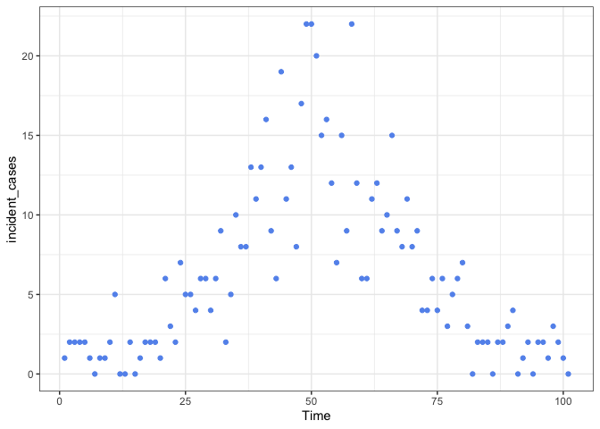
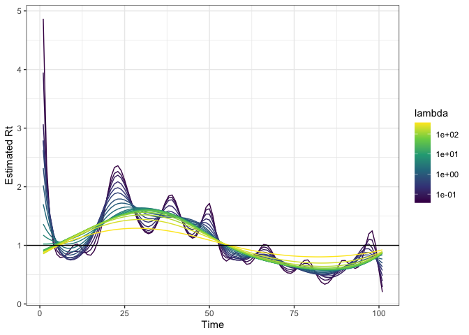
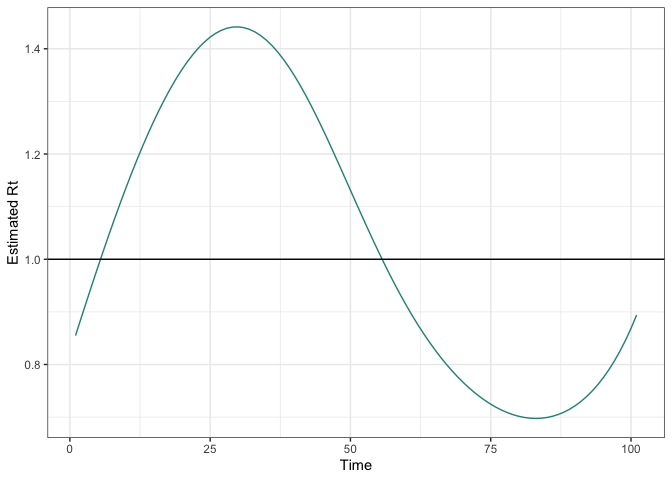

RtEstim Testing
================
Christine Sangphet
2024-07-07

# Quick Example

``` r
#load evironment

remotes::install_github("dajmcdon/rtestim")
```

    ## Skipping install of 'rtestim' from a github remote, the SHA1 (d6952c24) has not changed since last install.
    ##   Use `force = TRUE` to force installation

``` r
library(ggplot2)
```

# Quick Example

``` r
set.seed(12345)

dat <- data.frame(
  Time = 1:101,
  incident_cases = c(1, rpois(100, dnorm(1:100, 50, 15) * 500 + 1))
)

ggplot(dat, aes(Time, incident_cases)) +
  geom_point(colour = "cornflowerblue") +
  theme_bw()
```

<!-- -->

``` r
#We fit the model and visualize the resulting estimated sequences of Rt

library(rtestim)

mod <- estimate_rt(observed_counts = dat$incident_cases, nsol = 20)
plot(mod)
```

<!-- -->

``` r
#The additional parameter nsol = 20 specifies the number of $\lambda$s for which Rt is estimated
```

``` r
#A built in function for cross-validation can be used to select the tuning parameter

mod_cv <- cv_estimate_rt(dat$incident_cases, nsol = 20)
plot(mod_cv, which_lambda = "lambda.1se")
```

<!-- -->
