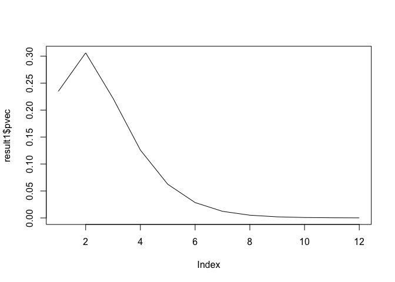
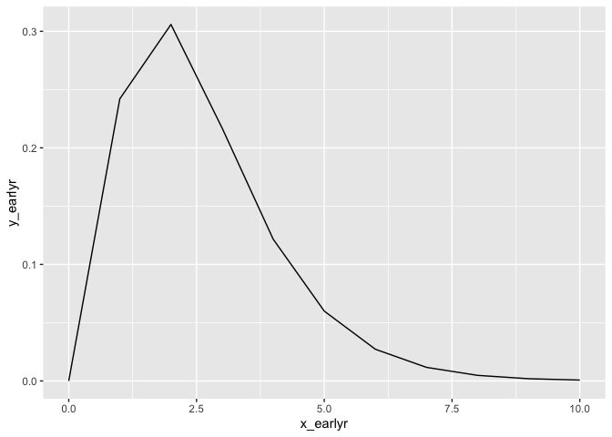
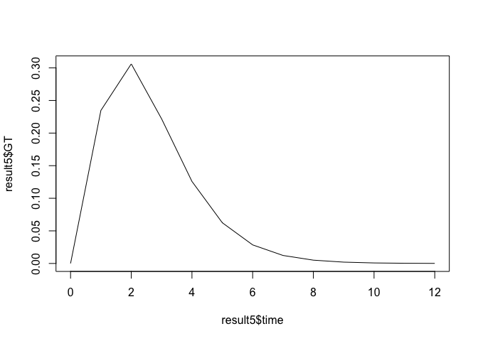
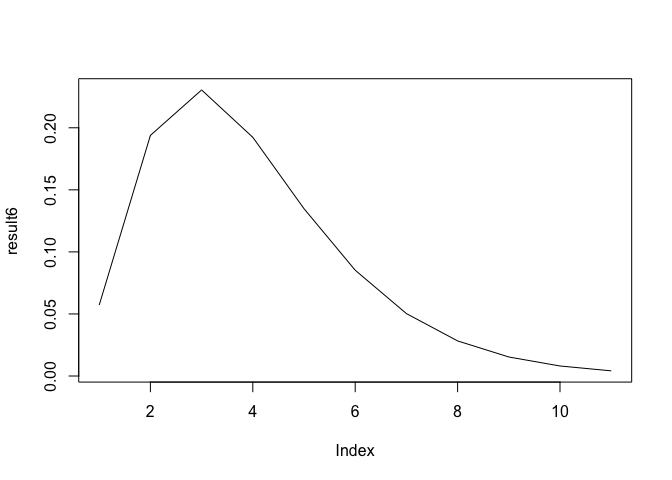
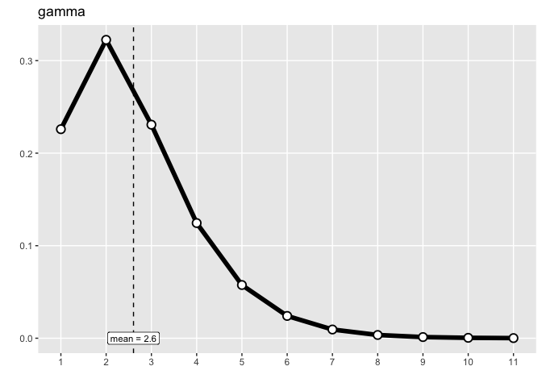

SI Code Breakdown
================
Christine Sangphet
2024-08-14

SI estimation when mean = 2.6 and sd = 1.5

## EpiLPS

``` r
epiLPS_si_func <- # Function to calculate the serial interval/generation time using a gamma distribution
  my_Idist_gamma <- function(mean, sd) {
    # Ensure the mean is greater than 1
    if (mean <= 1) 
      stop("mean must be larger than 1")
    
    # Ensure the standard deviation is positive
    if (sd <= 0) 
      stop("sd must be strictly positive")
    
    # Calculate the shape and rate parameters for the gamma distribution
    shape <- (mean / sd)^2
    rate <- mean / (sd^2)
    
    # Determine the maximum value for the gamma distribution
    Dmax <- floor(stats::qgamma(0.9999, shape, rate))
    
    # Define a function to compute the gamma distribution's probabilities
    gt <- function(t) {
      val <- (stats::pgamma(t + 0.5, shape, rate) - 
                stats::pgamma(t - 0.5, shape, rate)) / 
        (stats::pgamma(Dmax + 0.5, shape, rate) - 
           stats::pgamma(0.5, shape, rate))
      return(val)
    }
    
    # Apply the 'gt' function to each value from 1 to Dmax
    pvec <- sapply(seq_len(Dmax), gt)
    
    # Return a list containing the probabilities and parameters
    outlist <- list(pvec = pvec, dist = "gamma", shape = shape, rate = rate)
    
    return(outlist)
  }
```

``` r
mean_val <- 2.6
sd_val <- 1.5

# Call the function

result1 <- epiLPS_si_func(mean_val, sd_val)

# View the result

print(result1)
```

    ## $pvec
    ##  [1] 0.2347607172 0.3061130999 0.2217949514 0.1258257345 0.0624515217
    ##  [6] 0.0284937595 0.0122689922 0.0050642269 0.0020240933 0.0007887430
    ## [11] 0.0003011238 0.0001130366
    ## 
    ## $dist
    ## [1] "gamma"
    ## 
    ## $shape
    ## [1] 3.004444
    ## 
    ## $rate
    ## [1] 1.155556

``` r
plot(result1$pvec, type = "l")
```

<!-- -->

## EpiEstim

``` r
epiestim_si_func <- function(k, mu, sigma) 
{
  if (sigma < 0) {
    stop("sigma must be >=0.")
  }
  if (mu <= 1) {
    stop("mu must be >1")
  }
  if (any(k < 0)) {
    stop("all values in k must be >=0.")
  }

  a <- ((mu - 1) / sigma)^2
  b <- sigma^2 / (mu - 1)

  cdf_gamma <- function(k, a, b) stats::pgamma(k, shape = a, scale = b)

  res <- k * cdf_gamma(k, a, b) + 
    (k - 2) * cdf_gamma(k - 2, a, b) - 2 * (k - 1) * cdf_gamma(k - 1, a, b)
  res <- res + a * b * (2 * cdf_gamma(k - 1, a + 1, b) - 
                          cdf_gamma(k - 2, a + 1, b) - cdf_gamma(k, a + 1, b))
  res <- vnapply(res, function(e) max(0, e))

  return(res)
}

vnapply <- function(X, FUN, ...) {
  vapply(X, FUN, numeric(1), ...)
}
```

``` r
# Define parameters

mu <- 2.6
sigma <- 1.5

# Define values for k

k_values <- 0:10 

# Calculate discrete probabilities

result2 <- epiestim_si_func(k_values, mu, sigma)

# Print results
print(result2)
```

    ##  [1] 0.000000000 0.233172125 0.358579400 0.198110829 0.103342655 0.052905175
    ##  [7] 0.026821462 0.013516198 0.006783438 0.003394351 0.001694674

## epitrix

``` r
epitrix_si_func <- function (mu, cv) 
{
    shape <- 1/(cv^2)
    scale <- mu * cv^2
    return(list(shape = shape, scale = scale))
}
```

``` r
mu <- 2.6 
sigma <- 1.5 
cv <- sigma/mu

result3 <- epitrix_si_func(mu, cv)

print(result3)
```

    ## $shape
    ## [1] 3.004444
    ## 
    ## $scale
    ## [1] 0.8653846

``` r
#in previous testing we used the distcrete packaage to define the gamma distribution but here we plot solely based on the epitrix package 

library(ggplot2)

x_epitrix <- seq(0, 10)
y_epitrix <- dgamma(x_epitrix, shape = result3$shape, scale = result3$scale)
df_epitrix <- data.frame(x = x_epitrix, y = y_epitrix)
ggplot(df_epitrix, aes(x_epitrix, y_epitrix)) +
  geom_line() 
```

<!-- -->

## earlyR

``` r
earlyr_si_func <- function(disease = NULL, si = NULL, si_mean = NULL, si_sd = NULL, MAX_T = 1000) {
  if (is.null(si)) {
    if (is.null(si_mean) && disease == "ebola") {
        si_mean <- 15.3
    }
    if (is.null(si_sd) && disease == "ebola") {
        si_sd <- 9.3
    }
    if (is.null(si_mean)) stop("si_mean is missing")
    if (is.null(si_sd)) stop("si_sd is missing")

    si_param <- epitrix::gamma_mucv2shapescale(si_mean, si_sd / si_mean)

    si_full <- distcrete::distcrete("gamma", shape = si_param$shape,
                                    scale = si_param$scale,
                                    interval = 1L, w = 0L)
  } else {
    if (!inherits(si, "distcrete")) {
      stop("'si' must be a distcrete object")
    }
    if (as.integer(si$interval) != 1L) {
      msg <- sprintf("interval used in si is not 1 day, but %d)", si$interval)
      stop(msg)
    }

    si_full <- si
  }
  si <- si_full$d(seq_len(MAX_T))
  si[1] <- 0
  si <- si / sum(si)
  
  return(list(si = si, si_full = si_full))
}
```

``` r
result4 <- earlyr_si_func(si_mean = 2.6, si_sd = 1.5)

print(result4)
```

    ## $si
    ##    [1] 0.000000e+00 4.479748e-01 2.812354e-01 1.479620e-01 7.010944e-02
    ##    [6] 3.099878e-02 1.304853e-02 5.294563e-03 2.088008e-03 8.049426e-04
    ##   [11] 3.046060e-04 1.135029e-04 4.174547e-05 1.518311e-05 5.469052e-06
    ##   [16] 1.953401e-06 6.925216e-07 2.438930e-07 8.538738e-08 2.973547e-08
    ##   [21] 1.030538e-08 3.555922e-09 1.222096e-09 4.184745e-10 1.428139e-10
    ##   [26] 4.858726e-11 1.648269e-11 5.576506e-12 1.882129e-12 6.336047e-13
    ##   [31] 2.130078e-13 7.137629e-14 2.391666e-14 8.034504e-15 2.615885e-15
    ##   [36] 9.342447e-16 1.868489e-16 1.868489e-16 0.000000e+00 0.000000e+00
    ##   [41] 0.000000e+00 0.000000e+00 0.000000e+00 0.000000e+00 0.000000e+00
    ##   [46] 0.000000e+00 0.000000e+00 0.000000e+00 0.000000e+00 0.000000e+00
    ##   [51] 0.000000e+00 0.000000e+00 0.000000e+00 0.000000e+00 0.000000e+00
    ##   [56] 0.000000e+00 0.000000e+00 0.000000e+00 0.000000e+00 0.000000e+00
    ##   [61] 0.000000e+00 0.000000e+00 0.000000e+00 0.000000e+00 0.000000e+00
    ##   [66] 0.000000e+00 0.000000e+00 0.000000e+00 0.000000e+00 0.000000e+00
    ##   [71] 0.000000e+00 0.000000e+00 0.000000e+00 0.000000e+00 0.000000e+00
    ##   [76] 0.000000e+00 0.000000e+00 0.000000e+00 0.000000e+00 0.000000e+00
    ##   [81] 0.000000e+00 0.000000e+00 0.000000e+00 0.000000e+00 0.000000e+00
    ##   [86] 0.000000e+00 0.000000e+00 0.000000e+00 0.000000e+00 0.000000e+00
    ##   [91] 0.000000e+00 0.000000e+00 0.000000e+00 0.000000e+00 0.000000e+00
    ##   [96] 0.000000e+00 0.000000e+00 0.000000e+00 0.000000e+00 0.000000e+00
    ##  [101] 0.000000e+00 0.000000e+00 0.000000e+00 0.000000e+00 0.000000e+00
    ##  [106] 0.000000e+00 0.000000e+00 0.000000e+00 0.000000e+00 0.000000e+00
    ##  [111] 0.000000e+00 0.000000e+00 0.000000e+00 0.000000e+00 0.000000e+00
    ##  [116] 0.000000e+00 0.000000e+00 0.000000e+00 0.000000e+00 0.000000e+00
    ##  [121] 0.000000e+00 0.000000e+00 0.000000e+00 0.000000e+00 0.000000e+00
    ##  [126] 0.000000e+00 0.000000e+00 0.000000e+00 0.000000e+00 0.000000e+00
    ##  [131] 0.000000e+00 0.000000e+00 0.000000e+00 0.000000e+00 0.000000e+00
    ##  [136] 0.000000e+00 0.000000e+00 0.000000e+00 0.000000e+00 0.000000e+00
    ##  [141] 0.000000e+00 0.000000e+00 0.000000e+00 0.000000e+00 0.000000e+00
    ##  [146] 0.000000e+00 0.000000e+00 0.000000e+00 0.000000e+00 0.000000e+00
    ##  [151] 0.000000e+00 0.000000e+00 0.000000e+00 0.000000e+00 0.000000e+00
    ##  [156] 0.000000e+00 0.000000e+00 0.000000e+00 0.000000e+00 0.000000e+00
    ##  [161] 0.000000e+00 0.000000e+00 0.000000e+00 0.000000e+00 0.000000e+00
    ##  [166] 0.000000e+00 0.000000e+00 0.000000e+00 0.000000e+00 0.000000e+00
    ##  [171] 0.000000e+00 0.000000e+00 0.000000e+00 0.000000e+00 0.000000e+00
    ##  [176] 0.000000e+00 0.000000e+00 0.000000e+00 0.000000e+00 0.000000e+00
    ##  [181] 0.000000e+00 0.000000e+00 0.000000e+00 0.000000e+00 0.000000e+00
    ##  [186] 0.000000e+00 0.000000e+00 0.000000e+00 0.000000e+00 0.000000e+00
    ##  [191] 0.000000e+00 0.000000e+00 0.000000e+00 0.000000e+00 0.000000e+00
    ##  [196] 0.000000e+00 0.000000e+00 0.000000e+00 0.000000e+00 0.000000e+00
    ##  [201] 0.000000e+00 0.000000e+00 0.000000e+00 0.000000e+00 0.000000e+00
    ##  [206] 0.000000e+00 0.000000e+00 0.000000e+00 0.000000e+00 0.000000e+00
    ##  [211] 0.000000e+00 0.000000e+00 0.000000e+00 0.000000e+00 0.000000e+00
    ##  [216] 0.000000e+00 0.000000e+00 0.000000e+00 0.000000e+00 0.000000e+00
    ##  [221] 0.000000e+00 0.000000e+00 0.000000e+00 0.000000e+00 0.000000e+00
    ##  [226] 0.000000e+00 0.000000e+00 0.000000e+00 0.000000e+00 0.000000e+00
    ##  [231] 0.000000e+00 0.000000e+00 0.000000e+00 0.000000e+00 0.000000e+00
    ##  [236] 0.000000e+00 0.000000e+00 0.000000e+00 0.000000e+00 0.000000e+00
    ##  [241] 0.000000e+00 0.000000e+00 0.000000e+00 0.000000e+00 0.000000e+00
    ##  [246] 0.000000e+00 0.000000e+00 0.000000e+00 0.000000e+00 0.000000e+00
    ##  [251] 0.000000e+00 0.000000e+00 0.000000e+00 0.000000e+00 0.000000e+00
    ##  [256] 0.000000e+00 0.000000e+00 0.000000e+00 0.000000e+00 0.000000e+00
    ##  [261] 0.000000e+00 0.000000e+00 0.000000e+00 0.000000e+00 0.000000e+00
    ##  [266] 0.000000e+00 0.000000e+00 0.000000e+00 0.000000e+00 0.000000e+00
    ##  [271] 0.000000e+00 0.000000e+00 0.000000e+00 0.000000e+00 0.000000e+00
    ##  [276] 0.000000e+00 0.000000e+00 0.000000e+00 0.000000e+00 0.000000e+00
    ##  [281] 0.000000e+00 0.000000e+00 0.000000e+00 0.000000e+00 0.000000e+00
    ##  [286] 0.000000e+00 0.000000e+00 0.000000e+00 0.000000e+00 0.000000e+00
    ##  [291] 0.000000e+00 0.000000e+00 0.000000e+00 0.000000e+00 0.000000e+00
    ##  [296] 0.000000e+00 0.000000e+00 0.000000e+00 0.000000e+00 0.000000e+00
    ##  [301] 0.000000e+00 0.000000e+00 0.000000e+00 0.000000e+00 0.000000e+00
    ##  [306] 0.000000e+00 0.000000e+00 0.000000e+00 0.000000e+00 0.000000e+00
    ##  [311] 0.000000e+00 0.000000e+00 0.000000e+00 0.000000e+00 0.000000e+00
    ##  [316] 0.000000e+00 0.000000e+00 0.000000e+00 0.000000e+00 0.000000e+00
    ##  [321] 0.000000e+00 0.000000e+00 0.000000e+00 0.000000e+00 0.000000e+00
    ##  [326] 0.000000e+00 0.000000e+00 0.000000e+00 0.000000e+00 0.000000e+00
    ##  [331] 0.000000e+00 0.000000e+00 0.000000e+00 0.000000e+00 0.000000e+00
    ##  [336] 0.000000e+00 0.000000e+00 0.000000e+00 0.000000e+00 0.000000e+00
    ##  [341] 0.000000e+00 0.000000e+00 0.000000e+00 0.000000e+00 0.000000e+00
    ##  [346] 0.000000e+00 0.000000e+00 0.000000e+00 0.000000e+00 0.000000e+00
    ##  [351] 0.000000e+00 0.000000e+00 0.000000e+00 0.000000e+00 0.000000e+00
    ##  [356] 0.000000e+00 0.000000e+00 0.000000e+00 0.000000e+00 0.000000e+00
    ##  [361] 0.000000e+00 0.000000e+00 0.000000e+00 0.000000e+00 0.000000e+00
    ##  [366] 0.000000e+00 0.000000e+00 0.000000e+00 0.000000e+00 0.000000e+00
    ##  [371] 0.000000e+00 0.000000e+00 0.000000e+00 0.000000e+00 0.000000e+00
    ##  [376] 0.000000e+00 0.000000e+00 0.000000e+00 0.000000e+00 0.000000e+00
    ##  [381] 0.000000e+00 0.000000e+00 0.000000e+00 0.000000e+00 0.000000e+00
    ##  [386] 0.000000e+00 0.000000e+00 0.000000e+00 0.000000e+00 0.000000e+00
    ##  [391] 0.000000e+00 0.000000e+00 0.000000e+00 0.000000e+00 0.000000e+00
    ##  [396] 0.000000e+00 0.000000e+00 0.000000e+00 0.000000e+00 0.000000e+00
    ##  [401] 0.000000e+00 0.000000e+00 0.000000e+00 0.000000e+00 0.000000e+00
    ##  [406] 0.000000e+00 0.000000e+00 0.000000e+00 0.000000e+00 0.000000e+00
    ##  [411] 0.000000e+00 0.000000e+00 0.000000e+00 0.000000e+00 0.000000e+00
    ##  [416] 0.000000e+00 0.000000e+00 0.000000e+00 0.000000e+00 0.000000e+00
    ##  [421] 0.000000e+00 0.000000e+00 0.000000e+00 0.000000e+00 0.000000e+00
    ##  [426] 0.000000e+00 0.000000e+00 0.000000e+00 0.000000e+00 0.000000e+00
    ##  [431] 0.000000e+00 0.000000e+00 0.000000e+00 0.000000e+00 0.000000e+00
    ##  [436] 0.000000e+00 0.000000e+00 0.000000e+00 0.000000e+00 0.000000e+00
    ##  [441] 0.000000e+00 0.000000e+00 0.000000e+00 0.000000e+00 0.000000e+00
    ##  [446] 0.000000e+00 0.000000e+00 0.000000e+00 0.000000e+00 0.000000e+00
    ##  [451] 0.000000e+00 0.000000e+00 0.000000e+00 0.000000e+00 0.000000e+00
    ##  [456] 0.000000e+00 0.000000e+00 0.000000e+00 0.000000e+00 0.000000e+00
    ##  [461] 0.000000e+00 0.000000e+00 0.000000e+00 0.000000e+00 0.000000e+00
    ##  [466] 0.000000e+00 0.000000e+00 0.000000e+00 0.000000e+00 0.000000e+00
    ##  [471] 0.000000e+00 0.000000e+00 0.000000e+00 0.000000e+00 0.000000e+00
    ##  [476] 0.000000e+00 0.000000e+00 0.000000e+00 0.000000e+00 0.000000e+00
    ##  [481] 0.000000e+00 0.000000e+00 0.000000e+00 0.000000e+00 0.000000e+00
    ##  [486] 0.000000e+00 0.000000e+00 0.000000e+00 0.000000e+00 0.000000e+00
    ##  [491] 0.000000e+00 0.000000e+00 0.000000e+00 0.000000e+00 0.000000e+00
    ##  [496] 0.000000e+00 0.000000e+00 0.000000e+00 0.000000e+00 0.000000e+00
    ##  [501] 0.000000e+00 0.000000e+00 0.000000e+00 0.000000e+00 0.000000e+00
    ##  [506] 0.000000e+00 0.000000e+00 0.000000e+00 0.000000e+00 0.000000e+00
    ##  [511] 0.000000e+00 0.000000e+00 0.000000e+00 0.000000e+00 0.000000e+00
    ##  [516] 0.000000e+00 0.000000e+00 0.000000e+00 0.000000e+00 0.000000e+00
    ##  [521] 0.000000e+00 0.000000e+00 0.000000e+00 0.000000e+00 0.000000e+00
    ##  [526] 0.000000e+00 0.000000e+00 0.000000e+00 0.000000e+00 0.000000e+00
    ##  [531] 0.000000e+00 0.000000e+00 0.000000e+00 0.000000e+00 0.000000e+00
    ##  [536] 0.000000e+00 0.000000e+00 0.000000e+00 0.000000e+00 0.000000e+00
    ##  [541] 0.000000e+00 0.000000e+00 0.000000e+00 0.000000e+00 0.000000e+00
    ##  [546] 0.000000e+00 0.000000e+00 0.000000e+00 0.000000e+00 0.000000e+00
    ##  [551] 0.000000e+00 0.000000e+00 0.000000e+00 0.000000e+00 0.000000e+00
    ##  [556] 0.000000e+00 0.000000e+00 0.000000e+00 0.000000e+00 0.000000e+00
    ##  [561] 0.000000e+00 0.000000e+00 0.000000e+00 0.000000e+00 0.000000e+00
    ##  [566] 0.000000e+00 0.000000e+00 0.000000e+00 0.000000e+00 0.000000e+00
    ##  [571] 0.000000e+00 0.000000e+00 0.000000e+00 0.000000e+00 0.000000e+00
    ##  [576] 0.000000e+00 0.000000e+00 0.000000e+00 0.000000e+00 0.000000e+00
    ##  [581] 0.000000e+00 0.000000e+00 0.000000e+00 0.000000e+00 0.000000e+00
    ##  [586] 0.000000e+00 0.000000e+00 0.000000e+00 0.000000e+00 0.000000e+00
    ##  [591] 0.000000e+00 0.000000e+00 0.000000e+00 0.000000e+00 0.000000e+00
    ##  [596] 0.000000e+00 0.000000e+00 0.000000e+00 0.000000e+00 0.000000e+00
    ##  [601] 0.000000e+00 0.000000e+00 0.000000e+00 0.000000e+00 0.000000e+00
    ##  [606] 0.000000e+00 0.000000e+00 0.000000e+00 0.000000e+00 0.000000e+00
    ##  [611] 0.000000e+00 0.000000e+00 0.000000e+00 0.000000e+00 0.000000e+00
    ##  [616] 0.000000e+00 0.000000e+00 0.000000e+00 0.000000e+00 0.000000e+00
    ##  [621] 0.000000e+00 0.000000e+00 0.000000e+00 0.000000e+00 0.000000e+00
    ##  [626] 0.000000e+00 0.000000e+00 0.000000e+00 0.000000e+00 0.000000e+00
    ##  [631] 0.000000e+00 0.000000e+00 0.000000e+00 0.000000e+00 0.000000e+00
    ##  [636] 0.000000e+00 0.000000e+00 0.000000e+00 0.000000e+00 0.000000e+00
    ##  [641] 0.000000e+00 0.000000e+00 0.000000e+00 0.000000e+00 0.000000e+00
    ##  [646] 0.000000e+00 0.000000e+00 0.000000e+00 0.000000e+00 0.000000e+00
    ##  [651] 0.000000e+00 0.000000e+00 0.000000e+00 0.000000e+00 0.000000e+00
    ##  [656] 0.000000e+00 0.000000e+00 0.000000e+00 0.000000e+00 0.000000e+00
    ##  [661] 0.000000e+00 0.000000e+00 0.000000e+00 0.000000e+00 0.000000e+00
    ##  [666] 0.000000e+00 0.000000e+00 0.000000e+00 0.000000e+00 0.000000e+00
    ##  [671] 0.000000e+00 0.000000e+00 0.000000e+00 0.000000e+00 0.000000e+00
    ##  [676] 0.000000e+00 0.000000e+00 0.000000e+00 0.000000e+00 0.000000e+00
    ##  [681] 0.000000e+00 0.000000e+00 0.000000e+00 0.000000e+00 0.000000e+00
    ##  [686] 0.000000e+00 0.000000e+00 0.000000e+00 0.000000e+00 0.000000e+00
    ##  [691] 0.000000e+00 0.000000e+00 0.000000e+00 0.000000e+00 0.000000e+00
    ##  [696] 0.000000e+00 0.000000e+00 0.000000e+00 0.000000e+00 0.000000e+00
    ##  [701] 0.000000e+00 0.000000e+00 0.000000e+00 0.000000e+00 0.000000e+00
    ##  [706] 0.000000e+00 0.000000e+00 0.000000e+00 0.000000e+00 0.000000e+00
    ##  [711] 0.000000e+00 0.000000e+00 0.000000e+00 0.000000e+00 0.000000e+00
    ##  [716] 0.000000e+00 0.000000e+00 0.000000e+00 0.000000e+00 0.000000e+00
    ##  [721] 0.000000e+00 0.000000e+00 0.000000e+00 0.000000e+00 0.000000e+00
    ##  [726] 0.000000e+00 0.000000e+00 0.000000e+00 0.000000e+00 0.000000e+00
    ##  [731] 0.000000e+00 0.000000e+00 0.000000e+00 0.000000e+00 0.000000e+00
    ##  [736] 0.000000e+00 0.000000e+00 0.000000e+00 0.000000e+00 0.000000e+00
    ##  [741] 0.000000e+00 0.000000e+00 0.000000e+00 0.000000e+00 0.000000e+00
    ##  [746] 0.000000e+00 0.000000e+00 0.000000e+00 0.000000e+00 0.000000e+00
    ##  [751] 0.000000e+00 0.000000e+00 0.000000e+00 0.000000e+00 0.000000e+00
    ##  [756] 0.000000e+00 0.000000e+00 0.000000e+00 0.000000e+00 0.000000e+00
    ##  [761] 0.000000e+00 0.000000e+00 0.000000e+00 0.000000e+00 0.000000e+00
    ##  [766] 0.000000e+00 0.000000e+00 0.000000e+00 0.000000e+00 0.000000e+00
    ##  [771] 0.000000e+00 0.000000e+00 0.000000e+00 0.000000e+00 0.000000e+00
    ##  [776] 0.000000e+00 0.000000e+00 0.000000e+00 0.000000e+00 0.000000e+00
    ##  [781] 0.000000e+00 0.000000e+00 0.000000e+00 0.000000e+00 0.000000e+00
    ##  [786] 0.000000e+00 0.000000e+00 0.000000e+00 0.000000e+00 0.000000e+00
    ##  [791] 0.000000e+00 0.000000e+00 0.000000e+00 0.000000e+00 0.000000e+00
    ##  [796] 0.000000e+00 0.000000e+00 0.000000e+00 0.000000e+00 0.000000e+00
    ##  [801] 0.000000e+00 0.000000e+00 0.000000e+00 0.000000e+00 0.000000e+00
    ##  [806] 0.000000e+00 0.000000e+00 0.000000e+00 0.000000e+00 0.000000e+00
    ##  [811] 0.000000e+00 0.000000e+00 0.000000e+00 0.000000e+00 0.000000e+00
    ##  [816] 0.000000e+00 0.000000e+00 0.000000e+00 0.000000e+00 0.000000e+00
    ##  [821] 0.000000e+00 0.000000e+00 0.000000e+00 0.000000e+00 0.000000e+00
    ##  [826] 0.000000e+00 0.000000e+00 0.000000e+00 0.000000e+00 0.000000e+00
    ##  [831] 0.000000e+00 0.000000e+00 0.000000e+00 0.000000e+00 0.000000e+00
    ##  [836] 0.000000e+00 0.000000e+00 0.000000e+00 0.000000e+00 0.000000e+00
    ##  [841] 0.000000e+00 0.000000e+00 0.000000e+00 0.000000e+00 0.000000e+00
    ##  [846] 0.000000e+00 0.000000e+00 0.000000e+00 0.000000e+00 0.000000e+00
    ##  [851] 0.000000e+00 0.000000e+00 0.000000e+00 0.000000e+00 0.000000e+00
    ##  [856] 0.000000e+00 0.000000e+00 0.000000e+00 0.000000e+00 0.000000e+00
    ##  [861] 0.000000e+00 0.000000e+00 0.000000e+00 0.000000e+00 0.000000e+00
    ##  [866] 0.000000e+00 0.000000e+00 0.000000e+00 0.000000e+00 0.000000e+00
    ##  [871] 0.000000e+00 0.000000e+00 0.000000e+00 0.000000e+00 0.000000e+00
    ##  [876] 0.000000e+00 0.000000e+00 0.000000e+00 0.000000e+00 0.000000e+00
    ##  [881] 0.000000e+00 0.000000e+00 0.000000e+00 0.000000e+00 0.000000e+00
    ##  [886] 0.000000e+00 0.000000e+00 0.000000e+00 0.000000e+00 0.000000e+00
    ##  [891] 0.000000e+00 0.000000e+00 0.000000e+00 0.000000e+00 0.000000e+00
    ##  [896] 0.000000e+00 0.000000e+00 0.000000e+00 0.000000e+00 0.000000e+00
    ##  [901] 0.000000e+00 0.000000e+00 0.000000e+00 0.000000e+00 0.000000e+00
    ##  [906] 0.000000e+00 0.000000e+00 0.000000e+00 0.000000e+00 0.000000e+00
    ##  [911] 0.000000e+00 0.000000e+00 0.000000e+00 0.000000e+00 0.000000e+00
    ##  [916] 0.000000e+00 0.000000e+00 0.000000e+00 0.000000e+00 0.000000e+00
    ##  [921] 0.000000e+00 0.000000e+00 0.000000e+00 0.000000e+00 0.000000e+00
    ##  [926] 0.000000e+00 0.000000e+00 0.000000e+00 0.000000e+00 0.000000e+00
    ##  [931] 0.000000e+00 0.000000e+00 0.000000e+00 0.000000e+00 0.000000e+00
    ##  [936] 0.000000e+00 0.000000e+00 0.000000e+00 0.000000e+00 0.000000e+00
    ##  [941] 0.000000e+00 0.000000e+00 0.000000e+00 0.000000e+00 0.000000e+00
    ##  [946] 0.000000e+00 0.000000e+00 0.000000e+00 0.000000e+00 0.000000e+00
    ##  [951] 0.000000e+00 0.000000e+00 0.000000e+00 0.000000e+00 0.000000e+00
    ##  [956] 0.000000e+00 0.000000e+00 0.000000e+00 0.000000e+00 0.000000e+00
    ##  [961] 0.000000e+00 0.000000e+00 0.000000e+00 0.000000e+00 0.000000e+00
    ##  [966] 0.000000e+00 0.000000e+00 0.000000e+00 0.000000e+00 0.000000e+00
    ##  [971] 0.000000e+00 0.000000e+00 0.000000e+00 0.000000e+00 0.000000e+00
    ##  [976] 0.000000e+00 0.000000e+00 0.000000e+00 0.000000e+00 0.000000e+00
    ##  [981] 0.000000e+00 0.000000e+00 0.000000e+00 0.000000e+00 0.000000e+00
    ##  [986] 0.000000e+00 0.000000e+00 0.000000e+00 0.000000e+00 0.000000e+00
    ##  [991] 0.000000e+00 0.000000e+00 0.000000e+00 0.000000e+00 0.000000e+00
    ##  [996] 0.000000e+00 0.000000e+00 0.000000e+00 0.000000e+00 0.000000e+00
    ## 
    ## $si_full
    ## A discrete distribution
    ##   name: gamma
    ##   parameters:
    ##     shape: 3.00444444444445
    ##     scale: 0.865384615384615

``` r
x_earlyr <- seq(0, 10)
y_earlyr <- dgamma(x_earlyr, shape = 3.00444444444445, scale = 0.865384615384615)
df_epitrix <- data.frame(x_earlyr, y_earlyr)
ggplot(df_epitrix, aes(x_earlyr, y_earlyr)) +
  geom_line() 
```

<!-- -->

## R0

``` r
r0_si_func <- function (type = c("empirical", "gamma", "weibull", "lognormal"), 
    val = NULL, truncate = NULL, step = 1, first.half = TRUE, 
    p0 = TRUE) 
{
    type = match.arg(type)
    if (type == "empirical") {
        GT <- val
        if (any(GT < 0)) 
            stop("Values in 'val' must be positive")
        if (sum(GT) > 1) 
            warning("Values will be standardized to sum to 1")
        if (!is.null(truncate)) {
            if (truncate < length(val)) {
                warning(paste("Empirical distribution truncated at length ", 
                  truncate))
                GT <- GT[1:truncate]
            }
        }
    }
    else {
        if (length(val) < 2) 
            stop("val= c(mean,sd) must be provided for parametric GT")
        mean <- val[1]
        sd <- val[2]
        if (any(c(mean, sd) <= 0)) 
            stop("'mean' and 'sd' must be positive")
        if (is.null(truncate)) {
            tmax <- ceiling(mean + 10 * sd)
        }
        else {
            tmax <- truncate
        }
        if (first.half) {
            t.scale <- c(0, 0.5 + c(0:tmax))
        }
        else {
            t.scale <- c(0:tmax)
        }
        if (type == "gamma") {
            a <- mean * mean/(sd * sd)
            s <- sd * sd/mean
            GT <- diff(pgamma(t.scale, shape = a, scale = s))
        }
        else if (type == "lognormal") {
            meanlog <- log(mean^2/sqrt(mean^2 + sd^2))
            sdlog <- sqrt(2) * sqrt(log(sqrt(mean^2 + sd^2)/mean))
            GT <- diff(plnorm(t.scale, meanlog = meanlog, sdlog = sdlog))
        }
        else if (type == "weibull") {
            cv <- sd/(mean)
            if (cv < 1e-06) {
                nu <- cv/(sqrt(trigamma(1)) - cv * digamma(1))
                shape <- 1/nu
                scale <- (mean)/(1 + nu * digamma(1))
            }
            else {
                aa <- log(cv^2 + 1)
                nu <- 2 * cv/(1 + cv)
                repeat {
                  gb <- (lgamma(1 + 2 * nu) - 2 * lgamma(1 + 
                    nu) - aa)/(2 * (digamma(1 + 2 * nu) - digamma(1 + 
                    nu)))
                  nu <- nu - gb
                  if (abs(gb) < 1e-12) 
                    break
                }
                shape <- 1/nu
                scale <- exp(log(mean) - lgamma(1 + nu))
            }
            GT <- diff(pweibull(t.scale, shape = shape, scale = scale))
        }
        if (is.null(truncate)) {
            GT.cum <- cumsum(GT)
            if (length(GT.cum[GT.cum > 0.9999]) != 0) {
                truncate <- (GT.cum > 0.9999) * (1:length(GT.cum))
                truncate <- min(truncate[truncate > 0])
                if (truncate == 0) 
                  warning(paste("provide truncate larger than ", 
                    mean + 10 * sd))
                GT <- GT[1:truncate]
            }
        }
    }
    if (p0 == TRUE) 
        GT[1] = 0
    time <- 0:(length(GT) - 1)
    GT <- GT/sum(GT)
    mu <- sum(GT * time)
    sigma <- sqrt(sum(GT * time^2) - mu^2)
    return(structure(list(GT = GT, time = time, mean = mu, sd = sigma), 
        class = "R0.GT"))
}
```

``` r
r0_gamma_params <- c(2.6, 1.5)  

result5 <- r0_si_func(type = "gamma", val = r0_gamma_params)

print(result5)
```

    ## $GT
    ##  [1] 0.0000000000 0.2347607172 0.3061130999 0.2217949514 0.1258257345
    ##  [6] 0.0624515217 0.0284937595 0.0122689922 0.0050642269 0.0020240933
    ## [11] 0.0007887430 0.0003011238 0.0001130366
    ## 
    ## $time
    ##  [1]  0  1  2  3  4  5  6  7  8  9 10 11 12
    ## 
    ## $mean
    ## [1] 2.656065
    ## 
    ## $sd
    ## [1] 1.490568
    ## 
    ## attr(,"class")
    ## [1] "R0.GT"

``` r
plot(x = result5$time, y = result5$GT, type = "l")
```

<!-- -->

## EpiNow2

``` r
#obtained from EpiNow2/R/utilities.R discretised_gamma_pmf function on Github

epinow2_si_func <- function(mean, sd, max_d, zero_pad = 0,
                                  reverse = FALSE) {
  alpha <- exp(2 * (log(mean) - log(sd)))
  beta <- exp(log(mean) - 2 * log(sd))
  pmf <- pgamma(1:(max_d + 1), shape = alpha, scale = beta) -
    pgamma(0:max_d, shape = alpha, scale = beta)
  pmf <- as.vector(pmf) /
    as.vector(pgamma(max_d + 1, shape = alpha, scale = beta))
  if (zero_pad > 0) {
    pmf <- c(rep(0, zero_pad), pmf)
  }
  if (reverse) {
    pmf <- rev(pmf)
  }
  return(pmf)
}
```

``` r
mean_epinow <- 2.6
sd_epinow <- 1.5
max_d_epinow <- 10
zero_pad <- 0
reverse <- FALSE

result6 <- epinow2_si_func(mean_epinow, sd_epinow, max_d_epinow, zero_pad, reverse)
print(result6)
```

    ##  [1] 0.057143914 0.193879363 0.230471028 0.192317532 0.134828237 0.085227954
    ##  [7] 0.050302384 0.028274894 0.015323775 0.008072963 0.004157955

``` r
plot(result6, type = "l")
```

<!-- -->

## ern

``` r
ern_si_func <- function(d) {
  a = get_discrete_dist(d)

  emp.mean = sum(c(1:d$max)*a)

  dplot = data.frame(
    x = 1:d$max,
    y = a
  )

  g = ggplot2::ggplot(dplot, ggplot2::aes(x=x, y=y)) +
    ggplot2::geom_line(linewidth = 2) +
    ggplot2::geom_point(size=3, fill='white', shape = 21, stroke = 1) +
    ggplot2::geom_vline(xintercept = emp.mean, linetype = 'dashed')+
    ggplot2::annotate(geom = 'label', x=emp.mean*1, y=0,
                      label = paste('mean =',round(emp.mean,2)), size=3)+
    ggplot2::theme(panel.grid.minor = ggplot2::element_blank())+
    ggplot2::scale_x_continuous(breaks = 0:d$max)+
    ggplot2::labs(title = d$dist, x='',y='')

  return(g)
}

get_discrete_dist <- function(params){

  # --- check args
  check_dist(params)

  if(!(params$dist %in% c("lnorm", "gamma", "norm", "unif"))) {
    stop(paste0("Distribution recipe has not been defined
                for specified distribution type (dist = `",
                params$dist, "`)"))
  }

  # --- get discrete dist

  if(params$dist == "lnorm"){
    x <- stats::dlnorm(
      x       = 1:params$max,
      meanlog = params$meanlog,
      sdlog   = params$sdlog
    )
  }

  if(params$dist == "norm"){
    x <- stats::dnorm(
      x    = 1:params$max,
      mean = params$mean,
      sd   = params$sd
    )
  }

  if(params$dist == "gamma"){
    if("sd" %in% names(params)){
      shape = params$mean^2/params$sd^2
      scale = params$sd^2/params$mean
    } else if("shape" %in% names(params)){
      shape = params$shape
      scale = params$mean/shape
    }
    x <- stats::dgamma(
      1:params$max,
      shape = shape,
      scale = scale
    )
  }
  
  if(params$dist == "unif"){
    x <- stats::runif(
      1:params$max,
      min = params$min,
      max = params$max
    )
  }

  # --- normalize to 1 and return
  return(x/sum(x))
}

check_dist <- function(x){

  if(x$dist == "gamma"){
    if(!("sd" %in% names(x) | "shape" %in% names(x))){
      stop(paste0("Gamma distributions must be specified with a mean and one of
a standard deviation (sd) or a shape parameter (shape).
Neither sd nor shape found: ", print(x)))
    }
    if("sd" %in% names(x) & "shape" %in% names(x)){
      stop(paste0("Gamma distributions must be specified with a mean and either
one of a standard deviation (sd) or a shape parameter (shape).
Both sd and shape found: ", print(x)))
    }
  }

  if(x$dist == "norm"){

    assertthat::assert_that(assertthat::has_name(x, 'mean'))
    assertthat::assert_that(assertthat::is.number(x$mean))
    assertthat::assert_that(assertthat::is.number(x$sd))
    if(x$sd <= 0) {
      stop(paste0('Standard deviation for normal distribution must be positive',
                  ' (currently sd = ',x$sd,'). ABORTING.'))
    }
  }

  if(x$dist == "lnorm"){

    assertthat::assert_that(assertthat::has_name(x, 'meanlog'))
    assertthat::assert_that(assertthat::has_name(x, 'sdlog'))
    assertthat::assert_that(assertthat::is.number(x$meanlog))
    assertthat::assert_that(assertthat::is.number(x$sdlog))

    if(x$sdlog <= 0) {
      stop(paste0('Standard deviation for lognormal distribution must be positive',
                  ' (currently sdlog = ',x$sdlog,'). ABORTING.'))
    }
  }

  return()
}
```

``` r
#obtained values from EpiEstim x ern 

d <- list(
  dist     = "gamma",
  mean     = 2.6,
  mean_sd  = 1.5,
  shape    = 3.4,
  shape_sd = 0.2,
  max      = 11
)

ern_si_func <- function(d) {
  
 a = get_discrete_dist(d)

  emp.mean = sum(c(1:d$max)*a)

  dplot = data.frame(
    x = 1:d$max,
    y = a
  )

  g = ggplot2::ggplot(dplot, ggplot2::aes(x=x, y=y)) +
    ggplot2::geom_line(linewidth = 2) +
    ggplot2::geom_point(size=3, fill='white', shape = 21, stroke = 1) +
    ggplot2::geom_vline(xintercept = emp.mean, linetype = 'dashed')+
    ggplot2::annotate(geom = 'label', x=emp.mean*1, y=0,
                      label = paste('mean =',round(emp.mean,2)), size=3)+
    ggplot2::theme(panel.grid.minor = ggplot2::element_blank())+
    ggplot2::scale_x_continuous(breaks = 0:d$max)+
    ggplot2::labs(title = d$dist, x='',y='')

  return(g)
}

result7 <- ern_si_func(d)

print(result7)
```

<!-- -->
