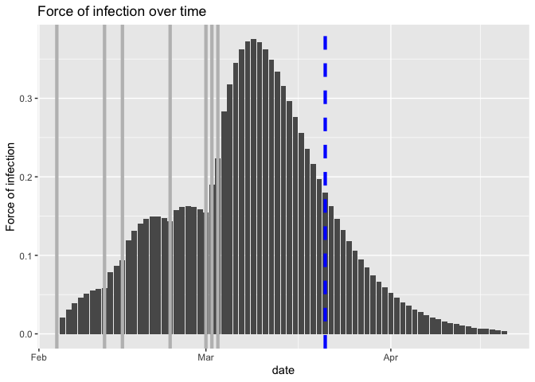
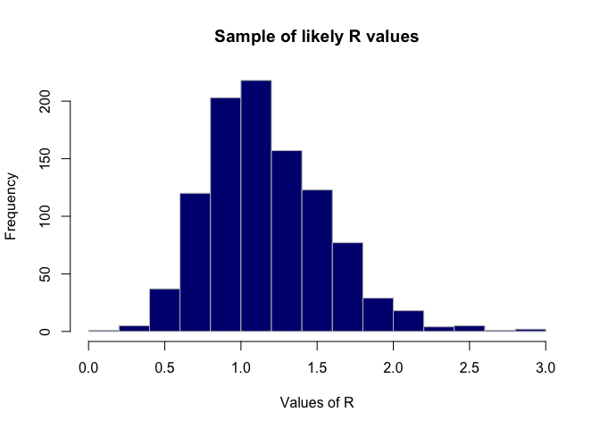
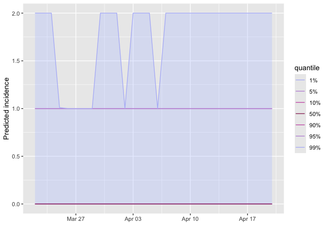
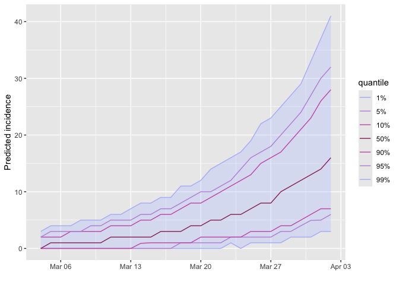
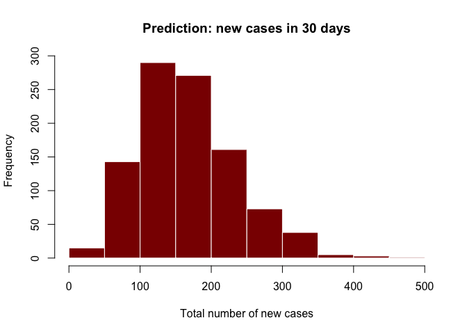

earlyR Testing
================
Christine Sangphet
2024-06-25

# Worked Example

### Assume a small outbreak of Ebola Virus Disease (EVD), for which the serial interval has been previously characterised. We study a fake outbreak, for which we will quantify infectiousness (R), and then project future incidence

``` r
#load environment 

library(earlyR)
library(ggplot2)
library(incidence)
```

``` r
#define the onset dates

onset <- as.Date(c("2017-02-04", "2017-02-12", "2017-02-15",
                   "2017-02-23", "2017-03-01", "2017-03-01",
           "2017-03-02", "2017-03-03", "2017-03-03")) 
```

``` r
#compute the daily incidence

library(incidence)

i <- incidence(onset)
i
```

    ## <incidence object>
    ## [9 cases from days 2017-02-04 to 2017-03-03]
    ## 
    ## $counts: matrix with 28 rows and 1 columns
    ## $n: 9 cases in total
    ## $dates: 28 dates marking the left-side of bins
    ## $interval: 1 day
    ## $timespan: 28 days
    ## $cumulative: FALSE

``` r
plot(i, border = "white")
```

    ## Warning: The `guide` argument in `scale_*()` cannot be `FALSE`. This was deprecated in
    ## ggplot2 3.3.4.
    ## ℹ Please use "none" instead.
    ## ℹ The deprecated feature was likely used in the incidence package.
    ##   Please report the issue at <https://github.com/reconhub/incidence/issues>.
    ## This warning is displayed once every 8 hours.
    ## Call `lifecycle::last_lifecycle_warnings()` to see where this warning was
    ## generated.

<!-- -->

``` r
#assume the current date is 3/21/2017. we need to indicate this to incidence using:

today <- as.Date("2017-03-21")
i <- incidence(onset, last_date = today)
i
```

    ## <incidence object>
    ## [9 cases from days 2017-02-04 to 2017-03-21]
    ## 
    ## $counts: matrix with 46 rows and 1 columns
    ## $n: 9 cases in total
    ## $dates: 46 dates marking the left-side of bins
    ## $interval: 1 day
    ## $timespan: 46 days
    ## $cumulative: FALSE

``` r
#plot and adjust x-axis

plot(i, border = "white") +
  scale_x_date(
    breaks = seq(min(i$dates), max(i$dates), by = "week"),
    labels = function(x) format(x, "%Y/%m/%d")
  ) +
  theme(axis.text.x = element_text(angle = 45, hjust = 1))
```

    ## Scale for x is already present.
    ## Adding another scale for x, which will replace the existing scale.

<!-- -->

``` r
#note: it is essential to make sure that the last days without cases are included (omitting this information would lead to an over-estimation of R)
```

### Estimating the Likelihood Distribution of R

``` r
#for estimating R, we need estimates of the mean and standard deviation (sd) of the serial interval i.e. the delay between the primary and secondary sympton onset dates

#define mean and sd (defined on website)

mu <- 15.3 # mean in days days
sigma <- 9.3 # sd in days 

#the function get_R is then used to estimate the most likely values of R:

res <- get_R(i, si_mean = mu, si_sd = sigma)
res
```

    ## 
    ## /// Early estimate of reproduction number (R) //
    ##  // class: earlyR, list
    ## 
    ##  // Maximum-Likelihood estimate of R ($R_ml):
    ## [1] 1.041041
    ## 
    ## 
    ##  // $lambda:
    ##   NA 0.01838179 0.0273192 0.03514719 0.0414835 0.04623398...
    ## 
    ##  // $dates:
    ## [1] "2017-02-04" "2017-02-05" "2017-02-06" "2017-02-07" "2017-02-08"
    ## [6] "2017-02-09"
    ## ...
    ## 
    ##  // $si (serial interval):
    ## A discrete distribution
    ##   name: gamma
    ##   parameters:
    ##     shape: 2.70655567117586
    ##     scale: 5.65294117647059

``` r
plot(res)
```

<!-- -->

### Represent infectiousness over time

``` r
plot(res, "lambdas", scale = length(onset) + 1) +
  geom_vline(xintercept = onset, col = "grey", lwd = 1.5) +
  geom_vline(xintercept = today, col = "blue", lty = 2, lwd = 1.5)
```

    ## Warning: Removed 1 row containing missing values or values outside the scale range
    ## (`geom_bar()`).

<!-- -->

``` r
#the figure shows the global force of infection over time, with vertical grey bards indicating the dates of sympton of onset. the dashed blue line indicates current day. note: the vertical scale for the bars is arbitrary, and only represents the relative force of infection
```

### Using sample_R to get a large sample of likely R values

``` r
R_val <- sample_R(res, 1000)
summary(R_val)
```

    ##    Min. 1st Qu.  Median    Mean 3rd Qu.    Max. 
    ##  0.1702  0.9009  1.1211  1.1657  1.4014  2.9830

``` r
quantile(R_val)
```

    ##        0%       25%       50%       75%      100% 
    ## 0.1701702 0.9009009 1.1211211 1.4014014 2.9829830

``` r
quantile(R_val, c(0.025, 0.975))
```

    ##      2.5%     97.5% 
    ## 0.5402903 2.0222723

``` r
hist(R_val, border = "grey", col = "navy",
     xlab = "Values of R",
     main = "Sample of likely R values")
```

<!-- -->

### Simulating future epicurves

``` r
#retrieve the serial interval (SI)

si <- res$si
si
```

    ## A discrete distribution
    ##   name: gamma
    ##   parameters:
    ##     shape: 2.70655567117586
    ##     scale: 5.65294117647059

``` r
#use the package projections 

library(projections)

future_i <- project(i, R = R_val, n_sim = 1000, si = res$si, n_days = 30)
future_i
```

    ## 
    ## /// Incidence projections //
    ## 
    ##   // class: projections, matrix, array
    ##   // 30 dates (rows); 1,000 simulations (columns)
    ## 
    ##  // first rows/columns:
    ##            [,1] [,2] [,3] [,4] [,5] [,6]
    ## 2017-03-22    2    0    0    0    0    0
    ## 2017-03-23    0    0    0    0    0    0
    ## 2017-03-24    0    0    0    0    0    0
    ## 2017-03-25    0    0    0    0    0    0
    ##  .
    ##  .
    ##  .
    ## 
    ##  // dates:
    ##  [1] "2017-03-22" "2017-03-23" "2017-03-24" "2017-03-25" "2017-03-26"
    ##  [6] "2017-03-27" "2017-03-28" "2017-03-29" "2017-03-30" "2017-03-31"
    ## [11] "2017-04-01" "2017-04-02" "2017-04-03" "2017-04-04" "2017-04-05"
    ## [16] "2017-04-06" "2017-04-07" "2017-04-08" "2017-04-09" "2017-04-10"
    ## [21] "2017-04-11" "2017-04-12" "2017-04-13" "2017-04-14" "2017-04-15"
    ## [26] "2017-04-16" "2017-04-17" "2017-04-18" "2017-04-19" "2017-04-20"

``` r
mean(future_i) 
```

    ## [1] 0.1463

``` r
plot(future_i)
```

<!-- -->

### Having the distribution of the total number of new cases predicted in the next 30 days

``` r
predicted_n <- colSums(future_i)
summary(predicted_n)
```

    ##    Min. 1st Qu.  Median    Mean 3rd Qu.    Max. 
    ##   0.000   1.000   3.000   4.389   7.000  27.000

``` r
hist(predicted_n, col = "darkred", border = "white",
     main = "Prediction: new cases in 30 days",
     xlab = "Total number of new cases")
```

<!-- -->

### What the results will look like without the recent zero incidence

``` r
alt_i <- incidence(onset)
alt_res <- get_R(alt_i, si_mean = mu, si_sd = sigma)
alt_R_val <- sample_R(alt_res, 1000)
alt_future_i <- project(alt_i, R = alt_R_val, n_sim = 1000, si = res$si, n_days = 30)
alt_future_i
```

    ## 
    ## /// Incidence projections //
    ## 
    ##   // class: projections, matrix, array
    ##   // 30 dates (rows); 1,000 simulations (columns)
    ## 
    ##  // first rows/columns:
    ##            [,1] [,2] [,3] [,4] [,5] [,6]
    ## 2017-03-04    3    0    3    2    0    2
    ## 2017-03-05    0    2    0    1    0    1
    ## 2017-03-06    1    1    0    2    1    0
    ## 2017-03-07    2    2    2    2    1    3
    ##  .
    ##  .
    ##  .
    ## 
    ##  // dates:
    ##  [1] "2017-03-04" "2017-03-05" "2017-03-06" "2017-03-07" "2017-03-08"
    ##  [6] "2017-03-09" "2017-03-10" "2017-03-11" "2017-03-12" "2017-03-13"
    ## [11] "2017-03-14" "2017-03-15" "2017-03-16" "2017-03-17" "2017-03-18"
    ## [16] "2017-03-19" "2017-03-20" "2017-03-21" "2017-03-22" "2017-03-23"
    ## [21] "2017-03-24" "2017-03-25" "2017-03-26" "2017-03-27" "2017-03-28"
    ## [26] "2017-03-29" "2017-03-30" "2017-03-31" "2017-04-01" "2017-04-02"

``` r
mean(alt_future_i)
```

    ## [1] 5.566267

``` r
#> [1] 5.5434
plot(alt_future_i)
```

<!-- -->

``` r
## alternative plot
col <- "#cc66991a"
matplot(alt_future_i, type = "l", col = col, lty = 1, lwd = 5,
        xlab = "Day from today",
    ylab = "Projected daily incidence")
```

<!-- -->

``` r
alt_predicted_n <- colSums(alt_future_i)
summary(alt_predicted_n)
```

    ##    Min. 1st Qu.  Median    Mean 3rd Qu.    Max. 
    ##      19     118     159     167     208     468

``` r
hist(alt_predicted_n, col = "darkred", border = "white",
     main = "Prediction: new cases in 30 days",
     xlab = "Total number of new cases")
```

<!-- -->
