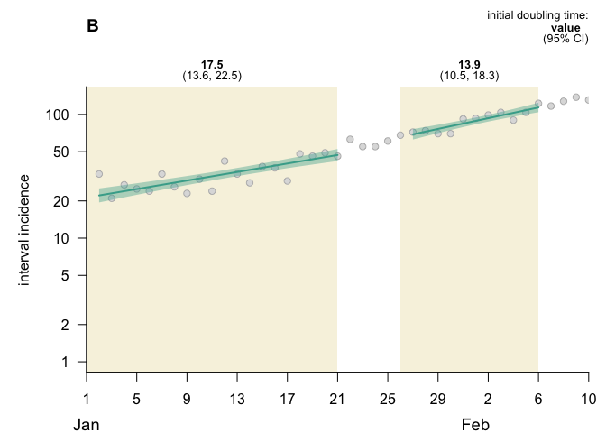

epigrowthfit Testing
================
Christine Sangphet
2024-07-03

``` r
#load environment

library(epigrowthfit)
```

# finalsize(): compute the expected epidemic

``` r
R0 <- 10^seq(-3, 1, length.out = 151L)
plot(R0, finalsize(R0, S0 = 1, I0 = 0), type = "l", las = 1,
xlab = "basic reproduction number",
ylab = "final size")
```

<!-- -->

# gi(): generation interval distribution

``` r
latent <- c(0.026, 0.104, 0.182, 0.246, 0.318, 0.104,
0.013, 0.004, 0.003)
m <- length(latent)

infectious <- c(0.138, 0.462, 0.256, 0.078, 0.041, 0.007,
0.004, 0.004, 0.006, 0.004)
n <- length(infectious)
```

``` r
#histogram of samples

y <- rgi(1e06, latent, infectious)
hist(y, breaks = seq(0, m + n + 1), freq = FALSE, las = 1,
ylab = "relative frequency",
main = "")
```

<!-- -->

``` r
#density and distribution functions

x <- seq(0, m + n + 1, by = 0.02)
fx <- dgi(x, latent, infectious)
Fx <- pgi(x, latent, infectious)
plot(x, fx, type = "l", las = 1, # consistent with histogram
xlab = "generation interval",
ylab = "density function")
```

<!-- -->

``` r
plot(x, Fx, type = "l", las = 1,
xlab = "generation interval",
ylab = "distribution function")
```

<!-- -->

``` r
#quantile function
p <- seq(0, 1, by = 0.001)
qp <- qgi(p, latent, infectious)

plot(p, qp, type = "l", las = 1,
xlab = "probability",
ylab = "quantile function")
```

<!-- -->

# plot.egf: plot nonlinear mixed effects models of epidemic growth

``` r
example("egf", package = "epigrowthfit")
```

    ## 
    ## egf> ## Simulate 'N' incidence time series exhibiting exponential growth
    ## egf> set.seed(180149L)
    ## 
    ## egf> N <- 10L
    ## 
    ## egf> f <- function(time, r, c0) {
    ## egf+     lambda <- diff(exp(log(c0) + r * time))
    ## egf+     c(NA, rpois(lambda, lambda))
    ## egf+ }
    ## 
    ## egf> time <- seq.int(0, 40, 1)
    ## 
    ## egf> r <- rlnorm(N, -3.2, 0.2)
    ## 
    ## egf> c0 <- rlnorm(N, 6, 0.2)
    ## 
    ## egf> data_ts <-
    ## egf+     data.frame(country = gl(N, length(time), labels = LETTERS[1:N]),
    ## egf+                time = rep.int(time, N),
    ## egf+                x = unlist(Map(f, time = list(time), r = r, c0 = c0)))
    ## 
    ## egf> rm(f, time)
    ## 
    ## egf> ## Define fitting windows (here, two per time series)
    ## egf> data_windows <-
    ## egf+     data.frame(country = gl(N, 1L, 2L * N, labels = LETTERS[1:N]),
    ## egf+                wave = gl(2L, 10L),
    ## egf+                start = c(sample(seq.int(0, 5, 1), N, TRUE),
    ## egf+                          sample(seq.int(20, 25, 1), N, TRUE)),
    ## egf+                end = c(sample(seq.int(15, 20, 1), N, TRUE),
    ## egf+                        sample(seq.int(35, 40, 1), N, TRUE)))
    ## 
    ## egf> ## Estimate the generative model
    ## egf> m1 <-
    ## egf+     egf(model = egf_model(curve = "exponential", family = "pois"),
    ## egf+         formula_ts = cbind(time, x) ~ country,
    ## egf+         formula_windows = cbind(start, end) ~ country,
    ## egf+         formula_parameters = ~(1 | country:wave),
    ## egf+         data_ts = data_ts,
    ## egf+         data_windows = data_windows,
    ## egf+         se = TRUE)

    ## computing a Hessian matrix ...

    ## 
    ## egf> ## Re-estimate the generative model with:
    ## egf> ## * Gaussian prior on beta[1L]
    ## egf> ## * LKJ prior on all random effect covariance matrices
    ## egf> ##   (here there happens to be just one)
    ## egf> ## * initial value of 'theta' set explicitly
    ## egf> ## * theta[3L] fixed at initial value
    ## egf> m2 <-
    ## egf+     update(m1,
    ## egf+            formula_priors = list(beta[1L] ~ Normal(mu = -3, sigma = 1),
    ## egf+                                  Sigma ~ LKJ(eta = 2)),
    ## egf+            init = list(theta = c(log(0.5), log(0.5), 0)),
    ## egf+            map = list(theta = 3L))

    ## computing a Hessian matrix ...

``` r
l <- list(legend = list(cex = 0.8),
value = list(cex = 0.8, font = 2),
ci = list(cex = 0.8))
control <- egf_control_plot(doubling = l)
op <- par(mar = c(3.5, 5, 5, 1))
plot(m1,
type = "interval",
show_predict = 2L,
show_doubling = 2L,
control = control)
```

<!-- --><!-- --><!-- --><!-- --><!-- --><!-- --><!-- --><!-- --><!-- --><!-- -->

``` r
plot(m1,
type = "cumulative",
main = "Fitted exponential model",
sub = quote(paste("Country", country)))
```

<!-- --><!-- --><!-- --><!-- --><!-- --><!-- --><!-- --><!-- --><!-- --><!-- -->

``` r
par(op)
op <- par(mar = c(3.5, 9.5, 5, 1))
plot(m1, type = "rt", subset = quote(country %in% LETTERS[4:6]))
```

<!-- --><!-- --><!-- -->

``` r
par(op)
```

# R0(): compute the basic reproduction number

``` r
r <- seq(0, 1, 0.02)
breaks <- seq(0, 20, 1)
probs <- diff(pgamma(breaks, shape = 1, scale = 2.5))
plot(r, R0(r, breaks, probs), las = 1,
xlab = "initial exponential growth rate",
ylab = "basic reproduction number")
```

<!-- -->

# simulate.egf(): simulation and parametric bootstrapping

### Simulates incidence data conditional on a fitted nonlinear mixed effects model of epidemic growth

``` r
example("egf", package = "epigrowthfit")
```

    ## 
    ## egf> ## Simulate 'N' incidence time series exhibiting exponential growth
    ## egf> set.seed(180149L)
    ## 
    ## egf> N <- 10L
    ## 
    ## egf> f <- function(time, r, c0) {
    ## egf+     lambda <- diff(exp(log(c0) + r * time))
    ## egf+     c(NA, rpois(lambda, lambda))
    ## egf+ }
    ## 
    ## egf> time <- seq.int(0, 40, 1)
    ## 
    ## egf> r <- rlnorm(N, -3.2, 0.2)
    ## 
    ## egf> c0 <- rlnorm(N, 6, 0.2)
    ## 
    ## egf> data_ts <-
    ## egf+     data.frame(country = gl(N, length(time), labels = LETTERS[1:N]),
    ## egf+                time = rep.int(time, N),
    ## egf+                x = unlist(Map(f, time = list(time), r = r, c0 = c0)))
    ## 
    ## egf> rm(f, time)
    ## 
    ## egf> ## Define fitting windows (here, two per time series)
    ## egf> data_windows <-
    ## egf+     data.frame(country = gl(N, 1L, 2L * N, labels = LETTERS[1:N]),
    ## egf+                wave = gl(2L, 10L),
    ## egf+                start = c(sample(seq.int(0, 5, 1), N, TRUE),
    ## egf+                          sample(seq.int(20, 25, 1), N, TRUE)),
    ## egf+                end = c(sample(seq.int(15, 20, 1), N, TRUE),
    ## egf+                        sample(seq.int(35, 40, 1), N, TRUE)))
    ## 
    ## egf> ## Estimate the generative model
    ## egf> m1 <-
    ## egf+     egf(model = egf_model(curve = "exponential", family = "pois"),
    ## egf+         formula_ts = cbind(time, x) ~ country,
    ## egf+         formula_windows = cbind(start, end) ~ country,
    ## egf+         formula_parameters = ~(1 | country:wave),
    ## egf+         data_ts = data_ts,
    ## egf+         data_windows = data_windows,
    ## egf+         se = TRUE)

    ## computing a Hessian matrix ...

    ## 
    ## egf> ## Re-estimate the generative model with:
    ## egf> ## * Gaussian prior on beta[1L]
    ## egf> ## * LKJ prior on all random effect covariance matrices
    ## egf> ##   (here there happens to be just one)
    ## egf> ## * initial value of 'theta' set explicitly
    ## egf> ## * theta[3L] fixed at initial value
    ## egf> m2 <-
    ## egf+     update(m1,
    ## egf+            formula_priors = list(beta[1L] ~ Normal(mu = -3, sigma = 1),
    ## egf+                                  Sigma ~ LKJ(eta = 2)),
    ## egf+            init = list(theta = c(log(0.5), log(0.5), 0)),
    ## egf+            map = list(theta = 3L))

    ## computing a Hessian matrix ...

``` r
zz <- simulate(m2, nsim = 6L, seed = 181952L, bootstrap = TRUE)
str(zz)
```

    ## List of 2
    ##  $ simulation:'data.frame':  300 obs. of  4 variables:
    ##   ..$ ts    : Factor w/ 10 levels "A","B","C","D",..: 1 1 1 1 1 1 1 1 1 1 ...
    ##   ..$ window: Factor w/ 20 levels "window_01","window_02",..: 1 1 1 1 1 1 1 1 1 1 ...
    ##   ..$ time  : num [1:300] 2 3 4 5 6 7 8 9 10 11 ...
    ##   ..$ X     : num [1:300, 1:6] 46 50 38 57 51 52 66 55 60 67 ...
    ##  $ bootstrap : num [1:44, 1:6] -3.0987 6.3682 -3.0339 -0.566 0.0529 ...
    ##   ..- attr(*, "dimnames")=List of 2
    ##   .. ..$ : chr [1:44] "beta" "beta" "theta" "theta" ...
    ##   .. ..$ : NULL
    ##  - attr(*, "RNGstate")= int 181952
    ##   ..- attr(*, "kind")=List of 3
    ##   .. ..$ : chr "Mersenne-Twister"
    ##   .. ..$ : chr "Inversion"
    ##   .. ..$ : chr "Rejection"
    ##  - attr(*, "class")= chr "simulate.egf"

``` r
matplot(t(zz[["bootstrap"]][!m2[["random"]], ]),
type = "o", las = 1, xlab = "simulation", ylab = "value")
```

<!-- -->

# simulate.egf_model(): simulating incidence time series

### Simulates equally spaced incidence time series according to a specified nonlinear model

``` r
r <- 0.04
c0 <- 400
s <- 0.2
mu <- log(c(r, c0))
Sigma <- diag(rep.int(s^2, length(mu)))
zz <- simulate(object = egf_model(curve = "exponential", family = "pois"),
nsim = 20L,
seed = 202737L,
mu = mu,
Sigma = Sigma,
cstart = 10)

str(zz)
```

    ## List of 9
    ##  $ model             :List of 4
    ##   ..$ curve      : chr "exponential"
    ##   ..$ excess     : logi FALSE
    ##   ..$ family     : chr "pois"
    ##   ..$ day_of_week: int 0
    ##   ..- attr(*, "class")= chr "egf_model"
    ##  $ formula_ts        :Class 'formula'  language cbind(time, x) ~ ts
    ##   .. ..- attr(*, ".Environment")=<environment: R_GlobalEnv> 
    ##  $ formula_windows   :Class 'formula'  language cbind(start, end) ~ ts
    ##   .. ..- attr(*, ".Environment")=<environment: R_GlobalEnv> 
    ##  $ formula_parameters:Class 'formula'  language ~(1 | ts)
    ##   .. ..- attr(*, ".Environment")=<environment: R_GlobalEnv> 
    ##  $ data_ts           :'data.frame':  2020 obs. of  3 variables:
    ##   ..$ ts  : Factor w/ 20 levels "1","2","3","4",..: 1 1 1 1 1 1 1 1 1 1 ...
    ##   ..$ time: num [1:2020] 0 1 2 3 4 5 6 7 8 9 ...
    ##   ..$ x   : num [1:2020] NA 15 24 21 17 24 21 26 29 28 ...
    ##  $ data_windows      :'data.frame':  20 obs. of  3 variables:
    ##   ..$ ts   : Factor w/ 20 levels "1","2","3","4",..: 1 2 3 4 5 6 7 8 9 10 ...
    ##   ..$ start: num [1:20] 1 1 1 1 1 2 2 1 1 2 ...
    ##   ..$ end  : num [1:20] 100 100 100 100 100 100 100 100 100 100 ...
    ##  $ init              :List of 2
    ##   ..$ beta : Named num [1:2] -3.22 5.99
    ##   .. ..- attr(*, "names")= chr [1:2] "log(r)" "log(c0)"
    ##   ..$ theta: num [1:3] -1.61 -1.61 0
    ##  $ Y                 : num [1:20, 1:2] -3.09 -3.33 -3.05 -3.27 -3.22 ...
    ##   ..- attr(*, "dimnames")=List of 2
    ##   .. ..$ : NULL
    ##   .. ..$ : chr [1:2] "log(r)" "log(c0)"
    ##  $ call              : language simulate.egf_model(object = egf_model(curve = "exponential", family = "pois"),      nsim = 20L, seed = 202737L, m| __truncated__
    ##  - attr(*, "RNGstate")= int 202737
    ##   ..- attr(*, "kind")=List of 3
    ##   .. ..$ : chr "Mersenne-Twister"
    ##   .. ..$ : chr "Inversion"
    ##   .. ..$ : chr "Rejection"
    ##  - attr(*, "class")= chr "simulate.egf_model"

``` r
mm <- egf(zz)
(pp <- cbind(actual = coef(zz), fitted = coef(mm)))
```

    ##         actual     fitted
    ## [1,] -3.218876 -3.1920463
    ## [2,]  5.991465  6.0181970
    ## [3,] -1.609438 -1.7258229
    ## [4,] -1.609438 -1.6046300
    ## [5,]  0.000000  0.6607207
