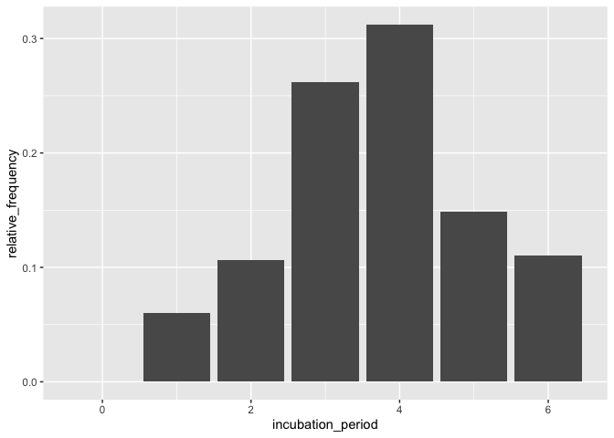

epitrix Testing
================
Christine Sangphet
2024-06-26

# Fitting a gamma distribution to delay data

### Simulate data which replicate the serial interval (SI), i.e. the delays between primary and secondary symptom onsets, in Ebola Virus Disease (EVD)

``` r
#load environment

library(epitrix)
```

``` r
#start by converting previously estimates of the mean and standard deviation of the SI to the parameters of a Gamma distribution 

mu <- 15.3 # mean in days days
sigma <- 9.3 # standard deviation in days
cv <- sigma/mu # coefficient of variation
cv
```

    ## [1] 0.6078431

``` r
param <- gamma_mucv2shapescale(mu, cv) # convertion to Gamma parameters
param
```

    ## $shape
    ## [1] 2.706556
    ## 
    ## $scale
    ## [1] 5.652941

``` r
#the shape and scale are parameters of a Gamma distribution we can use to generate delays. However, delays are typically reported per days, which implies a discretization (from continuous time to discrete numbers).
```

``` r
#we use the package distcrete to achieve this discretization. It generates a list of functions, including one to simulate data ($r), which we use to simulate 500 delays

library(distcrete)

si <- distcrete::distcrete("gamma", interval = 1,
               shape = param$shape,
               scale = param$scale, w = 0)
si
```

    ## A discrete distribution
    ##   name: gamma
    ##   parameters:
    ##     shape: 2.70655567117586
    ##     scale: 5.65294117647059

``` r
set.seed(1)
x <- si$r(500)
head(x, 10)
```

    ##  [1]  8 10 15 28  7 27 32 17 16  4

``` r
hist(x, col = "grey", border = "white",
     xlab = "Days between primary and secondary onset",
     main = "Simulated serial intervals")
```

<!-- -->

``` r
#x contains simulated data, for illustrative purpose. In practice, one would use real data from an ongoing outbreaks
```

``` r
#now we use fit_disc_gamma to estimate the parameters of a dicretised Gamma distribution from the data

si_fit <- fit_disc_gamma(x)
si_fit
```

    ## $mu
    ## [1] 15.21973
    ## 
    ## $cv
    ## [1] 0.585091
    ## 
    ## $sd
    ## [1] 8.90493
    ## 
    ## $ll
    ## [1] -1741.393
    ## 
    ## $converged
    ## [1] TRUE
    ## 
    ## $distribution
    ## A discrete distribution
    ##   name: gamma
    ##   parameters:
    ##     shape: 2.9211452090504
    ##     scale: 5.21019425891896

# Converting a growth rate (r) to a reproduction number (R0)

### The package incidence can fit a log-linear model to incidence curves (function fit), which produces a growth rate (r). This growth rate can in turn be translated into a basic reproduction number (R0) using r2R0. We illustrate this using simulated Ebola data from the outbreaks package, and using the serial interval from the previous example.

``` r
#load environment

library(incidence)
library(outbreaks)
```

``` r
i <- incidence(ebola_sim$linelist$date_of_onset)
i
```

    ## <incidence object>
    ## [5888 cases from days 2014-04-07 to 2015-04-30]
    ## 
    ## $counts: matrix with 389 rows and 1 columns
    ## $n: 5888 cases in total
    ## $dates: 389 dates marking the left-side of bins
    ## $interval: 1 day
    ## $timespan: 389 days
    ## $cumulative: FALSE

``` r
f <- fit(i[1:150]) # fit on first 150 days
```

    ## Warning in fit(i[1:150]): 22 dates with incidence of 0 ignored for fitting

``` r
plot(i[1:200], fit = f, color = "#9fc2fc")
```

    ## Warning: The `guide` argument in `scale_*()` cannot be `FALSE`. This was deprecated in
    ## ggplot2 3.3.4.
    ## ℹ Please use "none" instead.
    ## ℹ The deprecated feature was likely used in the incidence package.
    ##   Please report the issue at <https://github.com/reconhub/incidence/issues>.
    ## This warning is displayed once every 8 hours.
    ## Call `lifecycle::last_lifecycle_warnings()` to see where this warning was
    ## generated.

<!-- -->

``` r
r2R0(f$info$r, si$d(1:100))
```

    ## [1] 1.348624

``` r
r2R0(f$info$r.conf, si$d(1:100))
```

    ##         2.5 %   97.5 %
    ## [1,] 1.314055 1.383674

``` r
#we can also use the function lm2R0_sample to generate samples of R0 values compatible with a model fit

R0_val <- lm2R0_sample(f$model, si$d(1:100), n = 100)
head(R0_val)
```

    ## [1] 1.350970 1.347374 1.350076 1.358523 1.341549 1.341634

``` r
hist(R0_val, col = "grey", border = "white")
```

<!-- -->

# Estimate incubation periods

### The function empirical_incubation_dist() computes the discrete probability distribution by giving equal weight to each patient. Thus, in the case of N patients, the n possible exposure dates of a given patient get the overall weight 1/(n\*N). The function returns a data frame with column incubation_period containing the different incubation periods with a time step of one day and their relative_frequency

``` r
#load environment 

library(magrittr)
library(epitrix)
library(distcrete)
library(ggplot2)
```

``` r
#make a linelist object containing toy data with several possible exposure dates for each case

ll <- sim_linelist(15)

x <- 0:15
y <- distcrete("gamma", 1, shape = 12, rate = 3, w = 0)$d(x)
mkexposures <- function(i) {
  i - sample(x, size = sample.int(5, size = 1), replace = FALSE, prob = y)
}
exposures <- sapply(ll$date_of_onset, mkexposures)
ll$dates_exposure <- exposures

print(ll)
```

    ##    id date_of_onset date_of_report gender  outcome
    ## 1   1    2020-01-23     2020-02-01   male recovery
    ## 2   2    2020-02-14     2020-02-18   male    death
    ## 3   3    2020-01-25     2020-01-29 female recovery
    ## 4   4    2020-01-16     2020-01-30   male recovery
    ## 5   5    2020-01-22     2020-01-28   male    death
    ## 6   6    2020-01-26     2020-01-31   male recovery
    ## 7   7    2020-02-09     2020-02-16 female recovery
    ## 8   8    2020-02-17     2020-02-24 female recovery
    ## 9   9    2020-01-14     2020-01-20   male recovery
    ## 10 10    2020-02-22     2020-03-12   male recovery
    ## 11 11    2020-02-26     2020-03-04   male recovery
    ## 12 12    2020-01-06     2020-01-10   male recovery
    ## 13 13    2020-02-23     2020-02-29 female recovery
    ## 14 14    2020-01-08     2020-01-16 female recovery
    ## 15 15    2020-01-21     2020-01-26   male recovery
    ##                       dates_exposure
    ## 1                       18281, 18280
    ## 2                       18303, 18305
    ## 3                              18282
    ## 4  18274, 18273, 18275, 18272, 18271
    ## 5                              18279
    ## 6                              18281
    ## 7                       18297, 18298
    ## 8         18306, 18304, 18305, 18307
    ## 9                       18270, 18272
    ## 10 18308, 18311, 18310, 18313, 18312
    ## 11 18315, 18316, 18314, 18317, 18313
    ## 12        18264, 18263, 18265, 18262
    ## 13        18313, 18312, 18310, 18309
    ## 14               18264, 18265, 18266
    ## 15        18279, 18277, 18280, 18278

``` r
#empirical distribution

incubation_period_dist <- empirical_incubation_dist(ll, date_of_onset, dates_exposure)
print(incubation_period_dist)
```

    ## # A tibble: 7 × 2
    ##   incubation_period relative_frequency
    ##               <dbl>              <dbl>
    ## 1                 0              0    
    ## 2                 1              0.06 
    ## 3                 2              0.107
    ## 4                 3              0.262
    ## 5                 4              0.312
    ## 6                 5              0.149
    ## 7                 6              0.11

``` r
ggplot(incubation_period_dist, aes(incubation_period, relative_frequency)) +
  geom_col()
```

<!-- -->

``` r
#fit discrete gamma

fit <- fit_gamma_incubation_dist(ll, date_of_onset, dates_exposure)
print(fit)
```

    ## $mu
    ## [1] 4.229868
    ## 
    ## $cv
    ## [1] 0.32265
    ## 
    ## $sd
    ## [1] 1.364767
    ## 
    ## $ll
    ## [1] -1729.577
    ## 
    ## $converged
    ## [1] TRUE
    ## 
    ## $distribution
    ## A discrete distribution
    ##   name: gamma
    ##   parameters:
    ##     shape: 9.6058671470471
    ##     scale: 0.440342153837884

``` r
x = c(0:10)
y = fit$distribution$d(x)
ggplot(data.frame(x = x, y = y), aes(x, y)) +
  geom_col(data = incubation_period_dist, aes(incubation_period, relative_frequency)) +
  geom_point(stat="identity", col = "red", size = 3) +
  geom_line(stat="identity", col = "red")
```

<!-- -->
