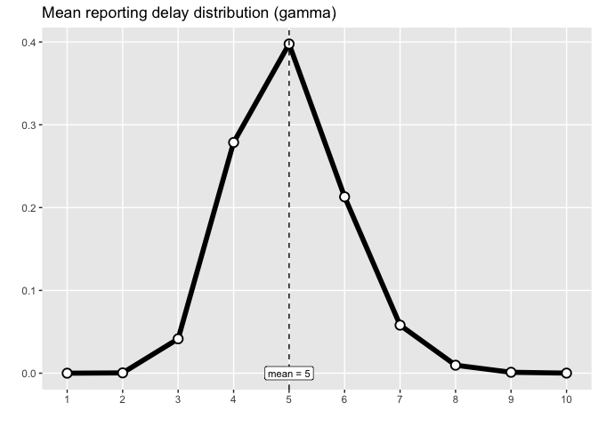
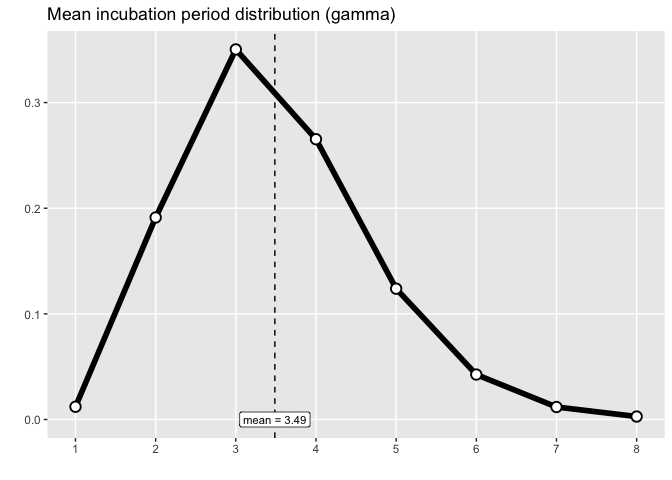

ern Testing
================
Christine Sangphet
2024-06-27

# Example with clinical data

``` r
#load environment

library(ern)
```

    ## 
    ## ern version: 2.0.0 
    ## 
    ## If not already installed, software JAGS is recommended. 
    ## (https://sourceforge.net/projects/mcmc-jags/files/)

``` r
library(ggplot2)
```

### A sample of Canadian COVID-19 clinical reports are included in ern. This data set includes weekly reports from the provinces of British Columbia, Alberta, Saskatchewan, Manitoba, Ontario, and Quebec, between 1 Feb 2020 and 1 Apr 2023.

``` r
#we start by loading a subset of the weekly clinical report data for Quebec

dat <- (ern::cl.data 
    |> dplyr::filter(
      pt == "qc",
      dplyr::between(date, as.Date("2021-07-01"), as.Date("2021-09-01"))
))
```

``` r
#we define distributions for the reporting fraction, reporting delay, incubation period, and intrinsic generation interval

#distributions

# reporting fraction

# define reporting delay 
dist.repdelay = ern::def_dist(
  dist = 'gamma',
  mean = 5,
  mean_sd = 1,
  sd = 1,
  sd_sd = 0.1,
  max = 10
)

# define reporting fraction 
dist.repfrac = ern::def_dist(
  dist = "unif",
  min = 0.1,
  max = 0.3
)

# define incubation period
dist.incub = ern::def_dist(
  dist     = "gamma",
  mean     = 3.49,
  mean_sd  = 0.1477,
  shape    = 8.5,
  shape_sd = 1.8945,
  max      = 8
)

# define generation interval
dist.gi = ern::def_dist(
  dist     = "gamma",
  mean     = 6.84,
  mean_sd  = 0.7486,
  shape    = 2.39,
  shape_sd = 0.3573,
  max      = 15
)
```

``` r
#we can visualize the assumed distributions with plot_dist()

plot_dist(dist.repdelay) + labs(title = paste0("Mean reporting delay distribution (", dist.repdelay$dist, ")"))
```

<!-- -->

``` r
plot_dist(dist.incub) + labs(title = paste0("Mean incubation period distribution (", dist.incub$dist, ")"))
```

<!-- -->

``` r
plot_dist(dist.gi) + labs(title = paste0("Mean generation interval distribution (", dist.gi$dist, ")"))
```

<!-- -->

``` r
#Note that the above dist.x lists define families of distributions (there is uncertainty specified in the mean distribution parameters), while plot_dist() only plots the mean distribution in this family.
```

### Specifying parameters

``` r
#The data set we are working with reports COVID-19 on a weekly basis, which is substantially longer than the typical generation interval of about 5 days for SAR-CoV-2. ern will estimate daily incidence from non-daily data. We specify the settings for this inference via prm.daily

#setting for daily report inference

prm.daily = list(
  method = "renewal",
  popsize = 1e7, # population size
   # Here, low value for `burn` and `iter` 
   # to have a fast compilation of the vignette.
   # For real-world applications, both `burn` and `iter`
   # should be significantly increased (e.g., 10,000).
   # Also, the number of chains should be at least 3 
   # (instead of 1 here) for real-world applications.
  burn = 100,
  iter = 200,
  chains = 1,
  prior_R0_shape = 2,
  prior_R0_rate = 0.6,
  prior_alpha_shape = 1,
  prior_alpha_rate = 1
)
```

``` r
#After the inference of the daily reports is performed, a check is run to ensure that the posterior aggregated daily reports are not too different from the observed aggregated reports (given as input). The parameter agg.reldiff.tol is the maximum tolerance (as a percentage) accepted for the relative difference between the observed and posterior aggregates

#settings for checks of daily inferred reports 

prm.daily.check = list(
  agg.reldiff.tol = 200
)
```

``` r
#Choosing a number of MCMC iterations that is not very large (to avoid long computation times, for example) may lead to daily report posteriors that are not very smooth. This, in turn, can affect the quality of Rt estimates. Hence, ern provides a smoothing of the posterior daily reports in order to improve the quality of Rt inference. The smoothing parameters are defined as follows

#smoothing settings for daily inferred reports 

prm.smooth = list(
  method = "rollmean",
  window = 3,
  align = 'center'
)
```

``` r
#We specify the parameters for the Rt ensemble

# Rt settings
prm.R = list(
  iter = 10, # number of iterations in Rt ensemble
  CI = 0.95, # 95% confidence interval
  window = 7, # time window for each Rt estimate
  config.EpiEstim = NULL
)
```

``` r
#once the above inputs and parameters re defined, we estimate Rt as follows:

r.estim = estimate_R_cl(
  cl.data      = dat,
  dist.repdelay = dist.repdelay,
  dist.repfrac  = dist.repfrac,
  dist.incub    = dist.incub,
  dist.gi       = dist.gi,
  prm.daily     = prm.daily,
  prm.daily.check = prm.daily.check,
  prm.smooth    = prm.smooth,
  prm.R         = prm.R,
  silent        = TRUE # suppress output messages
)
```

``` r
#the output of estimate_R_cl() can be visualized readily using plot_diagnostic_cl(), which generates a figure with the following panels

g = plot_diagnostic_cl(r.estim)
plot(g)
```

<!-- -->
