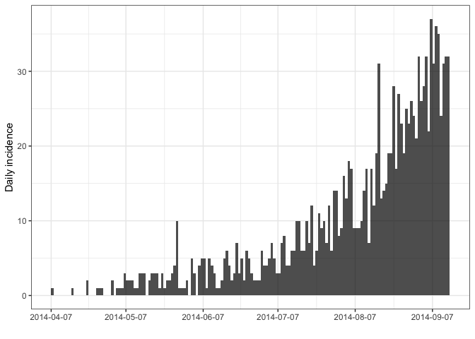

projections Testing
================
Christine Sangphet
2024-06-27

# Worked Example

### In this example, we use the simulated Ebola outbreak ebola_sim_clean from the outbreaks package to illustrate the package’s functionalities. We will:

- first calculate case incidence

- create a serial interval distribution from known mean / standard
  deviations (e.g. taken from the literature)

- project case incidence

- summarise the resulting projections

- export results as data_frame for further processing, e.g. making
  custom plots using *ggplot2*

- showcase advanced handling of projections objects (merging/adding
  projections)

``` r
#load environment

library(outbreaks)
library(incidence)
library(ggplot2)
```

``` r
linelist <- ebola_sim_clean$linelist
i <- incidence(linelist$date_of_onset)
plot(i) +
  theme_bw() # full outbreak
```

    ## Warning: The `guide` argument in `scale_*()` cannot be `FALSE`. This was deprecated in
    ## ggplot2 3.3.4.
    ## ℹ Please use "none" instead.
    ## ℹ The deprecated feature was likely used in the incidence package.
    ##   Please report the issue at <https://github.com/reconhub/incidence/issues>.
    ## This warning is displayed once every 8 hours.
    ## Call `lifecycle::last_lifecycle_warnings()` to see where this warning was
    ## generated.

<!-- -->

``` r
plot(i[1:160]) +
  theme_bw() # first 160 days
```

<!-- -->

### Creating a serial interval

#### We create a serial interval distribution using discrete (from the similarly named package); we use published values of the Serial Interval for Ebola with a mean of 15.3 days and a standard deviation of 9.3 days), to build a discretised Gamma distribution. Because the Gamma implementation in R uses shape and scale as parameters, we first need to convert the mean and coefficient of variation into shape and scale, using gamma_mucv2shapescale from the eptrix package

``` r
library(distcrete)
library(epitrix)
mu <- 15.3
sigma <- 9.3
cv <- sigma / mu
params <- gamma_mucv2shapescale(mu, cv)
params
```

    ## $shape
    ## [1] 2.706556
    ## 
    ## $scale
    ## [1] 5.652941

``` r
si <- distcrete("gamma", shape = params$shape,
                scale = params$scale,
                interval = 1, w = 0.5)
si
```

    ## A discrete distribution
    ##   name: gamma
    ##   parameters:
    ##     shape: 2.70655567117586
    ##     scale: 5.65294117647059

``` r
si_df <- data.frame(t = 1:50,
                    p = si$d(1:50))
ggplot(si_df, aes(x = t, y = p)) +
  theme_bw() +
  geom_col() +
  labs(title = "Serial interval",
       x = "Days after onset",
       y = "Probability")
```

<!-- -->

### Projecting future incidence

#### We forecast future incidence based on the incidence data and the serial interval, assuming a reproduction number of 1.5; for the sake of illustration, we start use the first 100 days of data to determine the force of infection, and derive forecasts for 30 days (in practice, forecasts can only be reliable for short term predictions, typically 3 weeks maximum)

``` r
library(projections)
set.seed(1)
pred_1 <- project(i[1:100], R = 1.5, si = si, n_days = 30, n_sim = 1000)
pred_1
```

    ## 
    ## /// Incidence projections //
    ## 
    ##   // class: projections, matrix, array
    ##   // 30 dates (rows); 1,000 simulations (columns)
    ## 
    ##  // first rows/columns:
    ##            [,1] [,2] [,3] [,4] [,5] [,6]
    ## 2014-07-16    4    7    7    7    7   12
    ## 2014-07-17    9    4    8   10    4   10
    ## 2014-07-18    8    8    4    3   10    4
    ## 2014-07-19    8    8   11    6   10    8
    ##  .
    ##  .
    ##  .
    ## 
    ##  // dates:
    ##  [1] "2014-07-16" "2014-07-17" "2014-07-18" "2014-07-19" "2014-07-20"
    ##  [6] "2014-07-21" "2014-07-22" "2014-07-23" "2014-07-24" "2014-07-25"
    ## [11] "2014-07-26" "2014-07-27" "2014-07-28" "2014-07-29" "2014-07-30"
    ## [16] "2014-07-31" "2014-08-01" "2014-08-02" "2014-08-03" "2014-08-04"
    ## [21] "2014-08-05" "2014-08-06" "2014-08-07" "2014-08-08" "2014-08-09"
    ## [26] "2014-08-10" "2014-08-11" "2014-08-12" "2014-08-13" "2014-08-14"

``` r
plot(pred_1) +
  theme_bw() # default plot
```

<!-- -->

``` r
pred_1_cum <- cumulate(pred_1) # cumulative predictions
plot(pred_1_cum) +
  theme_bw() # plot cumulative predictions
```

<!-- -->

``` r
#Forecasts stored in a projections object can also be added to an incidence plot using add_projections, which admits the same options as the plot method. This function is best used with a pipe %>%

library(magrittr)
plot(i[20:160], alpha = 0.5) %>%
  add_projections(pred_1, boxplots = FALSE, quantiles = c(0.025, 0.5)) +
  theme_bw()
```

    ## Scale for x is already present.
    ## Adding another scale for x, which will replace the existing scale.

<!-- -->

### Summarizing forecasts

``` r
#The summary function will summarise simulations using several statistics for each day of the forecast, allowing the user to switch off some of the summaries, and specify quantiles. Several options are illustrated below, but more information will be found at ?summary.projections

head(summary(pred_1)) #default summary
```

    ##        dates  mean       sd min max quantiles.2.5% quantiles.25% quantiles.50%
    ## 1 2014-07-16 6.705 2.580821   1  16              2             5           6.5
    ## 2 2014-07-17 6.975 2.716202   1  17              2             5           7.0
    ## 3 2014-07-18 7.313 2.670236   0  17              2             5           7.0
    ## 4 2014-07-19 7.702 2.712666   0  18              3             6           8.0
    ## 5 2014-07-20 7.827 2.726996   0  17              3             6           8.0
    ## 6 2014-07-21 8.221 2.830224   1  18              3             6           8.0
    ##   quantiles.75% quantiles.97.5%
    ## 1             8              12
    ## 2             9              13
    ## 3             9              13
    ## 4             9              13
    ## 5            10              13
    ## 6            10              14

``` r
tail(summary(pred_1))
```

    ##         dates   mean       sd min max quantiles.2.5% quantiles.25%
    ## 25 2014-08-09 14.020 3.897537   3  28              7         11.00
    ## 26 2014-08-10 14.525 4.106853   3  28              7         12.00
    ## 27 2014-08-11 14.900 4.279055   4  32              7         12.00
    ## 28 2014-08-12 15.693 4.546584   4  33              8         12.75
    ## 29 2014-08-13 15.821 4.408673   5  36              8         13.00
    ## 30 2014-08-14 16.339 4.501593   2  33              8         13.00
    ##    quantiles.50% quantiles.75% quantiles.97.5%
    ## 25            14            16              22
    ## 26            14            17              23
    ## 27            15            18              24
    ## 28            15            19              25
    ## 29            15            19              25
    ## 30            16            19              26

``` r
#keeping only mean, min and max

head(summary(pred_1, sd = FALSE, quantiles = FALSE))
```

    ##        dates  mean min max
    ## 1 2014-07-16 6.705   1  16
    ## 2 2014-07-17 6.975   1  17
    ## 3 2014-07-18 7.313   0  17
    ## 4 2014-07-19 7.702   0  18
    ## 5 2014-07-20 7.827   0  17
    ## 6 2014-07-21 8.221   1  18

``` r
#using 10%, 50% and 90% quantiles

head(summary(pred_1, quantiles = c(0.1, 0.5, 0.9)))
```

    ##        dates  mean       sd min max quantiles.10% quantiles.50% quantiles.90%
    ## 1 2014-07-16 6.705 2.580821   1  16             4           6.5            10
    ## 2 2014-07-17 6.975 2.716202   1  17             4           7.0            11
    ## 3 2014-07-18 7.313 2.670236   0  17             4           7.0            11
    ## 4 2014-07-19 7.702 2.712666   0  18             4           8.0            11
    ## 5 2014-07-20 7.827 2.726996   0  17             5           8.0            12
    ## 6 2014-07-21 8.221 2.830224   1  18             5           8.0            12

``` r
#to derive your own summary for each day, you can use apply with custom functions; for instance, to calculate the geometric mean for each day:

# function to calculate geometric mean

geo_mean = function(x, na.rm = TRUE){
  exp(sum(log(x[x > 0]), na.rm = na.rm) / length(x))
}

# raw output
apply(pred_1, 1, geo_mean)
```

    ## 2014-07-16 2014-07-17 2014-07-18 2014-07-19 2014-07-20 2014-07-21 2014-07-22 
    ##   6.163843   6.392041   6.759438   7.172451   7.295941   7.674789   7.671474 
    ## 2014-07-23 2014-07-24 2014-07-25 2014-07-26 2014-07-27 2014-07-28 2014-07-29 
    ##   8.026384   8.522398   8.618595   8.849186   9.182769   9.602397   9.960910 
    ## 2014-07-30 2014-07-31 2014-08-01 2014-08-02 2014-08-03 2014-08-04 2014-08-05 
    ##  10.244793  10.343175  10.746244  10.945269  11.274515  11.762397  11.945831 
    ## 2014-08-06 2014-08-07 2014-08-08 2014-08-09 2014-08-10 2014-08-11 2014-08-12 
    ##  12.588968  12.623958  12.924687  13.449257  13.900736  14.261928  15.006552 
    ## 2014-08-13 2014-08-14 
    ##  15.194230  15.679589

``` r
# with some formatting

temp <- apply(pred_1, 1, geo_mean)
data.frame(date = get_dates(pred_1),
           geometric_mean = apply(pred_1, 1, geo_mean),
           row.names = NULL)
```

    ##          date geometric_mean
    ## 1  2014-07-16       6.163843
    ## 2  2014-07-17       6.392041
    ## 3  2014-07-18       6.759438
    ## 4  2014-07-19       7.172451
    ## 5  2014-07-20       7.295941
    ## 6  2014-07-21       7.674789
    ## 7  2014-07-22       7.671474
    ## 8  2014-07-23       8.026384
    ## 9  2014-07-24       8.522398
    ## 10 2014-07-25       8.618595
    ## 11 2014-07-26       8.849186
    ## 12 2014-07-27       9.182769
    ## 13 2014-07-28       9.602397
    ## 14 2014-07-29       9.960910
    ## 15 2014-07-30      10.244793
    ## 16 2014-07-31      10.343175
    ## 17 2014-08-01      10.746244
    ## 18 2014-08-02      10.945269
    ## 19 2014-08-03      11.274515
    ## 20 2014-08-04      11.762397
    ## 21 2014-08-05      11.945831
    ## 22 2014-08-06      12.588968
    ## 23 2014-08-07      12.623958
    ## 24 2014-08-08      12.924687
    ## 25 2014-08-09      13.449257
    ## 26 2014-08-10      13.900736
    ## 27 2014-08-11      14.261928
    ## 28 2014-08-12      15.006552
    ## 29 2014-08-13      15.194230
    ## 30 2014-08-14      15.679589

### Exporting results

#### The functions as.data.frame can be handy for further processing of the forecast. The argument long in particular will be handy for further processing using dplyr or ggplot2, as it stores the ‘simulation’ as a 3rd columns, which can be used for grouping and/or aesthetics

``` r
#here is an example with ggplot2 to produce an alternative plot

df <- as.data.frame(pred_1, long = TRUE)
head(df)
```

    ##         date incidence sim
    ## 1 2014-07-16         4   1
    ## 2 2014-07-17         9   1
    ## 3 2014-07-18         8   1
    ## 4 2014-07-19         8   1
    ## 5 2014-07-20         5   1
    ## 6 2014-07-21         8   1

``` r
ggplot(df, aes(x = date, y = incidence)) +
  theme_bw() +
  geom_jitter(alpha = 0.05, size = 4) +
  geom_smooth()
```

    ## `geom_smooth()` using method = 'gam' and formula = 'y ~ s(x, bs = "cs")'

<!-- -->

### Advanced handling

#### projections objects can also be combined in two ways:

1.  merge different sets of simulations, using merge_projections; this
    can be useful e.g. for model averaging, where different models
    produce separate sets of forecasts which need combining
2.  Add forecasts from different simulation sets, using +, or
    merge_add_projections; this can be useful for simulating cases from
    different, complementary processes

We illustrate case 1, where we produce a second set of forecasts pred_2
using a different serial interval distribution, which we combine to
pred_1. For the sake of example, we use a made-up serial interval which
is much shorter than the one used in pred_1, with an average of 4 days,
and a standard deviation of 2 days

``` r
mu <- 4
sigma <- 2
cv <- sigma / mu
params <- gamma_mucv2shapescale(mu, cv)
params
```

    ## $shape
    ## [1] 4
    ## 
    ## $scale
    ## [1] 1

``` r
si_short <- distcrete("gamma", shape = params$shape,
                      scale = params$scale,
                      interval = 1, w = 0.5)
si_short
```

    ## A discrete distribution
    ##   name: gamma
    ##   parameters:
    ##     shape: 4
    ##     scale: 1

``` r
si_short_df <- data.frame(t = 1:20,
                          p = si_short$d(1:20))
ggplot(si_short_df, aes(x = t, y = p)) +
  theme_bw() +
  geom_col() +
  labs(title = "Other serial interval",
       x = "Days after onset",
       y = "Probability")
```

<!-- -->

``` r
#We now use this serial interval to produce a second set of forecasts. We compare them to the initial one, and the combined forecasts

set.seed(1)
pred_2 <- project(i[1:100], R = 1.5, si = si_short, n_days = 30, n_sim = 1000)
pred_2 # 1000 simulations
```

    ## 
    ## /// Incidence projections //
    ## 
    ##   // class: projections, matrix, array
    ##   // 30 dates (rows); 1,000 simulations (columns)
    ## 
    ##  // first rows/columns:
    ##            [,1] [,2] [,3] [,4] [,5] [,6]
    ## 2014-07-16    6   10   11   10   10   16
    ## 2014-07-17   13   12    7   12   10   12
    ## 2014-07-18   15   12   12   12   14   15
    ## 2014-07-19   13   11   20    9   15   16
    ##  .
    ##  .
    ##  .
    ## 
    ##  // dates:
    ##  [1] "2014-07-16" "2014-07-17" "2014-07-18" "2014-07-19" "2014-07-20"
    ##  [6] "2014-07-21" "2014-07-22" "2014-07-23" "2014-07-24" "2014-07-25"
    ## [11] "2014-07-26" "2014-07-27" "2014-07-28" "2014-07-29" "2014-07-30"
    ## [16] "2014-07-31" "2014-08-01" "2014-08-02" "2014-08-03" "2014-08-04"
    ## [21] "2014-08-05" "2014-08-06" "2014-08-07" "2014-08-08" "2014-08-09"
    ## [26] "2014-08-10" "2014-08-11" "2014-08-12" "2014-08-13" "2014-08-14"

``` r
plot(pred_2) +
  theme_bw() # default plot
```

<!-- -->

``` r
#combine the objects; note that any number of objects can be combined

pred_combined <- merge_projections(list(pred_1, pred_2))
pred_combined # 2000 simulations
```

    ## 
    ## /// Incidence projections //
    ## 
    ##   // class: projections, matrix, array
    ##   // 30 dates (rows); 2,000 simulations (columns)
    ## 
    ##  // first rows/columns:
    ##            sim_1 sim_2 sim_3 sim_4 sim_5 sim_6
    ## 2014-07-16     4     7     7     7     7    12
    ## 2014-07-17     9     4     8    10     4    10
    ## 2014-07-18     8     8     4     3    10     4
    ## 2014-07-19     8     8    11     6    10     8
    ##  .
    ##  .
    ##  .
    ## 
    ##  // dates:
    ##  [1] "2014-07-16" "2014-07-17" "2014-07-18" "2014-07-19" "2014-07-20"
    ##  [6] "2014-07-21" "2014-07-22" "2014-07-23" "2014-07-24" "2014-07-25"
    ## [11] "2014-07-26" "2014-07-27" "2014-07-28" "2014-07-29" "2014-07-30"
    ## [16] "2014-07-31" "2014-08-01" "2014-08-02" "2014-08-03" "2014-08-04"
    ## [21] "2014-08-05" "2014-08-06" "2014-08-07" "2014-08-08" "2014-08-09"
    ## [26] "2014-08-10" "2014-08-11" "2014-08-12" "2014-08-13" "2014-08-14"

``` r
list_plots <- list(
  plot(pred_1) + theme_bw() + labs(title = "Forecast with initial SI"),
  plot(pred_2,) + theme_bw() + labs(title = "Forecast with short SI"),
  plot(pred_combined) + theme_bw() + labs(title = "Combined forecasts")
)

library(cowplot)
plot_grid(plotlist = list_plots,
          ncol = 1)
```

<!-- -->

``` r
#to illustrate case 2 (not only merging, but adding projections objects), we artificially split the dataset by hospitals, derive separate forecasts for each, and add forecasts of two hospitals in the example below

# calculate incidence by hospital

i_hosp <- incidence(linelist$date_of_onset, groups = linelist$hospital)
plot(i_hosp) +
  theme_bw() +
  theme(legend.position = "bottom")
```

<!-- -->

``` r
# derive predictions for each hospital

n_groups <- ncol(get_counts(i_hosp))

pred_hosp <- lapply(
  seq_len(n_groups),
  function(j)
    project(i_hosp[1:100, j],
            R = 1.5,
            si = si,
            n_days = 60,
            n_sim = 500))
names(pred_hosp) <- colnames(get_counts(i_hosp))


# we combine forecasts for Connaught and Rokupa hospitals

pred_connaught_rokupa <- pred_hosp$`Connaught Hospital` + pred_hosp$`Rokupa Hospital`


list_plots <- list(
  plot(pred_hosp$`Connaught Hospital`) +
    theme_bw() +
    ylim(c(0, 30)) +
    labs(title = "Connaught hospital"),
  plot(pred_hosp$`Rokupa Hospital`) +
    theme_bw() +
    ylim(c(0, 30)) +
    labs(title = "Rokupa hospital"),
  plot(pred_connaught_rokupa) +
    theme_bw() +
    ylim(c(0, 30)) +
    labs(title = "Connaught + Rokupa")
)

plot_grid(plotlist = list_plots,
          ncol = 1)
```

<!-- -->

``` r
#note that to add more than 2 projections objects, one can use merge_add_projections. Also note that the + operator can also be used with a numeric, e.g. for adding an offset. For instance:

plot(pred_connaught_rokupa + 1000) +
  theme_bw() +
  labs(title = "Connaught + Rokupa with 1000 added cases")
```

<!-- -->
